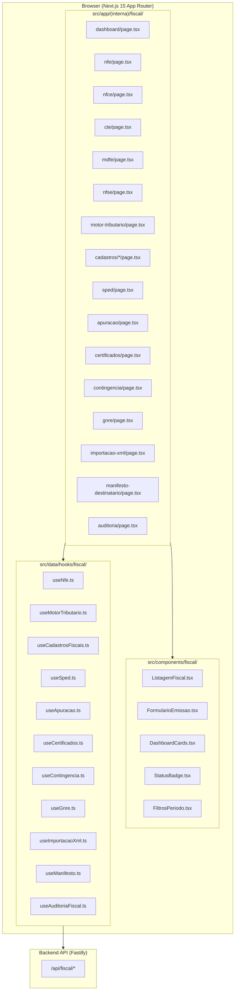
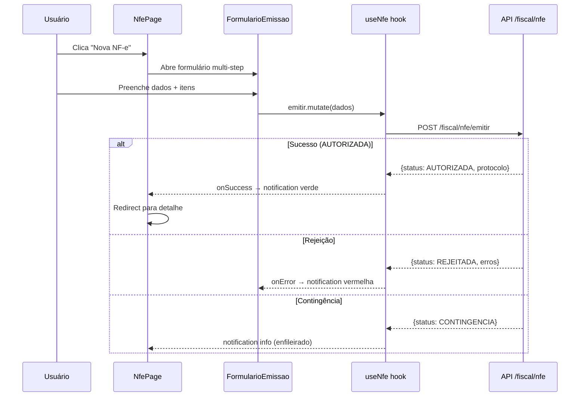

# Design Document: ERP Módulo Fiscal — Frontend

## Overview

O módulo fiscal frontend é uma extensão do sistema VisioFab ERP (Next.js 15 + Mantine 7) que fornece interfaces completas para operações fiscais eletrônicas brasileiras. Ele conecta-se ao backend fiscal existente (`/api/fiscal`) e segue os padrões de UI/UX já estabelecidos no projeto (sidebar modular, tabelas paginadas, React Query, notificações Mantine).

### Decisões Arquiteturais Chave

1. **Sidebar Fiscal expandida** — Todas as funcionalidades fiscais organizadas em grupos lógicos dentro do ModuleSidebar existente
2. **Hooks de dados reutilizáveis** — Extensão do padrão `useCrudGenerico` para endpoints fiscais, com hooks especializados para operações de emissão e contingência
3. **Componentes compostos** — `ListagemFiscal` (tabela paginada genérica) e `FormularioFiscal` (form multi-step) como blocos reutilizáveis
4. **Server-side pagination** — Toda listagem usa paginação via API (page/limit), sem carregamento de grandes datasets no cliente
5. **Cache granular** — Query keys hierárquicas para invalidação seletiva (`['fiscal', 'nfe']`, `['fiscal', 'motor-tributario']`)
6. **Module guard** — `useModuloGuard('FISCAL')` para controle de acesso ao módulo

## Architecture

### Diagrama de Alto Nível



### Fluxo de Emissão (Exemplo NF-e)



## Components and Interfaces

### Estrutura de Arquivos

```
src/
├── app/(interna)/fiscal/
│   ├── dashboard/page.tsx
│   ├── nfe/
│   │   ├── page.tsx               # Listagem NF-e (existente, será refatorada)
│   │   ├── nova/page.tsx          # Formulário emissão NF-e
│   │   └── [id]/page.tsx          # Detalhe NF-e
│   ├── nfce/
│   │   ├── page.tsx               # Listagem NFC-e
│   │   └── nova/page.tsx          # Formulário emissão NFC-e
│   ├── cte/
│   │   ├── page.tsx               # Listagem CT-e (existente, será refatorada)
│   │   └── nova/page.tsx
│   ├── mdfe/
│   │   ├── page.tsx
│   │   └── nova/page.tsx
│   ├── nfse/
│   │   ├── page.tsx
│   │   └── nova/page.tsx
│   ├── motor-tributario/
│   │   ├── page.tsx               # Listagem + CRUD regras
│   │   └── simular/page.tsx       # Simulação de busca
│   ├── cadastros/
│   │   ├── ncm/page.tsx
│   │   ├── cfop/page.tsx
│   │   ├── cest/page.tsx
│   │   ├── cst-csosn/page.tsx
│   │   └── natureza-operacao/page.tsx
│   ├── sped/page.tsx
│   ├── apuracao/page.tsx
│   ├── certificados/page.tsx
│   ├── contingencia/page.tsx
│   ├── gnre/page.tsx
│   ├── importacao-xml/page.tsx
│   ├── manifesto-destinatario/page.tsx
│   └── auditoria/page.tsx
├── components/fiscal/
│   ├── ListagemFiscal.tsx         # Tabela genérica paginada
│   ├── FormularioEmissao.tsx      # Form multi-step para DFe
│   ├── DashboardCards.tsx         # Cards de métricas
│   ├── StatusBadge.tsx            # Badge colorido por status
│   ├── FiltrosPeriodo.tsx         # Filtros data/período
│   ├── ModalCancelamento.tsx      # Modal cancelamento com justificativa
│   ├── ModalCartaCorrecao.tsx     # Modal CC-e
│   ├── UploadXml.tsx              # Dropzone para XMLs
│   └── SimuladorMotorTrib.tsx     # Form simulação motor tributário
└── data/hooks/fiscal/
    ├── useNfe.ts
    ├── useNfce.ts
    ├── useCte.ts
    ├── useMdfe.ts
    ├── useNfse.ts
    ├── useMotorTributario.ts
    ├── useCadastrosFiscais.ts
    ├── useSped.ts
    ├── useApuracao.ts
    ├── useCertificados.ts
    ├── useContingencia.ts
    ├── useGnre.ts
    ├── useImportacaoXml.ts
    ├── useManifesto.ts
    ├── useAuditoriaFiscal.ts
    └── useDashboardFiscal.ts
```

### Componentes Reutilizáveis

#### ListagemFiscal

Componente genérico de tabela paginada com filtros, utilizado por todas as telas de listagem.

```typescript
interface ListagemFiscalProps<T> {
  queryKey: string[]
  endpoint: string
  columns: ColumnDef<T>[]
  filters?: FilterConfig[]
  actions?: (item: T) => React.ReactNode
  title: string
  breadcrumb: string
  createButton?: { label: string; href: string }
  statusColors?: Record<string, string>
}

interface ColumnDef<T> {
  key: keyof T | string
  label: string
  render?: (value: any, item: T) => React.ReactNode
  width?: number | string
}

interface FilterConfig {
  key: string
  label: string
  type: 'text' | 'select' | 'date' | 'daterange'
  options?: { value: string; label: string }[]
}
```

#### FormularioEmissao

Form multi-step para emissão de documentos fiscais.

```typescript
interface FormularioEmissaoProps {
  tipo: 'NFE' | 'NFCE' | 'CTE' | 'MDFE' | 'NFSE'
  steps: StepConfig[]
  onSubmit: (dados: any) => Promise<void>
  initialData?: Partial<any>
  title: string
  breadcrumb: string
}

interface StepConfig {
  label: string
  icon: React.ElementType
  fields: FieldConfig[]
  validate?: (values: any) => Record<string, string>
}

interface FieldConfig {
  name: string
  label: string
  type: 'text' | 'number' | 'select' | 'date' | 'textarea' | 'product-search'
  required?: boolean
  span?: number  // grid column span (1-12)
  options?: { value: string; label: string }[]
}
```

#### StatusBadge

```typescript
interface StatusBadgeProps {
  status: string
  colorMap?: Record<string, string>
}

// Cores padrão para documentos fiscais:
const FISCAL_STATUS_COLORS: Record<string, string> = {
  PENDENTE: 'gray',
  RASCUNHO: 'gray',
  AUTORIZADA: 'green',
  AUTORIZADO: 'green',
  REJEITADA: 'red',
  REJEITADO: 'red',
  CANCELADA: 'orange',
  CANCELADO: 'orange',
  DENEGADA: 'yellow',
  CONTINGENCIA: 'blue',
  FALHA_RETRANSMISSAO: 'red',
  INUTILIZADO: 'violet',
}
```

### Alteração no ModuleSidebar

O módulo fiscal no `MODULE_MENUS` será expandido:

```typescript
fiscal: {
  title: 'Fiscal',
  entries: [
    { icon: IconHome, label: 'Dashboard', href: '/fiscal/dashboard' },
    {
      label: 'Documentos', icon: IconFileInvoice, items: [
        { icon: IconFileInvoice, label: 'NF-e', href: '/fiscal/nfe' },
        { icon: IconReceipt, label: 'NFC-e', href: '/fiscal/nfce' },
        { icon: IconTruck, label: 'CT-e', href: '/fiscal/cte' },
        { icon: IconTruck, label: 'MDF-e', href: '/fiscal/mdfe' },
        { icon: IconFileText, label: 'NFS-e', href: '/fiscal/nfse' },
      ],
    },
    {
      label: 'Motor Tributário', icon: IconCalculator, items: [
        { icon: IconCalculator, label: 'Regras', href: '/fiscal/motor-tributario' },
        { icon: IconSearch, label: 'Simular', href: '/fiscal/motor-tributario/simular' },
      ],
    },
    {
      label: 'Cadastros', icon: IconDatabase, items: [
        { icon: IconHash, label: 'NCM', href: '/fiscal/cadastros/ncm' },
        { icon: IconHash, label: 'CFOP', href: '/fiscal/cadastros/cfop' },
        { icon: IconHash, label: 'CEST', href: '/fiscal/cadastros/cest' },
        { icon: IconHash, label: 'CST/CSOSN', href: '/fiscal/cadastros/cst-csosn' },
        { icon: IconFileText, label: 'Natureza Operação', href: '/fiscal/cadastros/natureza-operacao' },
      ],
    },
    {
      label: 'Obrigações', icon: IconClipboardCheck, items: [
        { icon: IconFileText, label: 'SPED', href: '/fiscal/sped' },
        { icon: IconChartBar, label: 'Apuração', href: '/fiscal/apuracao' },
        { icon: IconReceipt, label: 'GNRE', href: '/fiscal/gnre' },
      ],
    },
    {
      label: 'Utilitários', icon: IconSettings, items: [
        { icon: IconKey, label: 'Certificados', href: '/fiscal/certificados' },
        { icon: IconAlertCircle, label: 'Contingência', href: '/fiscal/contingencia' },
        { icon: IconUpload, label: 'Importação XML', href: '/fiscal/importacao-xml' },
        { icon: IconTruckDelivery, label: 'Manifesto Dest.', href: '/fiscal/manifesto-destinatario' },
        { icon: IconEye, label: 'Auditoria', href: '/fiscal/auditoria' },
      ],
    },
  ],
}
```

## Data Models

### Tipos TypeScript (Frontend)

```typescript
// === Tipos compartilhados ===

interface PaginatedResponse<T> {
  data: T[]
  total: number
  page: number
  limit: number
  totalPages: number
}

interface FiscalFilters {
  page?: number
  limit?: number
  status?: string
  periodo?: string       // YYYY-MM
  dataInicio?: string    // ISO date
  dataFim?: string       // ISO date
  busca?: string
}

// === Documento Fiscal ===

interface DocumentoFiscal {
  id: string
  tipo: 'NFE' | 'NFCE' | 'CTE' | 'MDFE' | 'NFSE'
  serie: number
  numero: number
  chaveAcesso: string | null
  status: StatusDocumento
  naturezaOp: string | null
  dataEmissao: string
  destCpfCnpj: string | null
  destRazao: string | null
  valorTotal: number
  protocolo: string | null
  contingencia: boolean
  ambiente: 1 | 2
}

type StatusDocumento =
  | 'RASCUNHO' | 'PENDENTE' | 'AUTORIZADA' | 'REJEITADA'
  | 'CANCELADA' | 'DENEGADA' | 'CONTINGENCIA'
  | 'FALHA_RETRANSMISSAO' | 'INUTILIZADO'

// === Emissão NF-e ===

interface EmissaoNfePayload {
  dadosGerais: {
    naturezaOp: string
    tipoOperacao: 0 | 1
    finalidade: 1 | 2 | 3 | 4
    dataEmissao: string
    dataSaida?: string
  }
  destinatario: {
    cpfCnpj: string
    razaoSocial: string
    ie?: string
    uf: string
    endereco: Endereco
  }
  itens: ItemNfe[]
  transporte: DadosTransporte
  pagamento: DadosPagamento
  informacoesComplementares?: string
}

interface ItemNfe {
  produtoId?: string
  codigoProd: string
  descricao: string
  ncm: string
  cfop: string
  unidade: string
  quantidade: number
  valorUnitario: number
  valorDesconto?: number
}

// === Motor Tributário ===

interface RegraTributaria {
  id: string
  ncm: string
  cfop: string
  ufOrigem: string
  ufDestino: string
  regimeTributario: number
  icmsAliquota: number
  icmsCst: string | null
  icmsCsosn: string | null
  pisAliquota: number
  pisCst: string | null
  cofinsAliquota: number
  cofinsCst: string | null
  ipiAliquota: number
  ipiCst: string | null
  ativo: boolean
}

interface SimulacaoMotorPayload {
  ncm: string
  cfop: string
  ufOrigem: string
  ufDestino: string
  regimeTributario: number
}

interface SimulacaoMotorResponse {
  encontrada: boolean
  regra: RegraTributaria | null
  nivelFallback: 'EXATO' | 'NCM_PARCIAL' | 'CFOP_GENERICO' | 'PADRAO_REGIME' | null
}

// === Cadastros Fiscais ===

interface Ncm {
  id: string
  codigo: string
  descricao: string
  aliqIPI: number | null
}

interface Cfop {
  id: string
  codigo: string
  descricao: string
  tipo: 'ENTRADA' | 'SAIDA'
}

interface Cest {
  id: string
  codigo: string
  descricao: string
  segmento: string | null
}

interface CstCsosn {
  id: string
  codigo: string
  tipo: 'CST' | 'CSOSN'
  descricao: string
}

interface NaturezaOperacao {
  id: string
  descricao: string
  cfopEntrada: string | null
  cfopSaida: string | null
  tipoOperacao: string
  ativo: boolean
}

// === SPED ===

interface SpedGeracaoPayload {
  tipo: 'EFD_ICMS_IPI' | 'EFD_CONTRIBUICOES' | 'ECD' | 'ECF' | 'REINF'
  periodo: string  // YYYY-MM
}

interface SpedHistorico {
  id: string
  tipo: string
  periodo: string
  status: 'GERADO' | 'ERRO'
  nomeArquivo: string
  criadoEm: string
  erro: string | null
}

// === Apuração ===

interface ApuracaoFiscal {
  id: string
  tipo: 'ICMS' | 'ICMS_ST' | 'PIS' | 'COFINS' | 'IPI'
  periodo: string
  totalDebitos: number
  totalCreditos: number
  saldoFinal: number
  valorRecolher: number
  fechado: boolean
}

// === Certificados ===

interface CertificadoDigital {
  id: string
  cnpj: string
  titular: string
  validoDe: string
  validoAte: string
  ativo: boolean
  diasParaVencer: number
  statusVencimento: 'VALIDO' | 'PROXIMO_VENCIMENTO' | 'EXPIRADO'
}

// === Contingência ===

interface StatusContingencia {
  sefazOnline: boolean
  ultimaVerificacao: string
  totalPendentes: number
}

interface ItemFilaContingencia {
  id: string
  tipoDocumento: string
  numero: number
  dataEnfileiramento: string
  tentativas: number
  status: 'PENDENTE' | 'TRANSMITIDO' | 'FALHA'
  erro: string | null
}

// === GNRE ===

interface Gnre {
  id: string
  ufDestino: string
  codigoReceita: string
  valor: number
  referencia: string
  status: 'PENDENTE' | 'PAGO' | 'VENCIDO'
  dataPagamento: string | null
}

// === Importação XML ===

interface ImportacaoXml {
  id: string
  chaveAcesso: string
  fornecedor: string
  valor: number
  data: string
  status: 'IMPORTADO' | 'PROCESSADO' | 'ERRO'
}

// === Manifesto Destinatário ===

interface NfeRecebida {
  chaveAcesso: string
  emitente: string
  valor: number
  dataEmissao: string
  situacaoManifesto: 'SEM_MANIFESTO' | 'CIENCIA' | 'CONFIRMADA' | 'DESCONHECIDA' | 'NAO_REALIZADA'
}

// === Auditoria ===

interface LogAuditoria {
  id: string
  dataHora: string
  usuario: string
  operacao: string
  documento: string
  detalhes: Record<string, any>
}
```

## Data Flow — Hooks

### Padrão CRUD Fiscal (extensão do useCrudGenerico)

```typescript
// src/data/hooks/fiscal/useCadastrosFiscais.ts
import { useCrudGenerico } from '@/data/hooks/useCrudGenerico'

export const ncmCrud = useCrudGenerico<Ncm>('/fiscal/cadastros/ncm', 'fiscal-ncm')
export const cfopCrud = useCrudGenerico<Cfop>('/fiscal/cadastros/cfop', 'fiscal-cfop')
export const cestCrud = useCrudGenerico<Cest>('/fiscal/cadastros/cest', 'fiscal-cest')
export const cstCsosnCrud = useCrudGenerico<CstCsosn>('/fiscal/cadastros/cst-csosn', 'fiscal-cst-csosn')
export const naturezaOperacaoCrud = useCrudGenerico<NaturezaOperacao>(
  '/fiscal/cadastros/natureza-operacao', 'fiscal-natureza-operacao'
)
export const motorTributarioCrud = useCrudGenerico<RegraTributaria>(
  '/fiscal/motor-tributario', 'fiscal-motor-tributario'
)
export const gnreCrud = useCrudGenerico<Gnre>('/fiscal/gnre', 'fiscal-gnre')
export const certificadosCrud = useCrudGenerico<CertificadoDigital>(
  '/fiscal/certificados', 'fiscal-certificados'
)
```

### Hook Especializado — useNfe

```typescript
// src/data/hooks/fiscal/useNfe.ts
import { useQuery, useMutation, useQueryClient } from '@tanstack/react-query'
import { api } from '@/lib/api'

export function useNfe() {
  function useListar(params?: FiscalFilters) {
    return useQuery<PaginatedResponse<DocumentoFiscal>>({
      queryKey: ['fiscal', 'nfe', params],
      queryFn: async () => {
        const { data } = await api.get('/fiscal/nfe', { params })
        return data
      },
      staleTime: 1000 * 60 * 2,
    })
  }

  function useDetalhe(id: string) {
    return useQuery({
      queryKey: ['fiscal', 'nfe', id],
      queryFn: async () => {
        const { data } = await api.get(`/fiscal/nfe/${id}`)
        return data
      },
      enabled: !!id,
    })
  }

  function useEmitir() {
    const qc = useQueryClient()
    return useMutation({
      mutationFn: async (payload: EmissaoNfePayload) => {
        const { data } = await api.post('/fiscal/nfe/emitir', payload)
        return data
      },
      onSuccess: () => qc.invalidateQueries({ queryKey: ['fiscal', 'nfe'] }),
    })
  }

  function useCancelar() {
    const qc = useQueryClient()
    return useMutation({
      mutationFn: async ({ id, justificativa }: { id: string; justificativa: string }) => {
        const { data } = await api.post(`/fiscal/nfe/${id}/cancelar`, { justificativa })
        return data
      },
      onSuccess: () => qc.invalidateQueries({ queryKey: ['fiscal', 'nfe'] }),
    })
  }

  function useCartaCorrecao() {
    const qc = useQueryClient()
    return useMutation({
      mutationFn: async ({ id, textoCorrecao }: { id: string; textoCorrecao: string }) => {
        const { data } = await api.post(`/fiscal/nfe/${id}/cce`, { textoCorrecao })
        return data
      },
      onSuccess: () => qc.invalidateQueries({ queryKey: ['fiscal', 'nfe'] }),
    })
  }

  return { useListar, useDetalhe, useEmitir, useCancelar, useCartaCorrecao }
}
```

### Hook Especializado — useMotorTributario

```typescript
// src/data/hooks/fiscal/useMotorTributario.ts
export function useMotorTributario() {
  // CRUD via useCrudGenerico já declarado em useCadastrosFiscais.ts

  function useSimular() {
    return useMutation<SimulacaoMotorResponse, Error, SimulacaoMotorPayload>({
      mutationFn: async (payload) => {
        const { data } = await api.post('/fiscal/motor-tributario/simular', payload)
        return data
      },
    })
  }

  return { useSimular }
}
```

### Hook Especializado — useContingencia

```typescript
// src/data/hooks/fiscal/useContingencia.ts
export function useContingencia() {
  function useStatus() {
    return useQuery<StatusContingencia>({
      queryKey: ['fiscal', 'contingencia', 'status'],
      queryFn: async () => {
        const { data } = await api.get('/fiscal/contingencia/status')
        return data
      },
      refetchInterval: 30_000, // Auto-refresh a cada 30s
    })
  }

  function useFila(params?: { page?: number; limit?: number }) {
    return useQuery<PaginatedResponse<ItemFilaContingencia>>({
      queryKey: ['fiscal', 'contingencia', 'fila', params],
      queryFn: async () => {
        const { data } = await api.get('/fiscal/contingencia', { params })
        return data
      },
      refetchInterval: 30_000,
    })
  }

  function useRetransmitir() {
    const qc = useQueryClient()
    return useMutation({
      mutationFn: async (id: string) => {
        const { data } = await api.post(`/fiscal/contingencia/${id}/retransmitir`)
        return data
      },
      onSuccess: () => {
        qc.invalidateQueries({ queryKey: ['fiscal', 'contingencia'] })
        qc.invalidateQueries({ queryKey: ['fiscal', 'nfe'] })
      },
    })
  }

  function useRetransmitirTodos() {
    const qc = useQueryClient()
    return useMutation({
      mutationFn: async () => {
        const { data } = await api.post('/fiscal/contingencia/retransmitir-todos')
        return data
      },
      onSuccess: () => {
        qc.invalidateQueries({ queryKey: ['fiscal', 'contingencia'] })
        qc.invalidateQueries({ queryKey: ['fiscal', 'nfe'] })
      },
    })
  }

  return { useStatus, useFila, useRetransmitir, useRetransmitirTodos }
}
```

### Hook Especializado — useSped

```typescript
// src/data/hooks/fiscal/useSped.ts
export function useSped() {
  function useHistorico(params?: FiscalFilters) {
    return useQuery<PaginatedResponse<SpedHistorico>>({
      queryKey: ['fiscal', 'sped', params],
      queryFn: async () => {
        const { data } = await api.get('/fiscal/sped', { params })
        return data
      },
    })
  }

  function useGerar() {
    const qc = useQueryClient()
    return useMutation({
      mutationFn: async (payload: SpedGeracaoPayload) => {
        const { data } = await api.post(`/fiscal/sped/${payload.tipo}/gerar`, {
          periodo: payload.periodo,
        })
        return data
      },
      onSuccess: () => qc.invalidateQueries({ queryKey: ['fiscal', 'sped'] }),
    })
  }

  return { useHistorico, useGerar }
}
```

### Hook Especializado — useCertificados

```typescript
// src/data/hooks/fiscal/useCertificados.ts
export function useCertificados() {
  // Listagem via certificadosCrud.useListar()

  function useUpload() {
    const qc = useQueryClient()
    return useMutation({
      mutationFn: async ({ file, senha }: { file: File; senha: string }) => {
        const formData = new FormData()
        formData.append('arquivo', file)
        formData.append('senha', senha)
        const { data } = await api.post('/fiscal/certificados/upload', formData, {
          headers: { 'Content-Type': 'multipart/form-data' },
        })
        return data
      },
      onSuccess: () => qc.invalidateQueries({ queryKey: ['fiscal-certificados'] }),
    })
  }

  return { useUpload }
}
```

### Hook Especializado — useImportacaoXml

```typescript
// src/data/hooks/fiscal/useImportacaoXml.ts
export function useImportacaoXml() {
  function useListar(params?: FiscalFilters) {
    return useQuery<PaginatedResponse<ImportacaoXml>>({
      queryKey: ['fiscal', 'importacao-xml', params],
      queryFn: async () => {
        const { data } = await api.get('/fiscal/importacao', { params })
        return data
      },
    })
  }

  function useUpload() {
    const qc = useQueryClient()
    return useMutation({
      mutationFn: async (files: File[]) => {
        const formData = new FormData()
        files.forEach(f => formData.append('arquivos', f))
        const { data } = await api.post('/fiscal/importacao/upload', formData, {
          headers: { 'Content-Type': 'multipart/form-data' },
        })
        return data
      },
      onSuccess: () => qc.invalidateQueries({ queryKey: ['fiscal', 'importacao-xml'] }),
    })
  }

  function useGerarEntrada() {
    const qc = useQueryClient()
    return useMutation({
      mutationFn: async (id: string) => {
        const { data } = await api.post(`/fiscal/importacao/${id}/gerar-entrada`)
        return data
      },
      onSuccess: () => qc.invalidateQueries({ queryKey: ['fiscal', 'importacao-xml'] }),
    })
  }

  return { useListar, useUpload, useGerarEntrada }
}
```

### Hook Especializado — useManifesto

```typescript
// src/data/hooks/fiscal/useManifesto.ts
export function useManifesto() {
  function useListar(params?: FiscalFilters & { situacao?: string }) {
    return useQuery<PaginatedResponse<NfeRecebida>>({
      queryKey: ['fiscal', 'manifesto', params],
      queryFn: async () => {
        const { data } = await api.get('/fiscal/manifesto', { params })
        return data
      },
    })
  }

  function useManifestar() {
    const qc = useQueryClient()
    return useMutation({
      mutationFn: async ({
        chave, evento,
      }: { chave: string; evento: 'ciencia' | 'confirmacao' | 'desconhecimento' | 'nao-realizada' }) => {
        const { data } = await api.post(`/fiscal/manifesto/${chave}/${evento}`)
        return data
      },
      onSuccess: () => qc.invalidateQueries({ queryKey: ['fiscal', 'manifesto'] }),
    })
  }

  return { useListar, useManifestar }
}
```

### Hook — useDashboardFiscal

```typescript
// src/data/hooks/fiscal/useDashboardFiscal.ts
interface MetricasFiscais {
  nfeEmitidasMes: number
  nfePendentes: number
  valorFaturadoMes: number
  certificadosProximoVencimento: number
  documentosContingencia: number
}

export function useDashboardFiscal() {
  return useQuery<MetricasFiscais>({
    queryKey: ['fiscal', 'dashboard', 'metricas'],
    queryFn: async () => {
      const { data } = await api.get('/fiscal/dashboard/metricas')
      return data
    },
    staleTime: 1000 * 60 * 5,
  })
}
```

### Hook — useApuracao

```typescript
// src/data/hooks/fiscal/useApuracao.ts
export function useApuracao() {
  function useConsultar(tipo: string, periodo: string) {
    return useQuery<ApuracaoFiscal>({
      queryKey: ['fiscal', 'apuracao', tipo, periodo],
      queryFn: async () => {
        const { data } = await api.get(`/fiscal/apuracao/${tipo}`, { params: { periodo } })
        return data
      },
      enabled: !!tipo && !!periodo,
    })
  }

  function useCalcular() {
    const qc = useQueryClient()
    return useMutation({
      mutationFn: async ({ tipo, periodo }: { tipo: string; periodo: string }) => {
        const { data } = await api.post(`/fiscal/apuracao/${tipo}/calcular`, { periodo })
        return data
      },
      onSuccess: (_, vars) => {
        qc.invalidateQueries({ queryKey: ['fiscal', 'apuracao', vars.tipo, vars.periodo] })
      },
    })
  }

  return { useConsultar, useCalcular }
}
```

### Hook — useAuditoriaFiscal

```typescript
// src/data/hooks/fiscal/useAuditoriaFiscal.ts
export function useAuditoriaFiscal() {
  function useListar(params?: FiscalFilters & { usuario?: string; operacao?: string }) {
    return useQuery<PaginatedResponse<LogAuditoria>>({
      queryKey: ['fiscal', 'auditoria', params],
      queryFn: async () => {
        const { data } = await api.get('/fiscal/auditoria', { params })
        return data
      },
    })
  }

  return { useListar }
}
```

## API Endpoints Consumidos

| Endpoint | Método | Hook | Página |
|----------|--------|------|--------|
| `/fiscal/dashboard/metricas` | GET | useDashboardFiscal | Dashboard |
| `/fiscal/nfe` | GET | useNfe.useListar | NF-e List |
| `/fiscal/nfe/{id}` | GET | useNfe.useDetalhe | NF-e Detail |
| `/fiscal/nfe/emitir` | POST | useNfe.useEmitir | Nova NF-e |
| `/fiscal/nfe/{id}/cancelar` | POST | useNfe.useCancelar | NF-e List |
| `/fiscal/nfe/{id}/cce` | POST | useNfe.useCartaCorrecao | NF-e List |
| `/fiscal/nfce` | GET | useNfce.useListar | NFC-e List |
| `/fiscal/nfce/emitir` | POST | useNfce.useEmitir | Nova NFC-e |
| `/fiscal/cte` | GET | useCte.useListar | CT-e List |
| `/fiscal/cte/emitir` | POST | useCte.useEmitir | Novo CT-e |
| `/fiscal/mdfe` | GET | useMdfe.useListar | MDF-e List |
| `/fiscal/mdfe/emitir` | POST | useMdfe.useEmitir | Novo MDF-e |
| `/fiscal/nfse` | GET | useNfse.useListar | NFS-e List |
| `/fiscal/nfse/emitir` | POST | useNfse.useEmitir | Nova NFS-e |
| `/fiscal/motor-tributario` | GET/POST/PUT/DELETE | motorTributarioCrud | Motor Tributário |
| `/fiscal/motor-tributario/simular` | POST | useMotorTributario.useSimular | Simular |
| `/fiscal/cadastros/ncm` | GET/POST/PUT/DELETE | ncmCrud | NCM |
| `/fiscal/cadastros/cfop` | GET/POST/PUT/DELETE | cfopCrud | CFOP |
| `/fiscal/cadastros/cest` | GET/POST/PUT/DELETE | cestCrud | CEST |
| `/fiscal/cadastros/cst-csosn` | GET/POST/PUT/DELETE | cstCsosnCrud | CST/CSOSN |
| `/fiscal/cadastros/natureza-operacao` | GET/POST/PUT/DELETE | naturezaOperacaoCrud | Nat. Op. |
| `/fiscal/sped` | GET | useSped.useHistorico | SPED |
| `/fiscal/sped/{tipo}/gerar` | POST | useSped.useGerar | SPED |
| `/fiscal/apuracao/{tipo}` | GET | useApuracao.useConsultar | Apuração |
| `/fiscal/apuracao/{tipo}/calcular` | POST | useApuracao.useCalcular | Apuração |
| `/fiscal/certificados` | GET/DELETE | certificadosCrud | Certificados |
| `/fiscal/certificados/upload` | POST | useCertificados.useUpload | Certificados |
| `/fiscal/contingencia/status` | GET | useContingencia.useStatus | Contingência |
| `/fiscal/contingencia` | GET | useContingencia.useFila | Contingência |
| `/fiscal/contingencia/{id}/retransmitir` | POST | useContingencia.useRetransmitir | Contingência |
| `/fiscal/contingencia/retransmitir-todos` | POST | useContingencia.useRetransmitirTodos | Contingência |
| `/fiscal/gnre` | GET/POST | gnreCrud | GNRE |
| `/fiscal/gnre/gerar` | POST | gnreCrud.useCriar | GNRE |
| `/fiscal/gnre/{id}/pagar` | POST | useGnre.usePagar | GNRE |
| `/fiscal/importacao` | GET | useImportacaoXml.useListar | Importação XML |
| `/fiscal/importacao/upload` | POST | useImportacaoXml.useUpload | Importação XML |
| `/fiscal/importacao/{id}/gerar-entrada` | POST | useImportacaoXml.useGerarEntrada | Importação XML |
| `/fiscal/manifesto` | GET | useManifesto.useListar | Manifesto |
| `/fiscal/manifesto/{chave}/{evento}` | POST | useManifesto.useManifestar | Manifesto |
| `/fiscal/auditoria` | GET | useAuditoriaFiscal.useListar | Auditoria |

## Page Design — Exemplos de Implementação

### Dashboard Fiscal (`/fiscal/dashboard`)

```typescript
'use client'

import { Card, Grid, Text, LoadingOverlay, ThemeIcon } from '@mantine/core'
import { IconFileInvoice, IconAlertCircle, IconCash, IconKey, IconCloudOff } from '@tabler/icons-react'
import { useDashboardFiscal } from '@/data/hooks/fiscal/useDashboardFiscal'
import { useModuloGuard } from '@/hooks/useModuloGuard'

export default function DashboardFiscalPage() {
  useModuloGuard('FISCAL')
  const { data: metricas, isLoading } = useDashboardFiscal()

  const cards = [
    { label: 'NF-e Emitidas (mês)', value: metricas?.nfeEmitidasMes, icon: IconFileInvoice, color: 'teal' },
    { label: 'NF-e Pendentes', value: metricas?.nfePendentes, icon: IconAlertCircle, color: 'yellow' },
    { label: 'Valor Faturado', value: formatCurrency(metricas?.valorFaturadoMes), icon: IconCash, color: 'green' },
    { label: 'Certificados Expirando', value: metricas?.certificadosProximoVencimento, icon: IconKey, color: 'orange' },
    { label: 'Em Contingência', value: metricas?.documentosContingencia, icon: IconCloudOff, color: 'red' },
  ]

  return (
    <div>
      <Text size="xs" c="dimmed" mb={4}>Início / Fiscal / Dashboard</Text>
      <Text size="xl" fw={600} mb="lg">Dashboard Fiscal</Text>
      <Card pos="relative" p="lg">
        <LoadingOverlay visible={isLoading} />
        <Grid>
          {cards.map(card => (
            <Grid.Col key={card.label} span={{ base: 12, sm: 6, md: 4 }}>
              <Card withBorder p="md">
                <Group>
                  <ThemeIcon variant="light" color={card.color} size="lg">
                    <card.icon size={20} />
                  </ThemeIcon>
                  <div>
                    <Text size="xs" c="dimmed">{card.label}</Text>
                    <Text size="xl" fw={700}>{card.value ?? '—'}</Text>
                  </div>
                </Group>
              </Card>
            </Grid.Col>
          ))}
        </Grid>
      </Card>
    </div>
  )
}
```

### Motor Tributário — Simulação (`/fiscal/motor-tributario/simular`)

```typescript
'use client'

import { useState } from 'react'
import { Card, TextInput, Select, Button, Alert, Badge, Table, Text, Group } from '@mantine/core'
import { IconSearch } from '@tabler/icons-react'
import { useMotorTributario } from '@/data/hooks/fiscal/useMotorTributario'

const FALLBACK_COLORS: Record<string, string> = {
  EXATO: 'green',
  NCM_PARCIAL: 'teal',
  CFOP_GENERICO: 'yellow',
  PADRAO_REGIME: 'orange',
}

export default function SimularMotorPage() {
  const { useSimular } = useMotorTributario()
  const simular = useSimular()
  const [form, setForm] = useState({ ncm: '', cfop: '', ufOrigem: '', ufDestino: '', regimeTributario: '3' })

  const handleSimular = () => {
    simular.mutate({
      ...form,
      regimeTributario: Number(form.regimeTributario),
    })
  }

  return (
    <div>
      <Text size="xs" c="dimmed" mb={4}>Início / Fiscal / Motor Tributário / Simular</Text>
      <Text size="xl" fw={600} mb="lg">Simulação Motor Tributário</Text>
      <Card>
        {/* Form inputs + Button "Simular" */}
        {/* Result display with fallback level badge */}
        {simular.data && !simular.data.encontrada && (
          <Alert color="orange">Nenhuma regra encontrada. Item seria bloqueado.</Alert>
        )}
        {simular.data?.encontrada && (
          <Badge color={FALLBACK_COLORS[simular.data.nivelFallback!]}>
            Nível: {simular.data.nivelFallback}
          </Badge>
        )}
      </Card>
    </div>
  )
}
```

## Error Handling

### Erros de API (HTTP 4xx/5xx)

Toda resposta de erro da API é interceptada e exibe uma notificação vermelha via `@mantine/notifications`. A mensagem exibida é extraída de `error.response.data.message`. Se a mensagem não existe, exibe um texto genérico ("Erro ao processar operação").

```typescript
// Padrão para onError em mutations
onError: (err: any) => {
  notifications.show({
    title: 'Erro',
    message: err?.response?.data?.message || 'Erro ao processar operação',
    color: 'red',
  })
}
```

### Erros de Rede (sem resposta)

Se a requisição falha sem resposta HTTP (timeout, rede offline), exibe notificação com mensagem "Erro de conexão. Verifique sua rede." O React Query mantém a última versão em cache visível.

### Erros de Validação Client-Side

Formulários validam campos obrigatórios e formatos antes do submit. Erros são exibidos inline nos campos via prop `error` do Mantine. O formulário não é submetido se houver erros de validação.

### Fallback de Dados Vazios

Toda listagem exibe um empty state amigável quando `data.length === 0` e não está em loading. Toda query que retorna erro exibe um estado de erro com botão "Tentar novamente" que invoca `refetch()`.

### Timeout e Retry

React Query é configurado com `retry: 1` para queries (uma tentativa de retry automático). Mutations não fazem retry automático — o usuário deve tentar novamente manualmente.

## Correctness Properties

### Property 1: Navegação Completa
**Validates: Requirements 1.1, 1.2, 1.3**

Toda entrada no Sidebar_Fiscal aponta para uma rota válida que renderiza uma página sem erro. Para qualquer `entry.href` no menu fiscal, navegar para essa rota resulta em um componente React renderizado com sucesso.

### Property 2: Cache Invalidation Correta
**Validates: Requirements 21.3**

Após qualquer mutação bem-sucedida (criar, editar, excluir, emitir, cancelar), a query key correspondente é invalidada, garantindo que a próxima leitura busca dados frescos do servidor.

### Property 3: Paginação Consistente
**Validates: Requirements 3.2, 3.3**

Para qualquer listagem fiscal, mudar de página atualiza os params enviados à API (page + limit) e a tabela reflete exatamente os dados retornados. O total de páginas corresponde a `Math.ceil(total / limit)`.

### Property 4: Formulário de Emissão — Validação
**Validates: Requirements 4.3, 6.3**

Nenhum formulário de emissão envia dados inválidos à API. Todos os campos obrigatórios são validados client-side antes do POST. Se a validação falha, mensagens de erro são exibidas inline nos campos correspondentes.

### Property 5: Status Badges Determinísticos
**Validates: Requirements 3.5**

Para qualquer valor de `status` retornado pela API, o StatusBadge renderiza exatamente uma cor do mapa `FISCAL_STATUS_COLORS`. Se o status não existe no mapa, usa 'gray' como fallback.

### Property 6: Contingência — Auto-refresh
**Validates: Requirements 15.5**

O painel de contingência re-busca dados automaticamente a cada 30 segundos (±5s de tolerância), sem intervenção do usuário, garantindo que a fila está sempre atualizada.

### Property 7: Certificados — Indicação de Vencimento
**Validates: Requirements 14.4, 14.5**

Certificados com menos de 30 dias para vencer exibem badge "Próximo do Vencimento" (orange). Certificados expirados exibem badge "Expirado" (red). Certificados válidos por mais de 30 dias exibem badge "Válido" (green).

### Property 8: Upload Multipart
**Validates: Requirements 14.3, 17.3**

Todo upload de arquivo (certificado .pfx, XMLs) é enviado como `multipart/form-data` com o header `Content-Type` correto, garantindo que o backend recebe o arquivo binário corretamente.

### Property 9: Notificações de Erro
**Validates: Requirements 22.5**

Para qualquer resposta HTTP com status >= 400, uma notificação vermelha é exibida contendo a mensagem de erro do body da resposta (`error.response.data.message`). Nenhum erro silencioso.

### Property 10: Module Guard
**Validates: Requirements 1.1**

Toda página do módulo fiscal invoca `useModuloGuard('FISCAL')`. Se o usuário não tem permissão, é redirecionado para a página de módulos sem renderizar o conteúdo.

## Testing Strategy

### Testes Unitários (Vitest)

- **Hooks**: Testar cada hook fiscal com `@testing-library/react-hooks` + MSW para mock de API
- **Componentes**: Testar `ListagemFiscal`, `StatusBadge`, `FormularioEmissao` com `@testing-library/react`
- **Validação**: Testar schemas Zod de cada formulário com fast-check (property-based)

### Testes de Integração (Vitest)

- Fluxo completo de emissão: form → submit → response handling
- Cache invalidation: mutation → query refetch
- Sidebar navigation: detectModule + active state

### Testes E2E (Playwright)

- Navegar por todas as rotas fiscais sem erro
- Emitir NF-e em ambiente de homologação (mock API)
- Upload de certificado + verificação na lista
- Filtros e paginação nas listagens

### Property-Based Tests (fast-check)

```typescript
// Exemplo: StatusBadge sempre retorna cor válida
import fc from 'fast-check'

test('StatusBadge sempre mapeia para uma cor Mantine válida', () => {
  const validColors = ['gray', 'green', 'red', 'orange', 'yellow', 'blue', 'violet', 'teal']
  fc.assert(
    fc.property(fc.string(), (status) => {
      const color = FISCAL_STATUS_COLORS[status] ?? 'gray'
      return validColors.includes(color)
    })
  )
})

// Exemplo: Paginação nunca gera page < 1
test('Paginação nunca solicita page menor que 1', () => {
  fc.assert(
    fc.property(
      fc.integer({ min: 0, max: 10000 }), // total
      fc.integer({ min: 1, max: 100 }),    // limit
      fc.integer({ min: 1, max: 500 }),    // page clicked
      (total, limit, page) => {
        const totalPages = Math.max(1, Math.ceil(total / limit))
        const sanitizedPage = Math.min(Math.max(1, page), totalPages)
        return sanitizedPage >= 1 && sanitizedPage <= totalPages
      }
    )
  )
})
```
