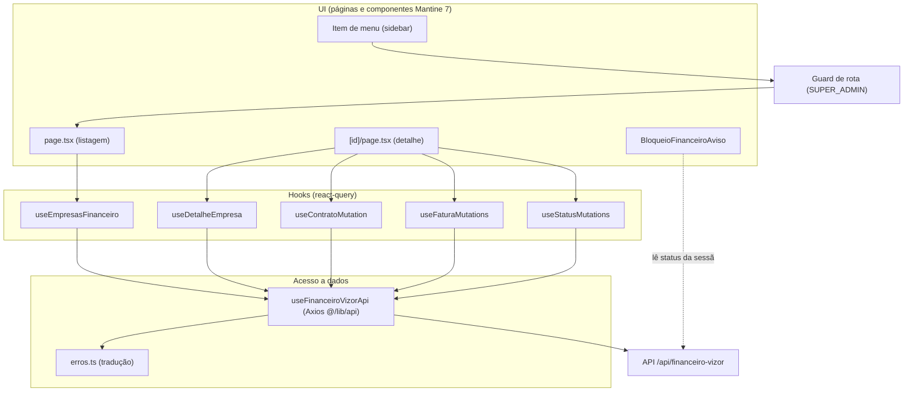
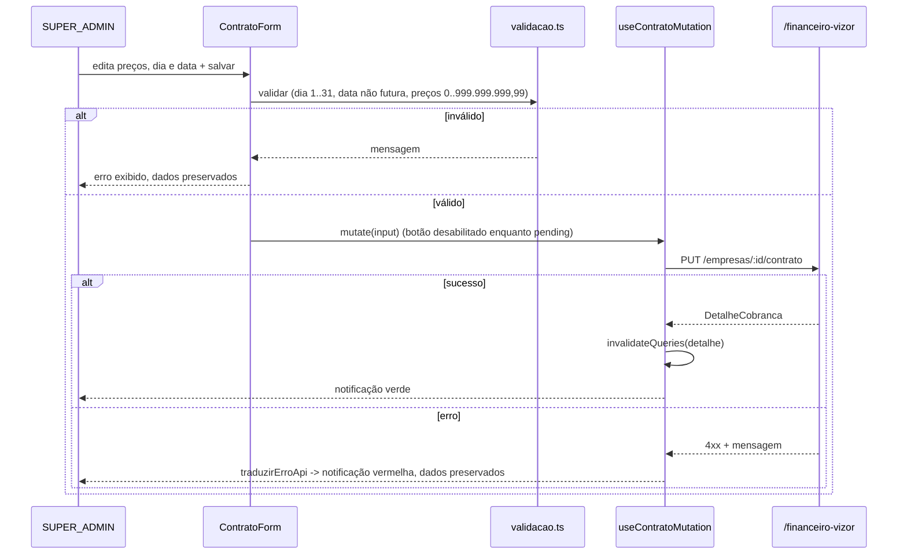

# Design Document — Financeiro Vizor (Frontend)

## Overview

Este documento descreve o design do **frontend** do painel administrativo do
**Financeiro Vizor** — o controle de cobrança recorrente das empresas clientes
do Vizor ERP (billing do SaaS). O painel é **exclusivo do perfil SUPER_ADMIN** e
consome a API REST já implementada no backend (`VisioFab.Wms.Back`) sob o prefixo
`/api/financeiro-vizor`.

O escopo aqui é somente a camada de apresentação: telas, fluxos de interação,
validação no cliente (espelhando a validação Zod do backend para dar feedback
imediato), controle de visibilidade e acesso por perfil, tratamento amigável das
respostas de erro da API e os avisos de bloqueio para o usuário de uma empresa
cliente inadimplente. Toda regra de negócio (cálculo de total, dias em atraso,
ciclo de inadimplência, guard de somente-leitura) já reside no backend — o
frontend apenas apresenta o estado retornado e aciona os endpoints.

Stack e padrões (consolidados no projeto, mesmos do Portal do Representante
Admin): **Next.js 15 (App Router)**, **Mantine 7**, **@tanstack/react-query**,
**Axios** (instância `@/lib/api` com base em `NEXT_PUBLIC_API_URL` e Authorization
via `authStorage`), **TypeScript**. Como o projeto é 100% TypeScript, todo o
design é em TypeScript.

O design se alinha ao contrato de API definido no design do backend
(`VisioFab.Wms.Back/.kiro/specs/financeiro-vizor/design.md`), reusando os mesmos
nomes de campos, valores de enum e códigos de erro.

## Alinhamento com o backend (contrato consumido)

Endpoints consumidos (prefixo `/api/financeiro-vizor`, todos exigem SUPER_ADMIN):

| Método | Rota | Uso no frontend | Req |
|---|---|---|---|
| GET | `/empresas` | Listagem com `statusFinanceiro`, `totalMensal`, `totalVencidoEmAberto` | 2 |
| GET | `/empresas/:id` | Detalhe: contrato, 6 preços de módulo, totais, dias em atraso, faturas | 3.1, 4 |
| PUT | `/empresas/:id/contrato` | Salvar contrato (`dataContrato`, `diaVencimento`, `precos[]`) | 3 |
| POST | `/empresas/:id/gerar-vencimentos` | Gera N faturas (`meses`, `competenciaInicial?`) → `{ criadas, ignoradas[] }` | 4.10–4.12 |
| POST | `/empresas/:id/faturas/:faturaId/baixa` | Baixa de fatura | 4.6, 4.7 |
| POST | `/empresas/:id/faturas/:faturaId/cancelar` | Cancelamento de fatura | 4.8, 4.9 |
| POST | `/empresas/:id/reativar` | Reativação (→ ATIVO), manual | 5.1, 5.2 |
| POST | `/empresas/:id/inativar` | Inativação (→ INATIVADO), manual | 5.3, 5.4 |

Enums espelhados do backend:

```typescript
export const MODULOS = ['COMPRAS', 'VENDAS', 'FINANCEIRO', 'FISCAL', 'WMS', 'PCP'] as const
export type Modulo = (typeof MODULOS)[number]

export type StatusFinanceiro = 'ATIVO' | 'SOMENTE_LEITURA' | 'INATIVADO'
export type StatusFatura = 'PENDENTE' | 'VENCIDA' | 'PAGA' | 'CANCELADA'

// Limites de negócio espelhados para validação no cliente (feedback imediato).
// A validação autoritativa permanece no backend (Zod).
export const PRECO_MIN = 0
export const PRECO_MAX = 999_999_999.99
export const DIA_VENCIMENTO_MIN = 1
export const DIA_VENCIMENTO_MAX = 31
export const MESES_MIN = 1
export const MESES_MAX = 60
```

## Data Models

O frontend **não persiste dados** — todo estado durável vive no backend. Os
"modelos" aqui são as formas de dados (view models) mantidas no cliente: o que a
API retorna (cache do react-query) e o que os formulários enviam. Elas espelham
1:1 os tipos de retorno do backend, sem transformação de estrutura, apenas
formatação para exibição.

### Modelos de leitura (respostas da API, cacheados via react-query)

- **EmpresaStatusView** — item da listagem (`GET /empresas`): `id`, `nome`,
  `statusFinanceiro` (`ATIVO | SOMENTE_LEITURA | INATIVADO`), `totalMensal`,
  `totalVencidoEmAberto`. (Req 2)
- **DetalheCobranca** — detalhe (`GET /empresas/:id`): `id`, `nome`,
  `statusFinanceiro`, `dataContrato`, `diaVencimento`, `precos` (sempre os 6
  módulos, `preco: 0` para não precificados), `totalMensal`,
  `totalVencidoEmAberto`, `diasEmAtraso` (`number | null`), `faturas`. (Req 3, 4)
- **PrecoModuloView** — `modulo` (`COMPRAS | VENDAS | FINANCEIRO | FISCAL | WMS |
  PCP`), `preco` (número, 0..999.999.999,99). (Req 3)
- **FaturaView** — `id`, `competencia` (`YYYY-MM`), `dataVencimento` (ISO),
  `valor`, `status` (`PENDENTE | VENCIDA | PAGA | CANCELADA`), `dataPagamento`
  (`string | null`). (Req 4)

### Modelos de escrita (payloads enviados)

- **SalvarContratoInput** — `dataContrato` (`YYYY-MM-DD`), `diaVencimento`
  (inteiro 1..31), `precos` (até 6 `PrecoModuloView`). Validado no cliente antes
  do `PUT /empresas/:id/contrato`. (Req 3.5–3.8)
- **GerarVencimentosInput** — `meses` (inteiro 1..60), `competenciaInicial?`
  (`YYYY-MM`). Validado antes do `POST /empresas/:id/gerar-vencimentos`. (Req
  4.10–4.12)
- **GerarVencimentosResultado** — resposta: `criadas` (número), `ignoradas`
  (lista de `YYYY-MM`), exibida na notificação. (Req 4.11)

As ações de baixa, cancelamento, reativação e inativação não têm corpo de
requisição; recebem `FaturaView`/`EmpresaStatusView` na resposta, usados para
atualizar o cache. (Req 4.7, 4.9, 5.2, 5.4)

As definições TypeScript completas destes modelos estão em
`lib/financeiro-vizor/types.ts` (ver seção Components and Interfaces).

## Architecture

### Estrutura de arquivos (App Router)

```
src/
  app/(interna)/financeiro-vizor/
    page.tsx                       # Listagem de empresas (Req 1, 2)
    [id]/page.tsx                  # Detalhe: contrato + faturas + ações (Req 3, 4, 5)
  components/financeiro-vizor/
    StatusFinanceiroBadge.tsx      # Selo de Status_Financeiro (Req 2.2, 7.4)
    StatusFaturaBadge.tsx          # Selo de status de Fatura (Req 4.3, 7.4)
    ContratoForm.tsx               # Form de contrato + preços por módulo (Req 3)
    FaturasTable.tsx               # Tabela de faturas + ações (Req 4)
    GerarVencimentosModal.tsx      # Modal de geração de vencimentos (Req 4.10–4.12)
    AcoesStatusEmpresa.tsx         # Botões reativar/inativar + confirmação (Req 5)
    BloqueioFinanceiroAviso.tsx    # Banner/tela de bloqueio ao cliente (Req 6)
  hooks/financeiro-vizor/
    useFinanceiroVizorApi.ts       # Camada de acesso à API (Axios)
    useEmpresasFinanceiro.ts       # Query: listagem (Req 2)
    useDetalheEmpresa.ts           # Query: detalhe (Req 3, 4)
    useContratoMutation.ts         # Mutation: salvar contrato (Req 3)
    useFaturaMutations.ts          # Mutations: baixa/cancelar/gerar (Req 4)
    useStatusMutations.ts          # Mutations: reativar/inativar (Req 5)
  lib/financeiro-vizor/
    types.ts                       # Tipos e enums espelhados do backend
    validacao.ts                   # Validação no cliente (espelha Zod)
    format.ts                      # Formatação monetária/competência
    erros.ts                       # Tradução amigável de erros da API (Req 8)
```

### Camadas



### Decisões de design

1. **Controle de acesso SUPER_ADMIN é explícito, não via `usePerfilGuard`
   genérico.** O hook `usePerfilGuard` existente concede acesso automático a
   `ADMIN` além de `SUPER_ADMIN` — comportamento inadequado aqui, pois o painel
   é exclusivo do SUPER_ADMIN. O guard deste módulo verifica estritamente
   `getUserPerfil() === 'SUPER_ADMIN'`, lendo o perfil do JWT via `authStorage`
   (nunca `localStorage` direto). (Req 1.1–1.5)

2. **Perfil lido do JWT via helpers existentes.** `getUserPerfil()`
   (`@/hooks/usePerfilGuard`) decodifica o token de `authStorage`. O item de menu
   e o guard de rota compartilham a mesma fonte de verdade. (Req 1.4)

3. **react-query como cache e orquestrador de estado servidor.** Listagem e
   detalhe são `useQuery`; ações são `useMutation` que invalidam as queries
   afetadas no `onSuccess`, garantindo que a lista de faturas/status exibida
   reflita o retorno da API sem manipulação manual de estado. (Req 4.7, 4.9,
   4.11, 5.2, 5.4)

4. **Validação no cliente espelha o Zod do backend, para feedback imediato.**
   `validacao.ts` reimplementa os limites (`diaVencimento` 1..31, `dataContrato`
   não futura, `preco` 0..999.999.999,99, `meses` 1..60) para bloquear o envio e
   mostrar mensagem antes de chamar a API. O backend continua sendo a autoridade
   final; se o backend rejeitar (422/409), a mensagem retornada é exibida e os
   dados da tela preservados. (Req 3.5–3.8, 4.12, 8.6, 8.7)

5. **Tradução centralizada de erros da API.** `erros.ts` mapeia o erro Axios para
   uma mensagem amigável, priorizando a mensagem do corpo da resposta e caindo
   para um texto genérico por código HTTP quando não há mensagem legível. Isso
   evita repetir tratamento em cada hook e garante consistência. (Req 8.3–8.8)

6. **Selos (badges) com cores estáveis por valor, legíveis em tema claro e
   escuro.** Mapas de cor fixos por valor de enum, usando variantes Mantine
   (`variant="light"`/`"filled"`) e tokens de tema `*-light`/`*-filled` — nunca
   cores claras fixas de índice `-0` como fundo. (Req 2.2, 4.3, 7.2, 7.4)

7. **Preservação de dados em erro.** Os formulários mantêm o estado local (form
   state do Mantine) intacto quando a validação falha ou a API retorna erro; nada
   é resetado antes de um sucesso confirmado. (Req 3.6–3.8, 3.10, 5.7, 8.6, 8.7)

8. **Aviso de bloqueio desacoplado do painel.** O `BloqueioFinanceiroAviso` é um
   componente independente do painel do SUPER_ADMIN, pensado para ser montado no
   layout da aplicação da empresa cliente; reage ao `Status_Financeiro` da
   sessão e ao HTTP 403 do guard do backend. (Req 6)

## Components and Interfaces

### 1. `lib/financeiro-vizor/types.ts`

Tipos de view espelhando os retornos do backend:

```typescript
export interface EmpresaStatusView {
  id: string
  nome: string
  statusFinanceiro: StatusFinanceiro
  totalMensal: number
  totalVencidoEmAberto: number
}

export interface PrecoModuloView {
  modulo: Modulo
  preco: number
}

export interface FaturaView {
  id: string
  competencia: string // "YYYY-MM"
  dataVencimento: string // ISO
  valor: number
  status: StatusFatura
  dataPagamento: string | null
}

export interface DetalheCobranca {
  id: string
  nome: string
  statusFinanceiro: StatusFinanceiro
  dataContrato: string | null // ISO
  diaVencimento: number | null
  precos: PrecoModuloView[] // sempre os 6 módulos, preco 0 quando não precificado
  totalMensal: number
  totalVencidoEmAberto: number
  diasEmAtraso: number | null
  faturas: FaturaView[]
}

export interface SalvarContratoInput {
  dataContrato: string // "YYYY-MM-DD"
  diaVencimento: number
  precos: PrecoModuloView[]
}

export interface GerarVencimentosInput {
  meses: number
  competenciaInicial?: string // "YYYY-MM"
}

export interface GerarVencimentosResultado {
  criadas: number
  ignoradas: string[]
}
```

### 2. `hooks/financeiro-vizor/useFinanceiroVizorApi.ts` — camada de acesso

Encapsula as chamadas Axios usando a instância `@/lib/api` (base
`NEXT_PUBLIC_API_URL`, Authorization injetado do `authStorage` pelo interceptor
já existente). (Req 8.1, 8.2)

```typescript
const BASE = '/financeiro-vizor'

export const financeiroVizorApi = {
  listarEmpresas: () =>
    api.get<EmpresaStatusView[]>(`${BASE}/empresas`).then((r) => r.data),

  obterDetalhe: (id: string) =>
    api.get<DetalheCobranca>(`${BASE}/empresas/${id}`).then((r) => r.data),

  salvarContrato: (id: string, input: SalvarContratoInput) =>
    api.put<DetalheCobranca>(`${BASE}/empresas/${id}/contrato`, input).then((r) => r.data),

  gerarVencimentos: (id: string, input: GerarVencimentosInput) =>
    api
      .post<GerarVencimentosResultado>(`${BASE}/empresas/${id}/gerar-vencimentos`, input)
      .then((r) => r.data),

  darBaixa: (id: string, faturaId: string) =>
    api.post<FaturaView>(`${BASE}/empresas/${id}/faturas/${faturaId}/baixa`).then((r) => r.data),

  cancelarFatura: (id: string, faturaId: string) =>
    api.post<FaturaView>(`${BASE}/empresas/${id}/faturas/${faturaId}/cancelar`).then((r) => r.data),

  reativar: (id: string) =>
    api.post<EmpresaStatusView>(`${BASE}/empresas/${id}/reativar`).then((r) => r.data),

  inativar: (id: string) =>
    api.post<EmpresaStatusView>(`${BASE}/empresas/${id}/inativar`).then((r) => r.data),
}
```

### 3. `lib/financeiro-vizor/erros.ts` — tradução amigável de erros (Req 8)

Função pura que recebe o erro Axios e devolve o texto a exibir. Prioriza a
mensagem do corpo (`response.data.message`/`error`), depois mapeia por status.

```typescript
export function traduzirErroApi(error: unknown): string {
  const ax = error as { response?: { status?: number; data?: { message?: string; error?: string } } }
  const status = ax.response?.status
  const msgApi = ax.response?.data?.message || ax.response?.data?.error

  switch (status) {
    case 401: // Req 8.3
      return 'Sua sessão expirou ou você não está autenticado. Entre novamente para continuar.'
    case 403: // Req 8.4, 6.3, 6.4 — usa msg da API quando houver (somente-leitura/inativada)
      return msgApi || 'Acesso negado. Você não tem permissão para esta operação.'
    case 404: // Req 8.5
      return msgApi || 'O recurso solicitado não foi encontrado.'
    case 409: // Req 8.6
      return msgApi || 'A operação não pôde ser concluída por um conflito no estado atual.'
    case 422: // Req 8.7
      return msgApi || 'Há dados inválidos na solicitação. Revise os campos e tente novamente.'
    default: // Req 8.8
      return msgApi || 'Ocorreu um erro ao processar a solicitação. Tente novamente.'
  }
}
```

As notificações de resultado usam `notifications.show` do Mantine com
`color: 'green'` para sucesso e `color: 'red'` para erro. (Req 8.9)

### 4. `lib/financeiro-vizor/validacao.ts` — validação no cliente (espelha Zod)

Funções puras que retornam mensagem de erro (`string`) ou `null` (válido).
Reusadas pelos formulários para bloquear o envio antes da chamada de API.

```typescript
export function validarDiaVencimento(dia: number): string | null // Req 3.6
export function validarDataContrato(data: string): string | null  // Req 3.7 (válida e não futura)
export function validarPreco(preco: number): string | null        // Req 3.8 (0..999.999.999,99, <=2 casas)
export function validarMeses(meses: number): string | null        // Req 4.12 (inteiro 1..60)
```

### 5. `lib/financeiro-vizor/format.ts` — formatação (Req 2.3)

```typescript
// Valores monetários em BRL com 2 casas
export function formatarBRL(valor: number): string // Intl.NumberFormat('pt-BR', { style: 'currency', currency: 'BRL' })
// Competência "YYYY-MM" -> "MM/YYYY"
export function formatarCompetencia(competencia: string): string
// Data ISO -> "DD/MM/YYYY"
export function formatarData(iso: string): string
```

### 6. Guard de acesso ao painel (Req 1)

O item de menu só é renderizado quando `getUserPerfil() === 'SUPER_ADMIN'`. As
páginas do painel executam a verificação na montagem: se o token não puder ser
decodificado, exibem notificação de erro e não renderizam dados; se o perfil não
for SUPER_ADMIN, exibem notificação de acesso negado e redirecionam para
`/dashboard`.

```typescript
// hook interno das páginas do painel
function useSuperAdminGuard(): 'verificando' | 'permitido' | 'negado' {
  const router = useRouter()
  const [estado, setEstado] = useState<'verificando' | 'permitido' | 'negado'>('verificando')
  useEffect(() => {
    const token = getAuthToken()
    if (!token) {
      notifications.show({ title: 'Erro', message: 'Não foi possível verificar a permissão de acesso.', color: 'red' })
      setEstado('negado')
      return
    }
    const perfil = getUserPerfil()
    if (perfil !== 'SUPER_ADMIN') {
      notifications.show({ title: 'Acesso negado', message: 'Acesso não autorizado.', color: 'red' })
      router.replace('/dashboard')
      setEstado('negado')
      return
    }
    setEstado('permitido')
  }, [router])
  return estado
}
```

### 7. `page.tsx` — Listagem de empresas (Req 2)

- `useEmpresasFinanceiro()` (`useQuery`) busca `GET /empresas`.
- Campo de busca (filtra por nome, case-insensitive) e `Select` de status
  (`ATIVO | SOMENTE_LEITURA | INATIVADO | todos`) — filtragem no cliente sobre a
  lista carregada. (Req 2.6–2.8)
- Tabela Mantine com colunas Nome, Status (`StatusFinanceiroBadge`), Total Mensal
  (`formatarBRL`), Total Vencido (`formatarBRL`); linha clicável navega para
  `/financeiro-vizor/:id`. (Req 2.1–2.3, 2.9)
- `Loader`/`Skeleton` enquanto `isLoading`. (Req 2.4)
- Estado vazio explícito quando a lista é vazia. (Req 2.5)

### 8. `[id]/page.tsx` — Detalhe (Req 3, 4, 5)

- `useDetalheEmpresa(id)` busca `GET /empresas/:id`; `Loader` enquanto carrega.
  (Req 4.5)
- Cabeçalho com Total Mensal, Total Vencido, dias em atraso e `StatusFinanceiroBadge`.
  (Req 4.1)
- `ContratoForm` (Req 3), `FaturasTable` (Req 4), `AcoesStatusEmpresa` (Req 5).

### 9. `ContratoForm.tsx` (Req 3)

- `@mantine/form` com campos: `DateInput` (dataContrato), `NumberInput`
  (diaVencimento), e um `NumberInput` por módulo (os 6 fixos, preço 0 default).
  (Req 3.1, 3.2)
- Total Mensal exibido é derivado da soma dos preços no form, recalculado a cada
  mudança (valor derivado do form state). (Req 3.4)
- `validate` do form aplica `validarDiaVencimento`, `validarDataContrato`,
  `validarPreco`; submit bloqueado e mensagens exibidas se inválido, preservando
  os dados. (Req 3.5–3.8)
- Submit chama `useContratoMutation`; botão salvar desabilitado enquanto
  `isPending`. (Req 3.9)
- Em erro da API, `traduzirErroApi` + notificação vermelha, dados preservados.
  (Req 3.10)

### 10. `FaturasTable.tsx` + `GerarVencimentosModal.tsx` (Req 4)

- Tabela: Competência (`formatarCompetencia`), Vencimento (`formatarData`), Valor
  (`formatarBRL`), Status (`StatusFaturaBadge`). Estado vazio quando não há
  faturas. (Req 4.2–4.4)
- Ações de linha (baixa/cancelar) com `modals.openConfirmModal` do Mantine antes
  de enviar; ao confirmar, chamam as mutations correspondentes, que invalidam o
  detalhe e mostram notificação de sucesso. (Req 4.6–4.9)
- `GerarVencimentosModal`: `NumberInput` de meses (validado 1..60 via
  `validarMeses`), envia e mostra notificação com o resultado (`criadas`,
  `ignoradas`). (Req 4.10–4.12)
- Botões que disparam ação ficam desabilitados enquanto a mutation está
  `isPending`. (Req 4.13)

### 11. `AcoesStatusEmpresa.tsx` (Req 5)

- Botões Reativar/Inativar com `modals.openConfirmModal` de confirmação.
- Ao confirmar, chamam `useStatusMutations` (`reativar`/`inativar`), que atualizam
  o status exibido conforme a resposta e mostram notificação de sucesso; botão de
  confirmação desabilitado enquanto `isPending`. (Req 5.1–5.4, 5.6)
- A reativação é sempre explícita — nenhuma baixa de fatura dispara reativação
  automática (a mutation de baixa não invoca a de reativar). (Req 5.5)
- Em erro da API, mensagem traduzida + status anterior preservado. (Req 5.7)

### 12. `BloqueioFinanceiroAviso.tsx` (Req 6)

Componente para o layout da aplicação da empresa cliente (fora do painel do
SUPER_ADMIN):

- `SOMENTE_LEITURA` → `Alert`/banner de somente-visualização por pendência
  financeira. (Req 6.1)
- `INATIVADO` → tela/aviso de acesso impedido. (Req 6.2)
- `ATIVO` → não renderiza nada. (Req 6.5)
- Ao receber HTTP 403 do backend (guard) em uma operação, a mensagem da API é
  exibida de forma amigável (via `traduzirErroApi`), sem códigos técnicos.
  (Req 6.3, 6.4)

### 13. Selos: `StatusFinanceiroBadge.tsx` e `StatusFaturaBadge.tsx` (Req 2.2, 4.3, 7.4)

Mapas de cor por valor, usando `Badge` do Mantine com `variant="light"`:

```typescript
const CORES_STATUS_FINANCEIRO: Record<StatusFinanceiro, string> = {
  ATIVO: 'green',
  SOMENTE_LEITURA: 'yellow',
  INATIVADO: 'red',
}

const CORES_STATUS_FATURA: Record<StatusFatura, string> = {
  PENDENTE: 'blue',
  VENCIDA: 'orange',
  PAGA: 'green',
  CANCELADA: 'gray',
}
```

## Fluxos principais (sequência)

### Salvar contrato (Req 3)



### Baixa de fatura (Req 4.6, 4.7)

```mermaid
sequenceDiagram
    participant SA as SUPER_ADMIN
    participant T as FaturasTable
    participant Modal as ConfirmModal
    participant M as useFaturaMutations
    participant API as /financeiro-vizor
    SA->>T: aciona baixa
    T->>Modal: abre confirmação
    SA->>Modal: confirma
    Modal->>M: darBaixa(id, faturaId)  (botão desabilitado enquanto pending)
    M->>API: POST .../faturas/:faturaId/baixa
    API-->>M: FaturaView
    M->>M: invalidateQueries(detalhe)
    M-->>SA: notificação verde; status NÃO reativa a empresa (Req 5.5)
```

## Correctness Properties

Propriedades sobre as funções puras do frontend (candidatas a testes com
`fast-check` — o projeto já usa `fast-check`, ver steering de infraestrutura).

### Property 1: Total mensal exibido = soma dos preços do form

Para qualquer combinação de preços válidos nos 6 módulos, o Total Mensal exibido
pelo `ContratoForm` é igual à soma exata desses preços; alterar um preço atualiza
o total pela mesma diferença.

**Validates: Requirements 3.4**

### Property 2: Validação de dia de vencimento

`validarDiaVencimento(d)` retorna `null` se e somente se `d` é inteiro e
`1 <= d <= 31`; caso contrário retorna mensagem não vazia.

**Validates: Requirements 3.6**

### Property 3: Validação de preço

`validarPreco(p)` retorna `null` se e somente se `0 <= p <= 999.999.999,99` com
no máximo duas casas decimais; caso contrário retorna mensagem não vazia.

**Validates: Requirements 3.8**

### Property 4: Validação de data de contrato não futura

`validarDataContrato(s)` retorna `null` se e somente se `s` é uma data válida com
valor menor ou igual à data atual; datas inválidas ou futuras retornam mensagem.

**Validates: Requirements 3.7**

### Property 5: Validação de meses

`validarMeses(n)` retorna `null` se e somente se `n` é inteiro e `1 <= n <= 60`.

**Validates: Requirements 4.12**

### Property 6: Filtro de listagem por nome é case-insensitive e por substring

Para qualquer lista de empresas e termo `t`, o filtro retorna exatamente as
empresas cujo nome contém `t` ignorando maiúsculas/minúsculas; termo vazio
retorna todas.

**Validates: Requirements 2.6**

### Property 7: Filtro por status

Para qualquer lista e status `s` selecionado (diferente de "todos"), o filtro
retorna exatamente as empresas com `statusFinanceiro === s`; "todos" retorna a
lista inteira.

**Validates: Requirements 2.7, 2.8**

### Property 8: Cor de selo determinística e total por valor de enum

Para todo valor de `StatusFinanceiro`/`StatusFatura` existe exatamente uma cor
mapeada, e valores distintos usam cores distintas.

**Validates: Requirements 2.2, 4.3**

### Property 9: Formatação monetária

`formatarBRL(v)` produz sempre uma string com duas casas decimais para qualquer
`v >= 0`.

**Validates: Requirements 2.3, 3.4**

### Property 10: Tradução de erro sempre retorna texto amigável não vazio

Para qualquer erro (com ou sem mensagem no corpo, com qualquer status),
`traduzirErroApi` retorna uma string não vazia e nunca expõe o código HTTP cru
como única informação.

**Validates: Requirements 8.3, 8.4, 8.5, 8.6, 8.7, 8.8**

## Error Handling

| Cenário | Origem | Tratamento no frontend | Req |
|---|---|---|---|
| Token ausente/indecodificável | Guard de rota | Notificação de erro; não renderiza dados de cobrança | 1.5 |
| Perfil ≠ SUPER_ADMIN | Guard de rota | Notificação de acesso negado + redirect `/dashboard` | 1.3 |
| Dia/preço/data inválidos | Validação cliente | Bloqueia envio, mensagem específica, preserva dados | 3.6–3.8 |
| Meses inválidos | Validação cliente | Bloqueia envio, mensagem específica | 4.12 |
| HTTP 401 | API | "Sessão expirada" amigável | 8.3 |
| HTTP 403 (somente-leitura/inativada) | API/guard backend | Mensagem da API amigável, sem código técnico | 6.3, 6.4, 8.4 |
| HTTP 404 | API | "Recurso não encontrado" amigável | 8.5 |
| HTTP 409 | API | Mensagem de conflito da API, dados preservados | 8.6 |
| HTTP 422 | API | Mensagem de validação da API, dados preservados | 8.7 |
| Erro sem mensagem legível | API | Mensagem genérica amigável | 8.8 |

## Testing Strategy

- **Unitários / property-based (`fast-check` + Vitest):** funções puras de
  `validacao.ts`, `format.ts`, `erros.ts` e os filtros de listagem, cobrindo as
  Correctness Properties 1–10. Prioridade máxima por serem determinísticas e sem
  I/O.
- **Componentes (Testing Library):** `StatusFinanceiroBadge`/`StatusFaturaBadge`
  (cor por valor), `ContratoForm` (bloqueio de submit em dados inválidos, total
  derivado), `FaturasTable` (estado vazio, abertura de confirmação), guard de
  acesso (redirect quando perfil ≠ SUPER_ADMIN).
- **Hooks (react-query):** mutations invalidam as queries corretas no sucesso;
  em erro, `traduzirErroApi` é chamado e o estado não é alterado indevidamente.
  Axios mockado.
- **E2E (Playwright, opcional):** fluxo SUPER_ADMIN — listar, filtrar, abrir
  detalhe, salvar contrato, gerar vencimentos, baixar/cancelar fatura, reativar/
  inativar. Alinhado à suíte de QA existente do projeto.
