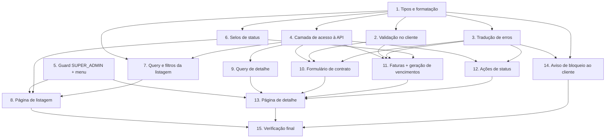

# Implementation Plan

## Overview

Plano de implementação do frontend do painel Financeiro Vizor (Next.js 15 +
Mantine 7 + react-query + Axios). A ordem segue de baixo para cima: primeiro o
núcleo puro e testável (tipos, formatação, validação, tradução de erros), depois
a camada de acesso à API e o guard de acesso, e por fim as telas que compõem
esses blocos. As funções puras são cobertas por testes property-based com
`fast-check`, alinhado ao padrão de qualidade do projeto.

## Tasks

- [x] 1. Base de tipos, formatação e enums espelhados do backend
  - Criar `src/lib/financeiro-vizor/types.ts` com os tipos e enums: `Modulo`/`MODULOS`, `StatusFinanceiro`, `StatusFatura`, `EmpresaStatusView`, `PrecoModuloView`, `FaturaView`, `DetalheCobranca`, `SalvarContratoInput`, `GerarVencimentosInput`, `GerarVencimentosResultado`, e as constantes de limite (`PRECO_MIN`, `PRECO_MAX`, `DIA_VENCIMENTO_MIN/MAX`, `MESES_MIN/MAX`)
  - Criar `src/lib/financeiro-vizor/format.ts` com `formatarBRL`, `formatarCompetencia`, `formatarData`
  - _Requirements: 2.3, 3.1, 3.4, 4.2_

- [x] 2. Validação no cliente (espelha o Zod do backend)
- [x] 2.1 Implementar funções puras de validação
  - Criar `src/lib/financeiro-vizor/validacao.ts` com `validarDiaVencimento`, `validarDataContrato`, `validarPreco`, `validarMeses` retornando `string | null`
  - _Requirements: 3.6, 3.7, 3.8, 4.12_
- [x] 2.2 Testes property-based da validação
  - Escrever testes `fast-check` cobrindo Property 2 (dia de vencimento), Property 3 (preço), Property 4 (data não futura), Property 5 (meses)
  - _Requirements: 3.6, 3.7, 3.8, 4.12_

- [x] 3. Tradução amigável de erros da API
- [x] 3.1 Implementar `traduzirErroApi`
  - Criar `src/lib/financeiro-vizor/erros.ts` mapeando erro Axios → mensagem amigável, priorizando `response.data.message`/`error` e caindo para texto por status (401/403/404/409/422/genérico)
  - _Requirements: 8.3, 8.4, 8.5, 8.6, 8.7, 8.8_
- [x] 3.2 Testes property-based da tradução de erro
  - Escrever testes `fast-check` cobrindo Property 10: qualquer erro produz string não vazia e nunca expõe apenas o código HTTP cru
  - _Requirements: 8.3, 8.4, 8.5, 8.6, 8.7, 8.8_

- [x] 4. Camada de acesso à API
  - Criar `src/hooks/financeiro-vizor/useFinanceiroVizorApi.ts` (objeto `financeiroVizorApi`) usando a instância `@/lib/api`: `listarEmpresas`, `obterDetalhe`, `salvarContrato`, `gerarVencimentos`, `darBaixa`, `cancelarFatura`, `reativar`, `inativar`
  - Garantir que todas as rotas usam o prefixo `/financeiro-vizor` sobre `NEXT_PUBLIC_API_URL` e que o Authorization vem do interceptor de `authStorage` já existente
  - _Requirements: 8.1, 8.2_

- [x] 5. Guard de acesso exclusivo SUPER_ADMIN
- [x] 5.1 Implementar hook de guarda de rota
  - Criar hook `useSuperAdminGuard` (interno ao módulo) que lê o token de `authStorage` e o perfil via `getUserPerfil()`; se token ausente/indecodificável → notificação de erro e não libera; se perfil ≠ SUPER_ADMIN → notificação de acesso negado + `router.replace('/dashboard')`
  - _Requirements: 1.3, 1.4, 1.5_
- [x] 5.2 Adicionar item de menu condicional
  - Exibir o item "Financeiro Vizor" no menu apenas quando `getUserPerfil() === 'SUPER_ADMIN'`; ocultar (não renderizar) para os demais perfis
  - _Requirements: 1.1, 1.2_

- [x] 6. Selos de status (badges)
- [x] 6.1 Implementar `StatusFinanceiroBadge` e `StatusFaturaBadge`
  - Criar os componentes em `src/components/financeiro-vizor/` com mapas de cor por valor de enum, usando `Badge` do Mantine com `variant="light"` (contraste em tema claro/escuro, sem cores fixas `-0`)
  - _Requirements: 2.2, 4.3, 7.2, 7.4_
- [x] 6.2 Testes dos selos
  - Testar que todo valor de `StatusFinanceiro`/`StatusFatura` mapeia para exatamente uma cor e valores distintos usam cores distintas (Property 8)
  - _Requirements: 2.2, 4.3_

- [x] 7. Query e filtros da listagem de empresas
- [x] 7.1 Hook de listagem
  - Criar `src/hooks/financeiro-vizor/useEmpresasFinanceiro.ts` (`useQuery` sobre `listarEmpresas`)
  - _Requirements: 2.1_
- [x] 7.2 Funções puras de filtro
  - Implementar filtro por nome (substring, case-insensitive) e por status (valor específico ou "todos") como funções puras reutilizáveis
  - _Requirements: 2.6, 2.7, 2.8_
- [x] 7.3 Testes property-based dos filtros
  - Escrever testes `fast-check` cobrindo Property 6 (filtro por nome) e Property 7 (filtro por status)
  - _Requirements: 2.6, 2.7, 2.8_

- [x] 8. Página de listagem de empresas
  - Criar `src/app/(interna)/financeiro-vizor/page.tsx` aplicando `useSuperAdminGuard`
  - Renderizar tabela Mantine (Nome, Status via badge, Total Mensal e Total Vencido via `formatarBRL`), campo de busca e `Select` de status; linha navega para `/financeiro-vizor/:id`
  - Exibir `Loader` enquanto carrega e estado vazio quando a lista é vazia
  - _Requirements: 2.1, 2.2, 2.3, 2.4, 2.5, 2.9_

- [x] 9. Query de detalhe da empresa
  - Criar `src/hooks/financeiro-vizor/useDetalheEmpresa.ts` (`useQuery` sobre `obterDetalhe(id)`)
  - _Requirements: 3.1, 4.1_

- [x] 10. Formulário de contrato e preços por módulo
- [x] 10.1 Componente `ContratoForm`
  - Criar `src/components/financeiro-vizor/ContratoForm.tsx` com `@mantine/form`: `DateInput` (dataContrato), `NumberInput` (diaVencimento) e um `NumberInput` por módulo (6 fixos, preço 0 default); exibir Total Mensal derivado da soma dos preços do form, recalculado a cada mudança
  - Aplicar `validate` com as funções de `validacao.ts`; bloquear submit e exibir mensagens preservando os dados quando inválido
  - _Requirements: 3.1, 3.2, 3.3, 3.4, 3.5, 3.6, 3.7, 3.8_
- [x] 10.2 Mutation de salvar contrato
  - Criar `src/hooks/financeiro-vizor/useContratoMutation.ts` (`useMutation` sobre `salvarContrato`) que invalida o detalhe no sucesso, mostra notificação verde, e em erro usa `traduzirErroApi` (notificação vermelha) preservando os dados
  - Desabilitar o botão salvar enquanto `isPending`
  - _Requirements: 3.5, 3.9, 3.10, 8.9_
- [x] 10.3 Teste do total mensal derivado
  - Testar Property 1: o Total Mensal exibido é a soma exata dos preços do form e altera pela mesma diferença ao mudar um preço
  - _Requirements: 3.4_

- [x] 11. Tabela de faturas e geração de vencimentos
- [x] 11.1 Componente `FaturasTable`
  - Criar `src/components/financeiro-vizor/FaturasTable.tsx`: colunas Competência (`formatarCompetencia`), Vencimento (`formatarData`), Valor (`formatarBRL`), Status (`StatusFaturaBadge`); estado vazio quando não há faturas
  - _Requirements: 4.2, 4.3, 4.4_
- [x] 11.2 Mutations de fatura
  - Criar `src/hooks/financeiro-vizor/useFaturaMutations.ts` com `darBaixa`, `cancelarFatura`, `gerarVencimentos`; cada uma invalida o detalhe no sucesso e mostra notificação (resultado da geração inclui `criadas`/`ignoradas`); erros via `traduzirErroApi`
  - Desabilitar o botão que disparou a ação enquanto `isPending`
  - _Requirements: 4.7, 4.9, 4.11, 4.13, 8.9_
- [x] 11.3 Confirmação de baixa e cancelamento
  - Usar `modals.openConfirmModal` antes de baixa e antes de cancelamento; enviar apenas ao confirmar
  - _Requirements: 4.6, 4.8_
- [x] 11.4 Modal de geração de vencimentos
  - Criar `src/components/financeiro-vizor/GerarVencimentosModal.tsx` com `NumberInput` de meses validado por `validarMeses` (bloqueia e mostra mensagem se inteiro fora de 1..60); enviar e notificar com o resultado
  - _Requirements: 4.10, 4.11, 4.12_

- [x] 12. Ações de status da empresa (reativar/inativar)
- [x] 12.1 Componente `AcoesStatusEmpresa`
  - Criar `src/components/financeiro-vizor/AcoesStatusEmpresa.tsx` com botões Reativar e Inativar, cada um abrindo `modals.openConfirmModal`
  - _Requirements: 5.1, 5.3_
- [x] 12.2 Mutations de status
  - Criar `src/hooks/financeiro-vizor/useStatusMutations.ts` com `reativar`/`inativar`; no sucesso atualizar o status exibido conforme a resposta e notificar (verde); em erro `traduzirErroApi` preservando o status anterior
  - Desabilitar o botão de confirmação enquanto `isPending`; garantir que a baixa de fatura NÃO invoca reativação
  - _Requirements: 5.2, 5.4, 5.5, 5.6, 5.7, 8.9_

- [x] 13. Página de detalhe da empresa
  - Criar `src/app/(interna)/financeiro-vizor/[id]/page.tsx` aplicando `useSuperAdminGuard` e `useDetalheEmpresa`
  - Cabeçalho com Total Mensal, Total Vencido, dias em atraso e `StatusFinanceiroBadge`; `Loader` enquanto carrega
  - Compor `ContratoForm`, `FaturasTable` (+ `GerarVencimentosModal`) e `AcoesStatusEmpresa`
  - _Requirements: 4.1, 4.5_

- [x] 14. Aviso de bloqueio para empresa cliente
  - Criar `src/components/financeiro-vizor/BloqueioFinanceiroAviso.tsx`: banner de somente-visualização em `SOMENTE_LEITURA`, tela de acesso impedido em `INATIVADO`, nada em `ATIVO`
  - Ao receber HTTP 403 do backend, exibir a mensagem da API de forma amigável (via `traduzirErroApi`), sem códigos técnicos
  - Montar o componente no layout da aplicação da empresa cliente
  - _Requirements: 6.1, 6.2, 6.3, 6.4, 6.5_

- [x] 15. Verificação final de padrões de interface e tratamento de erros
  - Revisar as telas para uso exclusivo de componentes Mantine 7, `TagsInput` onde houver campo de seleção-ou-digitação livre, e tokens de tema `*-light`/`*-filled` (sem `-0` fixo)
  - Conferir que 401 é tratado como sessão expirada em todas as chamadas e que notificações usam verde (sucesso) e vermelho (erro)
  - Rodar `npm run lint`, `npm run test` e `npm run build` e corrigir pendências
  - _Requirements: 7.1, 7.2, 7.3, 7.4, 8.3, 8.9_

## Task Dependency Graph



```json
{
  "waves": [
    { "wave": 1, "tasks": ["1"] },
    { "wave": 2, "tasks": ["2", "3", "4", "5", "6"] },
    { "wave": 3, "tasks": ["7", "9", "10", "11", "12", "14"] },
    { "wave": 4, "tasks": ["8", "13"] },
    { "wave": 5, "tasks": ["15"] }
  ]
}
```

## Notes

- Todo o estado durável reside no backend; o frontend só apresenta e aciona
  endpoints. A validação no cliente é para feedback imediato — a autoridade final
  é o Zod do backend.
- As funções puras (tarefas 2, 3, 7.2) devem ser mantidas sem I/O para
  viabilizar os testes property-based (Correctness Properties do design).
- O guard de acesso é estrito a `SUPER_ADMIN` — não reutilizar `usePerfilGuard`,
  que também libera `ADMIN`.
- A tarefa 14 (aviso de bloqueio) é o único componente montado fora do painel do
  SUPER_ADMIN; independe do guard de rota do painel.
