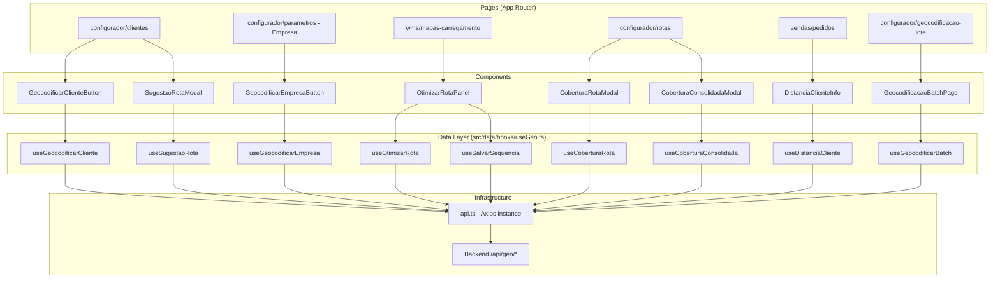

# Design Document: Geo Frontend Integration

## Overview

This design describes the frontend integration of geolocation capabilities into the VisioFab WMS system. The backend API endpoints (`/api/geo/*`) are already implemented; this feature adds the UI layer that allows users to geocode clients and the company, optimize delivery sequences, view route coverage, check distances, and perform batch geocoding.

The integration follows the existing project conventions: Next.js 15 App Router, Mantine v7 for UI components, TanStack Query v5 for server state management, Axios via `@/lib/api` for HTTP calls, and TypeScript throughout.

**Key Design Decisions:**
- All geo API calls are encapsulated in dedicated TanStack Query hooks at `src/data/hooks/useGeo.ts`
- No new pages are created for individual geo features — functionality is added to existing pages (Clientes, Empresa config, Mapas de Carregamento, Rotas, Vendas/Pedidos)
- One new page: Geocodificação em Lote at `(interna)/configurador/geocodificacao-lote/page.tsx`
- Notifications use `@mantine/notifications` with project-standard `notifications.show()`
- All mutation hooks automatically invalidate relevant query keys

---

## Architecture



### Data Flow Pattern

All geo operations follow the established project pattern:

1. **Queries (GET)**: `useQuery` with stale time, enabled conditions, and query keys for caching
2. **Mutations (POST)**: `useMutation` with `onSuccess` invalidating related query keys, `onError` showing notifications
3. **Notification pattern**: Success → `{ color: 'green' }`, Error → `{ color: 'red' }` with API message
4. **Loading states**: `isPending` from mutation or `isLoading` from query → disable buttons / show overlay

---

## Components and Interfaces

### GeocodificarClienteButton

**Location:** `src/components/geo/GeocodificarClienteButton.tsx`

**Purpose:** Renders a geocode button for a client. Shown when client has address (CEP or cidade). Calls the mutation and shows result feedback.

```typescript
interface GeocodificarClienteButtonProps {
  clienteId: string
  temEndereco: boolean  // cep || cidade exists
  temCoordenadas: boolean
}
```

**Behavior:**
- Renders `<Button>` with `IconMapPin` icon, text "Geocodificar"
- Disabled when `!temEndereco` or mutation `isPending`
- On click: calls `useGeocodificarCliente.mutate(clienteId)`
- Success: shows green notification "Coordenadas atualizadas com sucesso"
- Error 503: shows orange notification "Serviço de geocodificação temporariamente indisponível"
- Other errors: shows red notification with API message

### SugestaoRotaModal

**Location:** `src/components/geo/SugestaoRotaModal.tsx`

**Purpose:** Modal showing route suggestions based on geographic proximity.

```typescript
interface SugestaoRotaModalProps {
  opened: boolean
  onClose: () => void
  clienteId: string
  onRotaSelecionada: (rotaId: string) => void
}
```

**Behavior:**
- Uses `useSugestaoRota(clienteId)` query, enabled when `opened`
- Displays Table with columns: Código, Descrição, Distância Média (km), Qtd Clientes
- Empty state: message "Não há rotas com clientes geocodificados para comparação"
- Each row has "Selecionar" button → calls `onRotaSelecionada(rotaId)`

### GeocodificarEmpresaButton

**Location:** `src/components/geo/GeocodificarEmpresaButton.tsx`

**Purpose:** Geocode button for the company address.

```typescript
interface GeocodificarEmpresaButtonProps {
  temEndereco: boolean
  temCoordenadas: boolean
}
```

**Behavior:**
- Same pattern as `GeocodificarClienteButton` but calls `useGeocodificarEmpresa`
- When `!temCoordenadas`: shows `<Alert color="yellow">` informing geocoding is needed for route optimization

### OtimizarRotaPanel

**Location:** `src/components/geo/OtimizarRotaPanel.tsx`

**Purpose:** Panel within the Mapa de Carregamento detail that allows optimizing and saving delivery sequence.

```typescript
interface OtimizarRotaPanelProps {
  mapaId: string
  status: string
  nfs: MapaNf[]
}

interface SequenciaItem {
  ordem: number
  clienteRazaoSocial: string
  endereco: string
  distanciaParcialKm: number | null
  temGeolocalizacao: boolean
}
```

**Behavior:**
- Shows "Otimizar Rota" button only when `status === 'AGUARDANDO_SEPARACAO' || status === 'EM_CARREGAMENTO'`
- On click: calls `useOtimizarRota.mutate(mapaId)`
- Renders optimized list as Table: Ordem, Cliente, Endereço, Distância Parcial
- Non-geocoded clients shown at end with Badge "Sem geolocalização" and distance "—"
- Shows Card with `distanciaTotalKm` prominently (Badge with km value)
- After optimization: shows "Salvar Sequência" button
- On save: calls `useSalvarSequencia.mutate({ mapaId, sequencia })`
- Error about empresa without coords: specific notification guiding to geocode empresa first

### CoberturaRotaModal

**Location:** `src/components/geo/CoberturaRotaModal.tsx`

**Purpose:** Modal showing the geographic coverage of a single route.

```typescript
interface CoberturaRotaModalProps {
  opened: boolean
  onClose: () => void
  rotaId: string
  rotaDescricao: string
}
```

**Behavior:**
- Uses `useCoberturaRota(rotaId)` query
- Header card: total geocodificados / não-geocodificados
- Accordion or nested list: Cidade → Bairros com quantidade de clientes

### CoberturaConsolidadaModal

**Location:** `src/components/geo/CoberturaConsolidadaModal.tsx`

**Purpose:** Modal showing consolidated coverage across all routes with overlap highlighting.

```typescript
interface CoberturaConsolidadaModalProps {
  opened: boolean
  onClose: () => void
}
```

**Behavior:**
- Uses `useCoberturaConsolidada()` query
- Displays all routes' coverage grouped by city/bairro
- Overlapping areas (same city+bairro served by multiple routes) highlighted with `Badge color="orange"` listing the conflicting routes

### DistanciaClienteInfo

**Location:** `src/components/geo/DistanciaClienteInfo.tsx`

**Purpose:** Shows distance between empresa and client in the order detail.

```typescript
interface DistanciaClienteInfoProps {
  clienteId: string
  clienteTemCoordenadas: boolean
  empresaTemCoordenadas: boolean
}
```

**Behavior:**
- If `!clienteTemCoordenadas`: renders "Distância: não disponível (cliente sem geolocalização)"
- If `!empresaTemCoordenadas`: renders "Distância: não disponível (empresa sem geolocalização)"
- Otherwise: uses `useDistanciaCliente(clienteId)`, displays `{value.toFixed(2)} km`

### GeoStatusBadge

**Location:** `src/components/geo/GeoStatusBadge.tsx`

**Purpose:** Small badge/icon indicating geocoding status in client listings.

```typescript
interface GeoStatusBadgeProps {
  geocodificado: boolean
}
```

**Behavior:**
- `geocodificado === true`: `<Badge color="green" size="xs">` with `IconMapPinFilled`
- `geocodificado === false`: `<Badge color="gray" size="xs">` with `IconMapPinOff`

---

## Data Models

### API Response Types

```typescript
// Geocodificação response
interface GeocodificacaoResult {
  latitude: number
  longitude: number
  enderecoFormatado?: string
}

// Sugestão de rota response
interface SugestaoRota {
  rotaId: string
  codigo: string
  descricao: string
  distanciaMediaKm: number
  quantidadeClientes: number
}

// Otimização de rota response
interface OtimizacaoResult {
  sequencia: SequenciaEntrega[]
  distanciaTotalKm: number
}

interface SequenciaEntrega {
  ordem: number
  nfeId: string
  clienteId: string
  clienteRazaoSocial: string
  endereco: string
  distanciaParcialKm: number | null
  temGeolocalizacao: boolean
}

// Salvar sequência request
interface SalvarSequenciaRequest {
  sequencia: Array<{
    nfeId: string
    ordem: number
  }>
}

// Distância response
interface DistanciaResult {
  distanciaKm: number
  origemLatitude: number
  origemLongitude: number
  destinoLatitude: number
  destinoLongitude: number
}

// Cobertura de rota response
interface CoberturaRota {
  rotaId: string
  rotaDescricao: string
  totalClientesGeocodificados: number
  totalClientesNaoGeocodificados: number
  cidades: CidadeCobertura[]
}

interface CidadeCobertura {
  cidade: string
  uf: string
  bairros: BairroCobertura[]
}

interface BairroCobertura {
  bairro: string
  quantidadeClientes: number
}

// Cobertura consolidada response
interface CoberturaConsolidada {
  rotas: CoberturaRota[]
  sobreposicoes: Sobreposicao[]
}

interface Sobreposicao {
  cidade: string
  bairro: string
  rotas: Array<{ rotaId: string; codigo: string; descricao: string }>
}

// Batch geocodificação response
interface BatchGeoResult {
  totalProcessados: number
  sucessos: number
  falhas: number
  detalheFalhas: Array<{
    clienteId: string
    razaoSocial: string
    motivo: string
  }>
}

// Resumo para tela de lote
interface ResumoGeoClientes {
  total: number
  geocodificados: number
  naoGeocodificados: number
}
```

### Query Keys

```typescript
const GEO_KEYS = {
  clientes: 'clientes',                          // existing key
  empresa: 'empresa-config',                     // empresa configuration data
  mapas: 'mapas-carregamento',                   // existing key
  distancia: (clienteId: string) => ['geo-distancia', clienteId],
  sugestaoRota: (clienteId: string) => ['geo-sugestao-rota', clienteId],
  coberturaRota: (rotaId: string) => ['geo-cobertura', rotaId],
  coberturaConsolidada: ['geo-cobertura-consolidada'],
  resumoGeo: ['geo-resumo-clientes'],
}
```

---

## Correctness Properties

*A property is a characteristic or behavior that should hold true across all valid executions of a system — essentially, a formal statement about what the system should do. Properties serve as the bridge between human-readable specifications and machine-verifiable correctness guarantees.*

### Property 1: Geocode button visibility follows address condition

*For any* client object, the "Geocodificar" button is rendered (enabled) if and only if the client has a non-empty `cep` or a non-empty `cidade` field.

**Validates: Requirements 1.1**

### Property 2: Geocoding status indicator reflects coordinates

*For any* client object, the geo status badge indicates "geocodificado" if and only if the client has non-null `latitude` and `longitude` values.

**Validates: Requirements 1.7**

### Property 3: Route suggestion button enabled iff client has coordinates

*For any* client object, the "Sugerir Rota" button is enabled if and only if the client has non-null `latitude` and `longitude` values; otherwise the button is disabled with an explanatory tooltip.

**Validates: Requirements 2.1, 2.5**

### Property 4: Route suggestion display contains all required fields

*For any* non-empty array of route suggestions, every rendered suggestion item contains the route code, description, average distance in km, and client count.

**Validates: Requirements 2.3**

### Property 5: Optimize route button visibility follows map status

*For any* Mapa de Carregamento, the "Otimizar Rota" button is visible if and only if the status is `AGUARDANDO_SEPARACAO` or `EM_CARREGAMENTO`.

**Validates: Requirements 4.1**

### Property 6: Non-geocoded clients appear at end of optimized sequence

*For any* optimized delivery sequence containing both geocoded and non-geocoded clients, all non-geocoded clients appear after all geocoded clients, each with a "Sem geolocalização" indicator and distance shown as "—".

**Validates: Requirements 4.3, 4.4**

### Property 7: Romaneio display mode matches sequence existence

*For any* romaneio view, the order number and partial distance columns are displayed if and only if the underlying Mapa de Carregamento has a saved delivery sequence; when displayed, NFs are rendered in sequence order.

**Validates: Requirements 5.1, 5.2, 5.3, 5.5**

### Property 8: Distance formatting consistency

*For any* numeric distance value returned by the API, the displayed string formats the value to exactly 2 decimal places followed by " km".

**Validates: Requirements 6.3**

### Property 9: Coverage overlap highlighting

*For any* consolidated coverage dataset where a city+bairro combination is served by more than one route, that combination is visually highlighted and lists all overlapping routes.

**Validates: Requirements 7.7**

### Property 10: Batch result summary correctness

*For any* batch geocoding result, the displayed summary shows `sucessos + falhas === totalProcessados`, and the failure detail list contains exactly `falhas` items each with a client name and error reason.

**Validates: Requirements 8.5**

### Property 11: Geo hooks call correct endpoints

*For any* geo hook invocation with a valid entity ID, the hook calls the correct API endpoint path (as specified per hook) and, for mutation hooks, invalidates the appropriate query key upon success.

**Validates: Requirements 9.1, 9.2, 9.3, 9.4, 9.5, 9.6, 9.7, 9.8**

### Property 12: Buttons disabled during pending mutation

*For any* geo action button, the button is disabled (non-clickable) while a mutation is in the pending state for the same resource, preventing duplicate submissions.

**Validates: Requirements 10.1, 10.5**

### Property 13: Success notifications use green color

*For any* geo operation that completes successfully, a notification is shown with `color: 'green'` at position top-right.

**Validates: Requirements 10.2**

### Property 14: Error notifications use red color with API message

*For any* geo operation that fails (non-503), a notification is shown with `color: 'red'` and the message text matches the error message returned by the API.

**Validates: Requirements 10.3**

---

## Error Handling

### Error Classification and Responses

| HTTP Status | Scenario | User-Facing Action |
|---|---|---|
| 200 | Success | Green notification + UI update |
| 400 | Bad request / validation | Red notification with API message |
| 404 | Resource not found | Red notification with API message |
| 422 | Business rule violation (e.g., empresa sem coords) | Red notification with specific guidance message |
| 503 | Geocoding service unavailable | Orange notification: "Serviço de geocodificação temporariamente indisponível. Tente novamente mais tarde." |
| 5xx (other) | Server error | Red notification: "Erro interno. Tente novamente." |

### Error Handling Strategy per Hook

All mutation hooks follow a consistent error handling pattern:

```typescript
onError: (error: AxiosError<{ message?: string }>) => {
  const status = error.response?.status
  const message = error.response?.data?.message

  if (status === 503) {
    notifications.show({
      title: 'Serviço Indisponível',
      message: 'Serviço de geocodificação temporariamente indisponível. Tente novamente mais tarde.',
      color: 'orange',
    })
  } else {
    notifications.show({
      title: 'Erro',
      message: message || 'Ocorreu um erro inesperado.',
      color: 'red',
    })
  }
}
```

### Specific Business Error: Empresa sem Coordenadas

When the optimization endpoint returns an error indicating the empresa lacks coordinates (status 422 with specific message pattern), the notification should guide the user:

> "A empresa não possui coordenadas cadastradas. Acesse Configurador → Empresa para geocodificar o endereço."

### Batch Operation Partial Failure

The batch geocoding page handles partial failures by:
1. Displaying total success/failure counts
2. Rendering a table of failed clients with reasons
3. Offering a "Reexecutar Falhas" button that re-submits only the failed client IDs

---

## Testing Strategy

### Testing Framework

The project currently uses Playwright for E2E tests and has no unit test setup. For this feature:

- **Unit/Component tests**: Add Vitest + React Testing Library for component and hook testing
- **Property-based tests**: Use `fast-check` with Vitest for property tests (minimum 100 iterations per property)
- **E2E tests**: Playwright for critical flows (geocode client, optimize route)

### Unit Tests (Example-Based)

| Component/Hook | What to test |
|---|---|
| `useGeocodificarCliente` | Correct endpoint, cache invalidation |
| `GeocodificarClienteButton` | Loading state, disabled state, success/error notifications |
| `OtimizarRotaPanel` | Button visibility by status, save sequence flow |
| `DistanciaClienteInfo` | Fallback messages for missing coordinates |
| `CoberturaRotaModal` | Data rendering, empty state |
| `GeocodificacaoBatchPage` | Batch flow, retry mechanism |

### Property-Based Tests

Each correctness property (1–14) maps to a property-based test using `fast-check`:

- **Property 1**: Generate arbitrary client objects with random address fields; assert button rendered iff cep or cidade is non-empty
- **Property 2**: Generate clients with random lat/lng (or null); assert badge state matches
- **Property 3**: Generate clients with random coordinates (or null); assert button enabled/disabled state
- **Property 4**: Generate arbitrary arrays of suggestion objects; assert all fields present in rendered output
- **Property 5**: Generate maps with random statuses; assert button visibility
- **Property 6**: Generate mixed sequences; assert ordering invariant
- **Property 7**: Generate romaneio data with/without sequence; assert column presence
- **Property 8**: Generate random floats; assert formatted string matches `X.XX km` pattern
- **Property 9**: Generate coverage data with overlaps; assert highlighting
- **Property 10**: Generate batch results; assert summary consistency
- **Property 11**: Generate random IDs; assert hook endpoint correctness
- **Property 12**: Render button during pending state; assert disabled
- **Property 13-14**: After mutation resolution; assert notification config

**Configuration:**
- Library: `fast-check` (npm package)
- Minimum iterations: 100 per property
- Tag format: `// Feature: geo-frontend-integration, Property N: {description}`

### E2E Tests (Playwright)

| Flow | Steps |
|---|---|
| Geocodificar Cliente | Navigate to client detail → Click geocodificar → Verify coordinates appear |
| Otimizar Rota | Open mapa detail → Click otimizar → Verify sequence → Save |
| Geocodificação em Lote | Navigate to batch page → Execute → Verify results |
