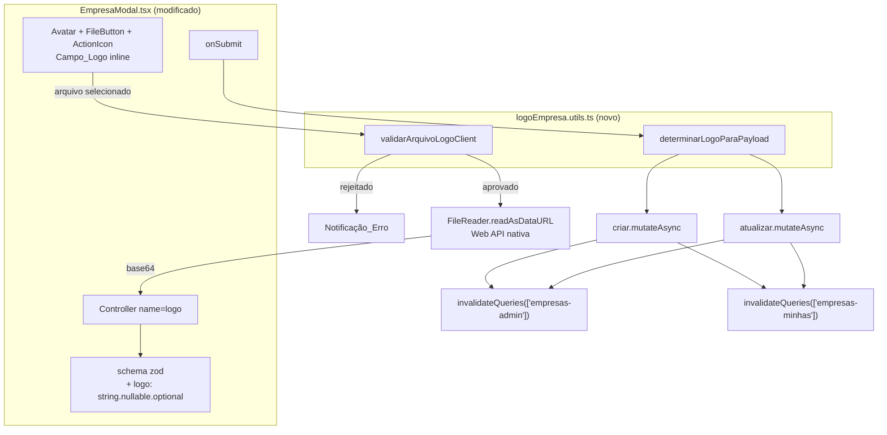
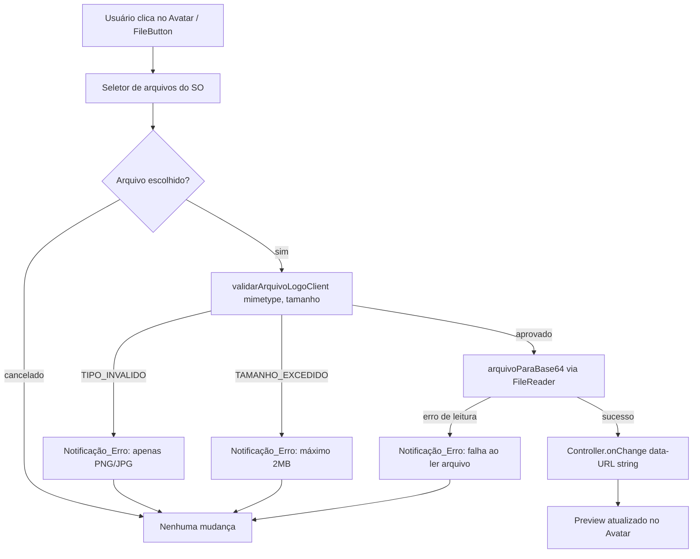
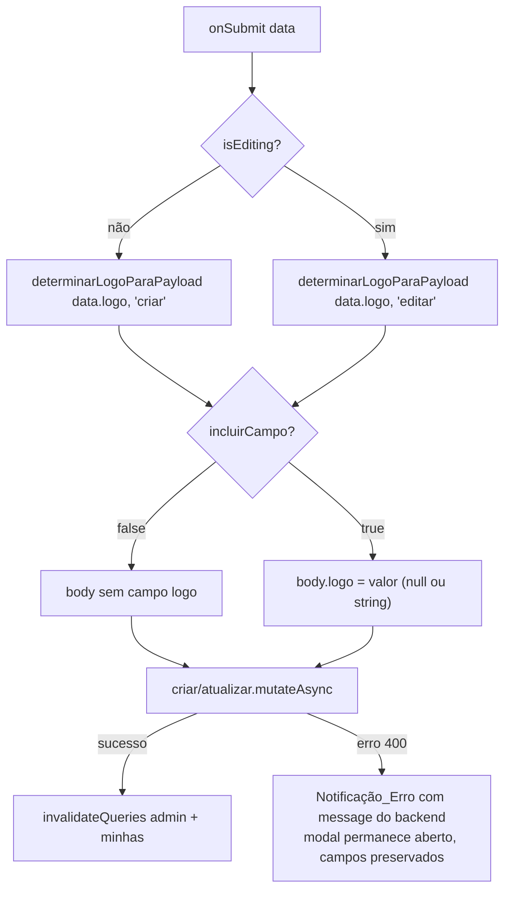

# Design Document — Logo da Empresa (Frontend)

## Overview

Esta feature adiciona o Campo_Logo ao `EmpresaModal.tsx` (bloco "MAIN
FIELDS", fora das Tabs), permitindo selecionar, trocar e remover o
logotipo de uma Empresa ao criar ou editar. O contrato de transporte já é
fixo pelo backend (spec `logo-empresa`): o campo `logo` viaja como string
base64 (com ou sem prefixo `data:image/...;base64,`) no corpo JSON de
`POST /empresas` e `PUT /empresas/:id`, aceitando `string | null |
undefined` — ausência mantém o valor atual, `null` remove, string
define/troca. O backend é a autoridade final de validação (formato via
magic bytes, tamanho máximo de 2.000.000 bytes de conteúdo binário
decodificado) e retorna 400 com mensagem em português quando o conteúdo é
inválido.

O trabalho neste repositório se resume a:

1. Adicionar o Campo_Logo (Avatar + FileButton + ActionIcon de remoção) ao
   bloco de campos principais do `EmpresaModal.tsx`.
2. Extrair duas funções puras — `validarArquivoLogoClient` e
   `determinarLogoParaPayload` — em um novo arquivo utilitário
   `logoEmpresa.utils.ts`, paralelo ao `selecaoEmpresa.utils.ts` já
   existente na mesma pasta.
3. Adicionar `logo` ao schema Zod do formulário e ao estado inicializado
   por `reset()`.
4. Ajustar a montagem do payload das mutations `criar`/`atualizar` e suas
   invalidações de query.

### Decisões de Design

- **Campo_Logo embutido inline no próprio `EmpresaModal.tsx`, não extraído
  para um componente separado.** É usado em um único lugar, sua marcação
  (Avatar + FileButton + ActionIcon) é pequena (~15-20 linhas de JSX) e já
  existe um precedente idêntico neste mesmo repositório
  (`configurador/empresa/page.tsx`, bloco "Logo upload area") que também
  mantém essa marcação inline em vez de extraí-la. Extrair um componente
  `CampoLogoEmpresa` separado adicionaria um arquivo e uma camada de props
  sem ganho de reuso ou de legibilidade nesta escala. Se o Campo_Logo
  precisar ser reaproveitado em um segundo lugar no futuro, a extração
  pode ser feita então.
- **Lógica pura extraída para `logoEmpresa.utils.ts`, lógica de UI mantida
  inline.** Ainda que o componente visual não seja extraído, a validação
  do arquivo (`validarArquivoLogoClient`) e a decisão do valor do payload
  (`determinarLogoParaPayload`) são funções puras sem dependência de
  estado de componente React — extraí-las para um arquivo utilitário
  próprio as torna testáveis isoladamente com fast-check, seguindo
  exatamente o padrão já usado por `selecaoEmpresa.utils.ts` /
  `selecaoEmpresa.utils.test.ts` e por `src/utils/produtoSku.ts` /
  `produtoSku.test.ts` neste repositório.
- **Conversão File → base64 via `FileReader.readAsDataURL` nativo, sem
  dependência nova.** É a API padrão do browser para esse fim, já
  suportada pelo ambiente de teste do projeto (`vitest.config.ts` usa
  `environment: 'jsdom'`, que implementa `FileReader`/`Blob`/`File`). Não
  há necessidade de bibliotecas como `react-dropzone` ou `file-saver` para
  este caso de uso pontual (um único arquivo, sem drag-and-drop).
- **Validação client-side é um pré-filtro de UX, não a autoridade de
  validação.** O limite de tamanho verificado no client (2.097.152 bytes /
  2MB, sobre o arquivo bruto selecionado, conforme Requirement 2.3) é
  ligeiramente diferente do limite do backend (2.000.000 bytes, sobre o
  conteúdo binário decodificado do base64, conforme spec `logo-empresa`).
  Essa diferença é aceitável e intencional: o objetivo do
  `validarArquivoLogoClient` é dar feedback imediato ao usuário antes de
  qualquer round-trip de rede; a validação final e definitiva — incluindo
  a verificação real de formato por assinatura binária — permanece
  exclusivamente no backend. Um arquivo que passe a validação client-side
  ainda pode, em tese, ser rejeitado pelo backend (ex.: um arquivo `.png`
  corrompido cujo conteúdo não corresponde à assinatura PNG); esse caso é
  coberto pelo Requirement 6 (exibição do erro 400 do backend).
- **`Controller` do react-hook-form para o campo `logo`**, consistente com
  o padrão já usado por todos os outros campos do `EmpresaModal.tsx`
  (`razaoSocial`, `nomeFantasia`, `cnpj`, etc.). O valor do campo no
  formulário é sempre `string | null` (nunca `undefined` em runtime,
  exceto antes do primeiro `reset()`), já que o `undefined` semântico ("o
  usuário não tocou no campo") é representado pela ausência de interação,
  não por um valor explícito — ver seção "Estado do Campo_Logo".
- **Tratamento de erro 400 do backend reaproveita o catch genérico já
  existente no `onSubmit`** (`err?.response?.data?.message`). Nenhuma
  lógica nova é necessária para o Requirement 6: a mensagem de erro
  retornada pelo backend para qualquer motivo de rejeição do logo
  (`FORMATO_INVALIDO`, `TAMANHO_EXCEDIDO`, `BASE64_INVALIDO`) já chega em
  `err.response.data.message` e já é exibida pela `Notificação_Erro`
  existente, sem fechar o modal e sem chamar `reset()` — o catch não altera
  o estado do formulário em nenhum campo.

## Architecture



### Fluxo de seleção de arquivo



### Fluxo de submit (montagem do payload)



## Components and Interfaces

### Estado do Campo_Logo

O valor do campo `logo` no formulário (`FormValues['logo']`) assume um dos
três significados definidos no Glossário dos requisitos:

| Valor em runtime | Significado |
|---|---|
| `null` | Sem logo — nenhuma imagem cadastrada, ou removida explicitamente pelo usuário |
| string base64/data-URL | Logo definido, cadastrado ou trocado |

O significado "`undefined` — nenhuma alteração" (Requirement 4.1) **não é
representado por um valor `undefined` em runtime no estado do
formulário**, e sim pela ausência de interação do usuário com o campo
durante a sessão de edição, combinada com a lógica de
`determinarLogoParaPayload`: em modo edição, se o valor do campo no
formulário for exatamente igual ao valor original de `editData.logo`
(inicializado por `reset`) **e** o usuário não tiver trocado nem removido
o logo, o campo é omitido do payload. Para manter essa função pura e
simples de testar, a implementação real usa um `ref` (ou variável local no
`onSubmit`) que sinaliza "o Campo_Logo foi tocado nesta sessão de edição" —
ver `determinarLogoParaPayload` abaixo, cuja assinatura recebe esse sinal
explicitamente em vez de inferir por comparação de valores.

### `src/app/(interna)/selecionar-empresa/logoEmpresa.utils.ts` (novo)

Módulo puro, sem dependências de React/Mantine/rede — testável
isoladamente com fast-check, seguindo o padrão de `selecaoEmpresa.utils.ts`.

```typescript
export const MIMETYPES_LOGO_PERMITIDOS = ['image/png', 'image/jpeg'] as const
export const TAMANHO_MAXIMO_LOGO_CLIENT_BYTES = 2_097_152 // 2MB

export type MotivoRejeicaoLogoClient = 'TIPO_INVALIDO' | 'TAMANHO_EXCEDIDO'

export type ResultadoValidacaoLogoClient =
  | { aprovado: true }
  | { aprovado: false; motivo: MotivoRejeicaoLogoClient }

/**
 * Validador_Logo_Client (Requirement 2). Função pura — recebe apenas o
 * mimetype declarado e o tamanho em bytes do arquivo (nunca o conteúdo
 * binário), sem I/O. Verifica tipo MIME antes de tamanho; ambos precisam
 * ser válidos para aprovação.
 */
export function validarArquivoLogoClient(
  mimetype: string,
  tamanhoBytes: number,
): ResultadoValidacaoLogoClient {
  if (!MIMETYPES_LOGO_PERMITIDOS.includes(mimetype as any)) {
    return { aprovado: false, motivo: 'TIPO_INVALIDO' }
  }
  if (tamanhoBytes > TAMANHO_MAXIMO_LOGO_CLIENT_BYTES) {
    return { aprovado: false, motivo: 'TAMANHO_EXCEDIDO' }
  }
  return { aprovado: true }
}

/** Mensagem amigável em português para cada motivo de rejeição client-side. */
export function mensagemErroLogoClient(motivo: MotivoRejeicaoLogoClient): string {
  switch (motivo) {
    case 'TIPO_INVALIDO':
      return 'Apenas arquivos PNG ou JPG são aceitos para o logo.'
    case 'TAMANHO_EXCEDIDO':
      return 'O tamanho máximo permitido para o logo é 2MB.'
  }
}

export type ModoFormularioEmpresa = 'criar' | 'editar'

export interface DecisaoPayloadLogo {
  incluirCampo: boolean
  valor?: string | null
}

/**
 * Requirement 4 — decide se o campo `logo` deve constar no corpo enviado
 * ao backend, e com qual valor. Função pura, sem I/O.
 *
 * `estadoLogo`: valor atual do campo no formulário (`string | null`).
 * `logoFoiTocado`: `true` se o usuário interagiu com o Campo_Logo durante
 *   esta sessão (selecionou um arquivo novo OU removeu o logo existente);
 *   `false` se o campo permanece exatamente como foi inicializado por
 *   `reset()` (relevante apenas em modo 'editar' — em modo 'criar' o
 *   valor inicial é sempre `null` e qualquer seleção já é "tocado").
 *
 * Regra: em modo 'criar', o campo é sempre incluído (com `null` quando
 * nenhum arquivo foi selecionado, ou com a string quando foi). Em modo
 * 'editar', o campo só é incluído quando `logoFoiTocado === true`;
 * caso contrário é omitido, preservando o logo já cadastrado no backend.
 */
export function determinarLogoParaPayload(
  estadoLogo: string | null,
  modo: ModoFormularioEmpresa,
  logoFoiTocado: boolean,
): DecisaoPayloadLogo {
  if (modo === 'editar' && !logoFoiTocado) {
    return { incluirCampo: false }
  }
  return { incluirCampo: true, valor: estadoLogo }
}
```

### Conversão File → base64

```typescript
/**
 * Requirement 3.1 — converte um `File` aprovado pelo Validador_Logo_Client
 * em uma string base64 no formato data-URL, usando a Web API nativa
 * `FileReader`. Não valida o arquivo (isso já ocorreu antes de chamar esta
 * função) e não lança: rejeita a Promise em caso de erro de leitura.
 */
function arquivoParaBase64(file: File): Promise<string> {
  return new Promise((resolve, reject) => {
    const reader = new FileReader()
    reader.onload = () => resolve(reader.result as string)
    reader.onerror = () => reject(reader.error ?? new Error('Falha ao ler o arquivo'))
    reader.readAsDataURL(file)
  })
}
```

Definida inline em `EmpresaModal.tsx` (não em `logoEmpresa.utils.ts`) por
depender da Web API `FileReader`, que não está disponível em todo runtime
Node — mantém `logoEmpresa.utils.ts` livre de qualquer dependência de
ambiente de browser, preservando a facilidade de testá-lo também fora do
`jsdom` se necessário no futuro.

### `EmpresaModal.tsx` (modificado)

**Schema Zod** — adicionar ao objeto já existente:

```typescript
const schema = z.object({
  // ...campos existentes...
  logo: z.string().nullable().optional(),
})
```

**Estado auxiliar de "campo tocado"**: uma variável de ref (`useRef<boolean>(false)`)
resetada para `false` a cada `reset()` (novo `useEffect` que já existe,
disparado por `[editData, reset, opened]`), e marcada como `true` dentro do
handler de seleção de arquivo aprovado e do handler de remoção.

**Inicialização em modo edição** (dentro do `useEffect` já existente):

```typescript
reset({
  // ...demais campos...
  logo: editData?.logo ?? null,
})
logoFoiTocadoRef.current = false
```

**Bloco "MAIN FIELDS"** — Campo_Logo adicionado ao lado dos campos
existentes, usando Mantine `Avatar` (preview), `FileButton` (seleção) e
`ActionIcon` com `IconTrash` (remoção), seguindo o padrão visual já usado
em `configurador/empresa/page.tsx`:

```tsx
<Controller name="logo" control={control} render={({ field }) => (
  <div className="flex flex-col items-center gap-2">
    <Avatar src={field.value || undefined} size={80} radius="md">
      {!field.value && <IconBuildingSkyscraper size={32} />}
    </Avatar>
    <Group gap={4}>
      <FileButton
        onChange={async (file) => {
          if (!file) return
          const resultado = validarArquivoLogoClient(file.type, file.size)
          if (!resultado.aprovado) {
            notifications.show({
              title: 'Arquivo inválido',
              message: mensagemErroLogoClient(resultado.motivo),
              color: 'red',
            })
            return
          }
          try {
            const base64 = await arquivoParaBase64(file)
            logoFoiTocadoRef.current = true
            field.onChange(base64)
          } catch {
            notifications.show({
              title: 'Erro',
              message: 'Não foi possível ler o arquivo selecionado.',
              color: 'red',
            })
          }
        }}
        accept="image/png,image/jpeg"
      >
        {(props) => <Button size="xs" variant="light" {...props}>{field.value ? 'Trocar' : 'Enviar'}</Button>}
      </FileButton>
      {field.value && (
        <ActionIcon
          size="sm" variant="light" color="red"
          onClick={() => {
            logoFoiTocadoRef.current = true
            field.onChange(null)
          }}
        >
          <IconTrash size={14} />
        </ActionIcon>
      )}
    </Group>
  </div>
)} />
```

**Montagem do payload no `onSubmit`**:

```typescript
async function onSubmit(data: FormValues) {
  const decisaoLogo = determinarLogoParaPayload(
    data.logo ?? null,
    isEditing ? 'editar' : 'criar',
    logoFoiTocadoRef.current,
  )
  const { logo, ...resto } = data
  const body = decisaoLogo.incluirCampo ? { ...resto, logo: decisaoLogo.valor } : resto

  try {
    if (isEditing) {
      await atualizar.mutateAsync({ id: editData.id, ...body })
    } else {
      await criar.mutateAsync(body)
    }
    // ...notificação de sucesso + onClose(), inalterado...
  } catch (err: any) {
    // ...catch genérico já existente, inalterado — cobre Requirement 6...
  }
}
```

**Invalidação de queries** — em ambas as mutations:

```typescript
onSuccess: () => {
  queryClient.invalidateQueries({ queryKey: ['empresas-admin'] })
  queryClient.invalidateQueries({ queryKey: ['empresas-minhas'] })
},
```

## Data Models

Nenhum novo modelo de dados. Extensão do tipo já existente do formulário:

```typescript
type FormValues = z.infer<typeof schema> // agora inclui: logo: string | null | undefined
```

`editData` (prop já existente, tipo `any`) passa a ser lido também em
`editData?.logo: string | null | undefined`, conforme já retornado por
`GET /empresas/minhas` (spec backend `logo-empresa`, Requirement do
endpoint `GET /empresas/minhas` expondo `logo`).

## Correctness Properties

*A property is a characteristic or behavior that should hold true across all valid executions of a system — essentially, a formal statement about what the system should do. Properties serve as a bridge between human-readable specifications and machine-verifiable correctness guarantees.*

Todas as properties abaixo testam funções puras (`validarArquivoLogoClient`,
`determinarLogoParaPayload`, e a lógica pura de decisão de preview/remoção
extraível como funções auxiliares), sem depender de rede ou de renderização
real de componente — seguindo o padrão de `src/utils/produtoSku.test.ts` e
`selecaoEmpresa.utils.test.ts` (fast-check + vitest, mínimo 100 iterações).
A conversão `arquivoParaBase64` depende da Web API `FileReader`, disponível
em `jsdom` (`environment: 'jsdom'` já configurado em `vitest.config.ts`),
permitindo testá-la também com fast-check.

### Reflexão sobre redundância

Os Acceptance Criteria 1.3 e 1.4 são complementares (exibir preview *sse*
não deve exibir placeholder) e foram consolidados na Property 1. Os
Acceptance Criteria 2.2, 2.3 e 2.4 descrevem os três desfechos possíveis
de uma única função de classificação (`validarArquivoLogoClient`) e foram
consolidados na Property 4, evitando três testes que exercitam a mesma
função com apenas a combinação de condições variando. Os Acceptance
Criteria 4.1 a 4.5 descrevem o comportamento de uma única função
(`determinarLogoParaPayload`) para diferentes combinações de entrada e
foram consolidados na Property 6. Os Acceptance Criteria 5.4 e 5.5 são
complementares (inicializar com o valor vs. inicializar com `null`) e
foram consolidados na Property 7.

### Property 1: Preview é exibido se e somente se o Estado_Logo é uma string não vazia

*For any* valor de Estado_Logo (`null`, ou qualquer string, incluindo a
string vazia), o Campo_Logo SHALL exibir o preview da imagem se e somente
se esse valor for uma string com comprimento maior que zero; caso
contrário SHALL exibir o placeholder padrão sem imagem.

**Validates: Requirements 1.3, 1.4**

### Property 2: Botão de remover é exibido se e somente se há um logo definido

*For any* valor de Estado_Logo (`null`, ou qualquer string não vazia), o
controle de remoção do Campo_Logo SHALL estar visível se e somente se esse
valor for uma string não vazia.

**Validates: Requirements 1.5**

### Property 3: Remover sempre resulta em Estado_Logo igual a `null`

*For any* valor atual de Estado_Logo (incluindo `null` ou qualquer string),
acionar o controle de remoção SHALL sempre definir o novo Estado_Logo como
`null`, independentemente do valor anterior.

**Validates: Requirements 1.6**

### Property 4: `validarArquivoLogoClient` classifica corretamente por tipo MIME e tamanho

*For any* string de mimetype e qualquer inteiro não negativo de
tamanhoBytes: (a) se o mimetype não pertence a `{image/png, image/jpeg}`,
`validarArquivoLogoClient` SHALL retornar `{ aprovado: false, motivo:
'TIPO_INVALIDO' }`, independentemente do tamanho; (b) se o mimetype
pertence ao conjunto permitido e o tamanho excede 2.097.152 bytes,
`validarArquivoLogoClient` SHALL retornar `{ aprovado: false, motivo:
'TAMANHO_EXCEDIDO' }`; (c) se o mimetype pertence ao conjunto permitido e
o tamanho é menor ou igual a 2.097.152 bytes, `validarArquivoLogoClient`
SHALL retornar `{ aprovado: true }`.

**Validates: Requirements 2.2, 2.3, 2.4, 2.5**

### Property 5: Conversão File → base64 é um round-trip fiel ao conteúdo original

*For any* conteúdo binário arbitrário (array de bytes) empacotado em um
`File`/`Blob` com mimetype `image/png` ou `image/jpeg`, converter esse
arquivo com `arquivoParaBase64` e então decodificar a porção base64 do
data-URL resultante (removendo o prefixo `data:<mimetype>;base64,`) SHALL
produzir um buffer idêntico, byte a byte, ao conteúdo binário original.

**Validates: Requirements 3.1**

### Property 6: `determinarLogoParaPayload` é consistente com o contrato do backend

*For any* combinação de `estadoLogo` (`null` ou string arbitrária, incluindo
vazia), `modo` (`'criar'` ou `'editar'`) e `logoFoiTocado` (booleano):
(a) se `modo === 'editar'` e `logoFoiTocado === false`, `determinarLogoParaPayload`
SHALL retornar `{ incluirCampo: false }` (campo omitido, preservando o
valor atual no backend); (b) em qualquer outro caso (modo `'criar'`, ou
modo `'editar'` com `logoFoiTocado === true`), `determinarLogoParaPayload`
SHALL retornar `{ incluirCampo: true, valor: estadoLogo }`, incluindo
exatamente `null` quando `estadoLogo` for `null` e exatamente a mesma
string quando `estadoLogo` for uma string.

**Validates: Requirements 4.1, 4.2, 4.3, 4.4, 4.5, 5.1, 5.2**

### Property 7: Inicialização do Estado_Logo ao reabrir em modo edição reflete `editData.logo`

*For any* valor de `editData.logo` (`undefined`, `null`, ou qualquer
string), inicializar o formulário em modo edição SHALL definir o
Estado_Logo como `null` quando `editData.logo` for `undefined` ou `null`,
e como a mesma string quando `editData.logo` for uma string; em ambos os
casos o sinalizador de "campo tocado" SHALL ser reiniciado para `false`.

**Validates: Requirements 5.4, 5.5**

## Error Handling

| Situação | Onde ocorre | Comportamento |
|---|---|---|
| Mimetype fora de `{image/png, image/jpeg}` | `validarArquivoLogoClient` (client) | Notificação_Erro "Apenas arquivos PNG ou JPG são aceitos para o logo."; Estado_Logo inalterado; nenhuma requisição é feita |
| Tamanho do arquivo > 2.097.152 bytes | `validarArquivoLogoClient` (client) | Notificação_Erro "O tamanho máximo permitido para o logo é 2MB."; Estado_Logo inalterado; nenhuma requisição é feita |
| Falha na leitura do arquivo (`FileReader.onerror`) | `arquivoParaBase64` (client) | Notificação_Erro "Não foi possível ler o arquivo selecionado."; Estado_Logo inalterado |
| Backend rejeita `logo` (400: `FORMATO_INVALIDO`, `TAMANHO_EXCEDIDO` ou `BASE64_INVALIDO`, conforme spec `logo-empresa`) | `criar`/`atualizar` `mutateAsync` (catch genérico já existente) | Notificação_Erro com `err.response.data.message` (mensagem do backend); modal permanece aberto; demais campos preservados |
| Qualquer outro erro de rede/servidor (já existente, não afetado por esta feature) | `criar`/`atualizar` `mutateAsync` (catch genérico já existente) | Notificação_Erro com `err.response.data.message` ou fallback "Falha ao salvar" |

Observação sobre o limite de tamanho: o client valida o arquivo bruto
(2.097.152 bytes) enquanto o backend valida o conteúdo binário decodificado
do base64 (2.000.000 bytes, spec `logo-empresa`). Um arquivo próximo ao
limite pode, em casos raros, passar a validação client-side e ainda ser
rejeitado pelo backend — esse caso é coberto pelo mesmo tratamento de erro
400 acima, sem necessidade de alinhar os dois limites exatamente.

## Testing Strategy

**Testes de propriedade (fast-check + vitest)**, em novo arquivo
`src/app/(interna)/selecionar-empresa/logoEmpresa.utils.test.ts`, cobrindo
as 7 properties acima com no mínimo 100 iterações cada, seguindo o padrão
de `produtoSku.test.ts` e `selecaoEmpresa.utils.test.ts`:

- Geradores de mimetype: `fc.constantFrom('image/png', 'image/jpeg')` para
  casos válidos e `fc.string().filter(s => !MIMETYPES_LOGO_PERMITIDOS.includes(s))`
  para casos inválidos (incluindo strings vazias, `image/gif`,
  `application/pdf`, etc.).
- Geradores de tamanho: `fc.integer({ min: 0, max: 2_097_152 })` para
  dentro do limite e `fc.integer({ min: 2_097_153, max: Number.MAX_SAFE_INTEGER })`
  para acima do limite.
- Gerador de conteúdo binário para a Property 5: `fc.uint8Array()` mapeado
  para um `Blob`/`File` via `new File([bytes], 'logo.png', { type: 'image/png' })`,
  disponível em `jsdom`.
- Gerador de `estadoLogo`/`editData.logo`: `fc.oneof(fc.constant(null), fc.constant(undefined), fc.string())`.

**Testes de exemplo (unit tests)**, complementares, em
`EmpresaModal.test.tsx` (novo, usando `@testing-library/react` já
disponível no projeto — verificar `package.json`), para:

- Requirement 3.2 — o schema Zod aceita `logo` como `undefined`, `null` e
  string, sem erro de validação.
- Requirement 3.3 — simular falha do `FileReader` (mock `onerror`) e
  verificar que a Notificação_Erro é exibida e o Estado_Logo permanece
  inalterado.
- Requirement 5.3 — mockar `criar`/`atualizar` com sucesso e verificar que
  `invalidateQueries` é chamado com `['empresas-admin']` e
  `['empresas-minhas']`.
- Requirement 5.4/5.5 — reabrir o modal com `editData.logo` preenchido e
  com `editData.logo` ausente, verificando o preview renderizado em cada
  caso (complementar à Property 7, que testa a função pura isoladamente).
- Requirement 6.1/6.2 — simular erro 400 do backend (mock axios rejeitando
  com `response.data.message`) e verificar que a Notificação_Erro exibe
  essa mensagem, o modal não é fechado (`onClose` não chamado) e os campos
  do formulário permanecem com os valores preenchidos antes do submit.
