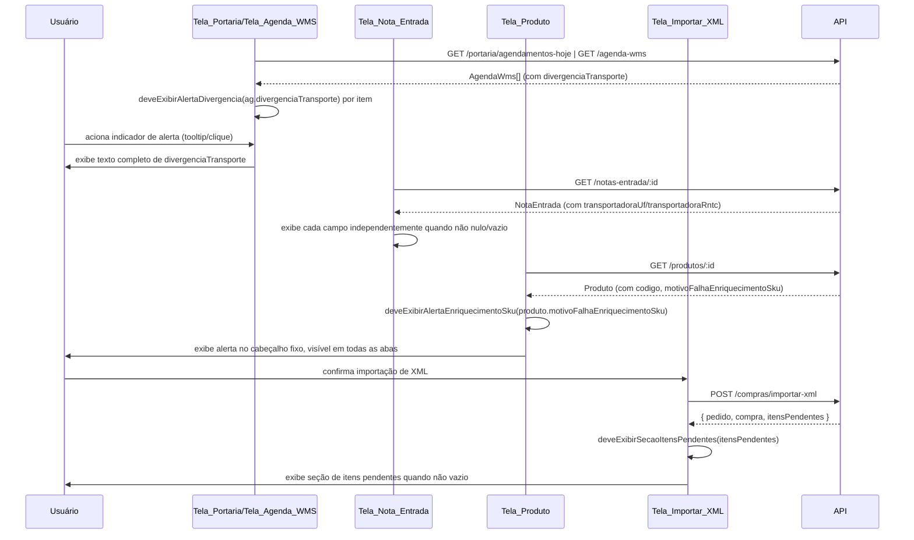
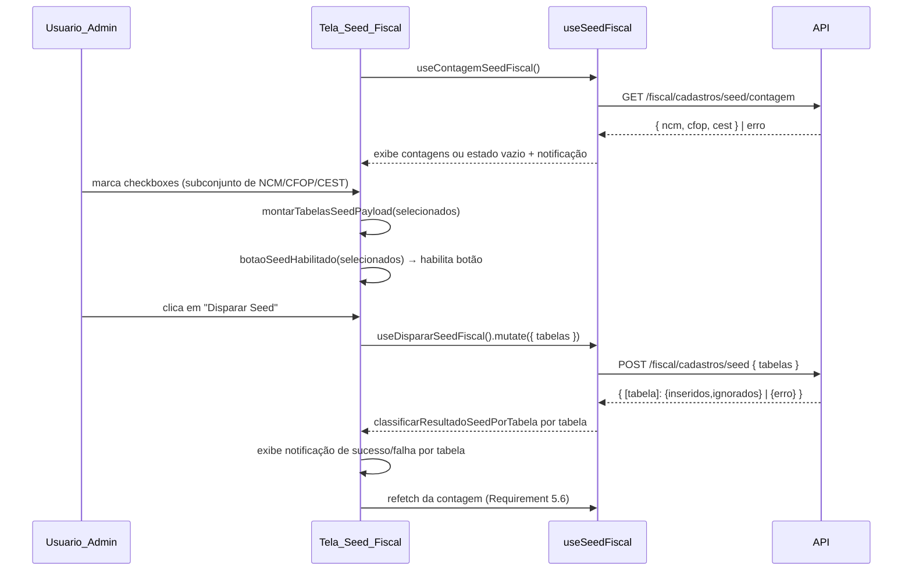
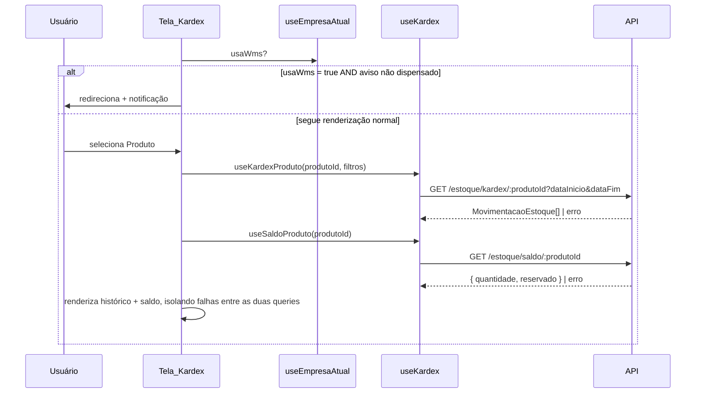
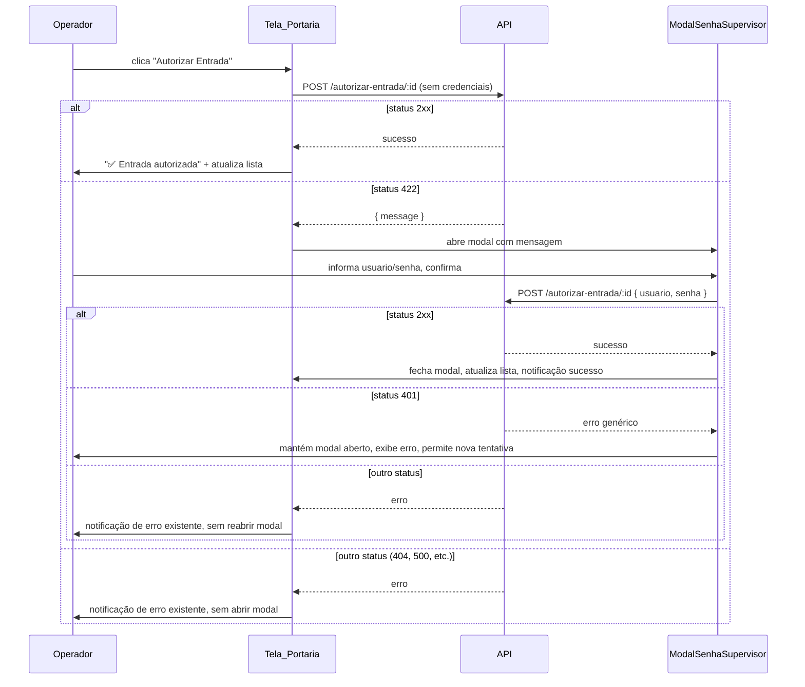
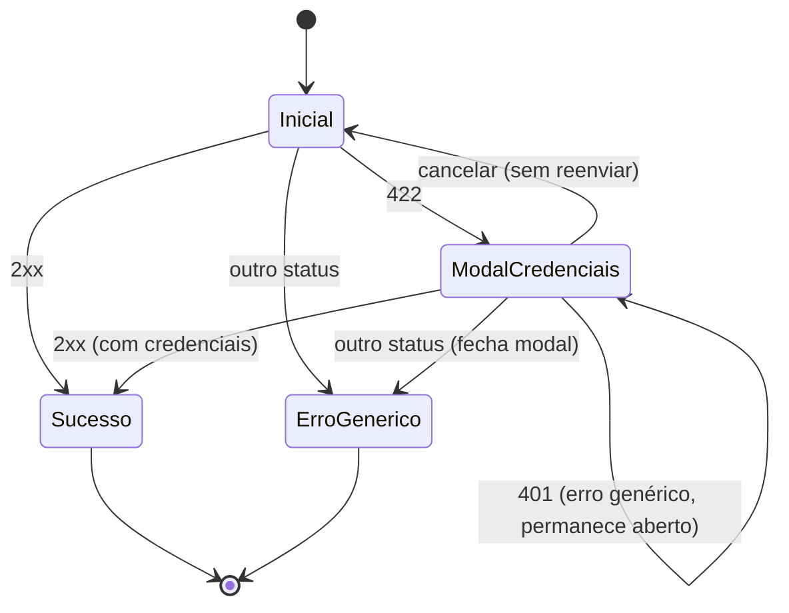

# Design Document — Melhorias Compras, WMS e Fiscal (Frontend)

## Overview

Este design cobre o frontend (`VisioFab.Wms.Front`, Next.js 15 App Router + Mantine 7 + `@tanstack/react-query` + Axios) para as cinco melhorias independentes cujo backend já está em produção (spec `melhorias-compras-wms-fiscal` em `VisioFab.Wms.Back`):

1. **Exibição de transporte via XML na Agenda/Portaria WMS** — exibição dos campos `divergenciaTransporte` (AgendaWms) e `transportadoraUf`/`transportadoraRntc` (NotaEntrada) já retornados pelas APIs existentes, com indicador visual de alerta quando há divergência.
2. **Código sequencial de Produto e enriquecimento de SKU** — exibição do campo `codigo` do Produto (já gerado automaticamente pelo backend) e do campo `motivoFalhaEnriquecimentoSku`, e tratamento do array `itensPendentes` retornado por `POST /compras/importar-xml`.
3. **Tela de Seed Fiscal** — nova página em Configurações que consulta a contagem de NCM/CFOP/CEST e dispara o seed a partir de checkboxes selecionáveis, consumindo `GET /api/fiscal/cadastros/seed/contagem` e `POST /api/fiscal/cadastros/seed`.
4. **Tela de Kardex** — nova página de consulta de histórico de movimentações (`GET /api/estoque/kardex/:produtoId`) e saldo atual (`GET /api/estoque/saldo/:produtoId`) de um produto, visível apenas para empresas com `usaWms = false`.
5. **Ajuste no fluxo "Autorizar Entrada" da Portaria** — a mutation existente em `src/app/(interna)/wms/portaria/page.tsx` passa a tratar respostas `422` (credenciais de Supervisor exigidas) e `401` (credenciais inválidas) do endpoint já existente `POST /portaria/autorizar-entrada/:id`, reaproveitando o componente `ModalSenhaSupervisor` já usado em `DivergenciaLoteValidadePanel.tsx`.

Nenhuma alteração de backend é necessária — todos os endpoints e campos já existem e estão em produção. O trabalho é inteiramente de composição de páginas, hooks de dados e pequenas funções puras de decisão de UI, seguindo os padrões já estabelecidos no código (`useModuloGuard`, `usePerfilGuard`, `useCrudGenerico`, hooks em `src/data/hooks/`, componentes Mantine).

### Decisões de Design

- **Indicador de divergência de transporte como função pura reutilizada em dois componentes** (`deveExibirAlertaDivergencia`, em novo arquivo `src/utils/transporteWms.ts`) — usada tanto pela Tela_Portaria quanto pela Tela_Agenda_WMS, garantindo que a mesma regra (`divergenciaTransporte` não nulo/vazio após `trim()`) decida a exibição do indicador nos dois lugares, sempre a partir do dado fresco retornado pela API (nunca de estado local em cache).
- **Exibição de `transportadoraUf`/`transportadoraRntc` na Tela_Nota_Entrada como função pura independente por campo** — cada campo é exibido isoladamente quando não nulo/vazio, sem depender do outro.
- **Alerta de falha de enriquecimento de SKU centralizado no cabeçalho fixo do `ProdutoModal`** (não dentro de uma aba específica), usando a mesma função pura de decisão (`deveExibirAlertaEnriquecimentoSku`) sempre reavaliada a partir do dado fresco de `produtoCompleto` (já buscado via `useQuery` com `staleTime: 0` no `ProdutoModal` existente) — garante que o alerta persista corretamente entre abas e entre reaberturas do modal.
- **Itens pendentes de importação de XML tratados como uma seção adicional do resultado da importação** (`ItensPendentesAlert`, novo componente local à página) — reaproveita a função pura `deveExibirSecaoItensPendentes` para decidir a exibição, sem nenhuma chamada adicional à API (os dados já vêm na resposta de `POST /compras/importar-xml`).
- **Reaproveitamento total do `ModalSenhaSupervisor` existente** (`src/components/wms/ModalSenhaSupervisor.tsx`) para a Requirement 10 — o componente já implementa exatamente o contrato necessário (`onConfirm({ usuario, senha }): Promise<void>`, exibe erro inline, `loading` no botão). Nenhum novo modal é criado; apenas a mutation de `autorizarEntrada` na página de Portaria é ajustada para orquestrar quando abri-lo.
- **Função central de decisão por status HTTP** (`decidirAcaoAutorizarEntrada`) extraída como lógica pura, testável sem rede, que mapeia `(status, tinhaCredenciais)` para uma das quatro ações (`ABRIR_MODAL_CREDENCIAIS`, `ERRO_CREDENCIAIS_INVALIDAS`, `SUCESSO`, `ERRO_GENERICO`). A página de Portaria e qualquer outro ponto de acionamento (ação rápida na tabela e botão do resultado de busca por placa) chamam a mesma função, garantindo tratamento idêntico em ambos os call-sites (Requirement 11.2).
- **Novo hook `useSeedFiscal.ts`** em `src/data/hooks/fiscal/`, seguindo o padrão dos demais hooks fiscais (`useCadastrosFiscais.ts`) — expõe `useContagemSeedFiscal()` (query) e `useDispararSeedFiscal()` (mutation), mais funções puras de decisão de UI (`montarTabelasSeedPayload`, `botaoSeedHabilitado`, `classificarResultadoSeedPorTabela`).
- **Novo hook `useKardex.ts`** em `src/data/hooks/`, seguindo o padrão de `useProduto.ts`/`useNotaEntrada.ts` — expõe `useKardexProduto(produtoId, filtros)` e `useSaldoProduto(produtoId)`, mais as funções puras `traduzirTipoMovimentacao`, `montarParametrosKardex`, `deveExibirEstadoVazioKardex`, `deveExibirEstadoFalhaKardex`.
- **Visibilidade condicional da navegação por `usaWms`**: a Tela_Kardex usa o mesmo dado já disponível via `GET /empresas/minha` (consumido em `configurador/empresa/page.tsx`) — nenhum novo endpoint é necessário. Um novo hook leve `useEmpresaAtual()` (ou reaproveitamento direto de `api.get('/empresas/minha')` via `useQuery`) alimenta a decisão `deveExibirLinkKardex(usaWms)`.
- **Dismissal do aviso da Tela_Kardex persistido em `localStorage`**, seguindo o padrão já usado por `EmpresaProvider`/`PreferencesProvider` (chave dedicada `visiofab-wms-kardex-aviso-dispensado`, sem chamada ao backend — é uma preferência puramente local, diferente de `UserPreferences` que é sincronizada com a API).
- **Seed Fiscal restrito a `ADMIN`** via `usePerfilGuard('ADMIN')`, seguindo exatamente o padrão já usado nas demais páginas administrativas (nenhuma modificação do hook existente, comportamento fail-open preservado quando a decodificação do token falha).

## Architecture

```mermaid
flowchart TD
    subgraph R1["1. Transporte XML — Agenda/Portaria"]
        PPORTREQ1["/wms/portaria (existente, modificada)"]
        PAGENDAREQ1["/wms/agenda (existente, modificada)"]
        PNOTAREQ1["NotaDetalheModal.tsx (existente, modificado)"]
        UTILTRANSP[src/utils/transporteWms.ts]
        API0A[GET /portaria/agendamentos-hoje]
        API0B[GET /agenda-wms]
        API0C[GET /notas-entrada/:id]
    end

    subgraph R2["2. Código Sequencial + SKU + Item Pendente"]
        PPRODREQ2["ProdutoModal.tsx (existente, modificado)"]
        PIMPORTREQ2["/compras/importar-xml (existente, modificado)"]
        UTILSKU[src/utils/produtoSku.ts]
        API0D[GET /produtos/:id]
        API0E[POST /compras/importar-xml]
    end

    subgraph R3["3. Tela de Seed Fiscal"]
        PSEED["/configuracoes/fiscal/seed (nova página)"]
        HSEED[useSeedFiscal.ts]
        API1[GET /fiscal/cadastros/seed/contagem]
        API2[POST /fiscal/cadastros/seed]
    end

    subgraph R4["4. Tela de Kardex"]
        PKARDEX["/estoque/kardex (nova página)"]
        HKARDEX[useKardex.ts]
        API3[GET /estoque/kardex/:produtoId]
        API4[GET /estoque/saldo/:produtoId]
        HEMP[useEmpresaAtual]
        API5[GET /empresas/minha]
    end

    subgraph R5["5. Autorizar Entrada — Portaria"]
        PPORT["/wms/portaria (página existente, modificada)"]
        HDECISAO[decidirAcaoAutorizarEntrada]
        MODALSUP[ModalSenhaSupervisor existente]
        API6[POST /portaria/autorizar-entrada/:id]
    end

    PPORTREQ1 --> UTILTRANSP --> API0A
    PAGENDAREQ1 --> UTILTRANSP --> API0B
    PNOTAREQ1 --> API0C

    PPRODREQ2 --> UTILSKU --> API0D
    PIMPORTREQ2 --> UTILSKU --> API0E

    PSEED --> HSEED --> API1
    HSEED --> API2
    PSEED -.perfil ADMIN.-> usePerfilGuard

    PKARDEX --> HKARDEX --> API3
    HKARDEX --> API4
    PKARDEX --> HEMP --> API5

    PPORT --> HDECISAO --> API6
    HDECISAO --> MODALSUP
```



### Fluxo 0 — Transporte XML e código sequencial (exibição)



### Fluxo 1 — Seed Fiscal



### Fluxo 2 — Kardex



### Fluxo 3 — Autorizar Entrada com Supervisor



## Components and Interfaces

### Requirement 1 — Transporte via XML na Agenda/Portaria WMS

| Módulo | Arquivo | Responsabilidade |
|--------|---------|-------------------|
| utils | `src/utils/transporteWms.ts` (novo) | `deveExibirAlertaDivergencia(divergenciaTransporte: string \| null \| undefined): boolean` + `deveExibirCampoTransporte(valor: string \| null \| undefined): boolean` — funções puras reutilizadas pelos três pontos de exibição |
| páginas | `src/app/(interna)/wms/portaria/page.tsx` (modificado) | Cada linha da tabela de agendamentos (`renderAgendamentoRow`) passa a renderizar um ícone de alerta (Tooltip com o texto de `divergenciaTransporte`) quando `deveExibirAlertaDivergencia(ag.divergenciaTransporte)` é `true` |
| páginas | `src/app/(interna)/wms/agenda/page.tsx` (modificado) | Mesma lógica aplicada à tabela de agendamentos por doca |
| componentes | `src/app/(interna)/recebimento/NotaDetalheModal.tsx` (modificado) | Exibe `nota.transportadoraUf`/`nota.transportadoraRntc` (quando `deveExibirCampoTransporte` é `true` para cada um) próximos ao campo `transportadora` já existente no cabeçalho do modal |

**Funções puras** (`transporteWms.ts`):

```typescript
/** Requirement 1.3, 1.4, 1.6 — decisão é exclusivamente sobre o valor vindo da API. */
export function deveExibirAlertaDivergencia(divergenciaTransporte: string | null | undefined): boolean {
  return !!divergenciaTransporte && divergenciaTransporte.trim().length > 0
}

/** Requirement 1.7, 1.8 — cada campo de transporte é decidido de forma independente. */
export function deveExibirCampoTransporte(valor: string | null | undefined): boolean {
  return !!valor && valor.trim().length > 0
}
```

**Integração na Tela_Portaria** (trecho de `renderAgendamentoRow`, `wms/portaria/page.tsx`):

```tsx
<Table.Td>
  {ag.motorista && <Text size="sm">{ag.motorista}</Text>}
  {ag.placa && <Text size="xs" c="dimmed" className="font-mono">{ag.placa}</Text>}
  {!ag.motorista && !ag.placa && <Text size="sm" c="dimmed">—</Text>}
  {deveExibirAlertaDivergencia(ag.divergenciaTransporte) && (
    <Tooltip label={ag.divergenciaTransporte} multiline w={280}>
      <ThemeIcon color="orange" variant="light" size="sm" ml={4}><IconAlertTriangle size={12} /></ThemeIcon>
    </Tooltip>
  )}
</Table.Td>
```

A mesma marcação (ícone `IconAlertTriangle` + `Tooltip`) é aplicada na célula de motorista/placa de `wms/agenda/page.tsx`.

**Integração na Tela_Nota_Entrada** (`NotaDetalheModal.tsx`, cabeçalho):

```tsx
{deveExibirCampoTransporte(nota.transportadoraUf) && (
  <div><Text size="xs" c="dimmed">UF Transporte</Text><Text>{nota.transportadoraUf}</Text></div>
)}
{deveExibirCampoTransporte(nota.transportadoraRntc) && (
  <div><Text size="xs" c="dimmed">RNTC</Text><Text>{nota.transportadoraRntc}</Text></div>
)}
```

### Requirement 2 — Código sequencial de Produto e enriquecimento de SKU

| Módulo | Arquivo | Responsabilidade |
|--------|---------|-------------------|
| utils | `src/utils/produtoSku.ts` (novo) | `deveExibirAlertaEnriquecimentoSku(motivo: string \| null \| undefined): boolean` + `deveExibirSecaoItensPendentes(itensPendentes: unknown[] \| null \| undefined): boolean` |
| componentes | `src/app/(interna)/configurador/produtos/ProdutoModal.tsx` (modificado) | Cabeçalho fixo do modal passa a exibir um `Alert` quando `deveExibirAlertaEnriquecimentoSku(produtoCompleto?.motivoFalhaEnriquecimentoSku)` é `true`, reaproveitando o `useQuery` de `produtoCompleto` já existente (`staleTime: 0`, refetch a cada abertura) — sem nova chamada à API |
| páginas | `src/app/(interna)/compras/importar-xml/page.tsx` (modificado) | Etapa de resultado (`step === 2`) passa a exibir uma seção `Alert` com a lista de `resultado.itensPendentes` quando `deveExibirSecaoItensPendentes(resultado.itensPendentes)` é `true` |

**Funções puras** (`produtoSku.ts`):

```typescript
export interface ItemPendenteXml { cProd: string; xProd: string; motivo: string }

/** Requirement 2.2, 2.3, 2.5 — sempre reavaliada a partir do dado fresco da API (produtoCompleto). */
export function deveExibirAlertaEnriquecimentoSku(motivo: string | null | undefined): boolean {
  return !!motivo && motivo.trim().length > 0
}

/** Requirement 3.1, 3.2 — array vazio ou ausente (undefined/null) SHALL produzir false. */
export function deveExibirSecaoItensPendentes(itensPendentes: ItemPendenteXml[] | null | undefined): boolean {
  return Array.isArray(itensPendentes) && itensPendentes.length > 0
}
```

**Integração no `ProdutoModal.tsx`** (cabeçalho fixo, antes das `Tabs`):

```tsx
{deveExibirAlertaEnriquecimentoSku(produtoCompleto?.motivoFalhaEnriquecimentoSku) && (
  <Alert icon={<IconAlertCircle size={16} />} color="orange" variant="light" mb="md">
    O SKU deste produto não foi enriquecido automaticamente: {produtoCompleto.motivoFalhaEnriquecimentoSku}.
    Verifique os dados logísticos na aba &quot;Estoque / Lotes&quot;.
  </Alert>
)}
```

Por estar no cabeçalho fixo (fora do componente `<Tabs>`), o alerta permanece visível independentemente da aba selecionada (Requirement 2.4) e é recalculado a cada abertura do modal a partir do `produtoCompleto` já buscado com `staleTime: 0` (Requirement 2.5) — nenhuma alteração adicional é necessária no hook de busca existente.

**Integração em `compras/importar-xml/page.tsx`** (etapa de resultado, `step === 2`):

```tsx
{deveExibirSecaoItensPendentes(resultado.itensPendentes) && (
  <Alert icon={<IconAlertCircle size={16} />} color="orange" variant="light" mb="md" title="Itens pendentes de resolução manual">
    Os itens abaixo não foram incluídos no pedido de compra criado devido ao esgotamento da faixa de códigos
    sequenciais de produto e necessitam de resolução manual:
    <Table mt="sm" size="sm">
      <Table.Thead><Table.Tr><Table.Th>Código Fornecedor</Table.Th><Table.Th>Descrição</Table.Th><Table.Th>Motivo</Table.Th></Table.Tr></Table.Thead>
      <Table.Tbody>
        {resultado.itensPendentes.map((item: ItemPendenteXml, idx: number) => (
          <Table.Tr key={idx}>
            <Table.Td className="font-mono">{item.cProd}</Table.Td>
            <Table.Td>{item.xProd}</Table.Td>
            <Table.Td>{item.motivo}</Table.Td>
          </Table.Tr>
        ))}
      </Table.Tbody>
    </Table>
  </Alert>
)}
```

O rótulo "Código" do campo `codigo` do Produto na aba "Dados Gerais" do `ProdutoModal.tsx` é mantido sem alteração de texto ou de comportamento de edição (Requirement 2.1) — a única mudança é que, para produtos criados via importação de XML, esse valor já vem preenchido pelo backend com o código sequencial gerado automaticamente.

### Requirement 4 e 5 — Seed Fiscal (contagem e disparo)

| Módulo | Arquivo | Responsabilidade |
|--------|---------|-------------------|
| páginas | `src/app/(interna)/configuracoes/fiscal/seed/page.tsx` (novo) | Página da Tela_Seed_Fiscal: `usePerfilGuard('ADMIN')`, checkboxes NCM/CFOP/CEST, cards de contagem, botão de disparo, notificações por tabela |
| hooks | `src/data/hooks/fiscal/useSeedFiscal.ts` (novo) | `useContagemSeedFiscal()`, `useDispararSeedFiscal()` + funções puras `montarTabelasSeedPayload`, `botaoSeedHabilitado`, `classificarResultadoSeedPorTabela`, `deveExibirDadosParciaisSeed` |
| navegação | `src/components/modules/ModulesSidebar.tsx` (modificado) | Novo item "Seed Fiscal (NCM/CFOP/CEST)" dentro do submenu "Configurações", renderizado apenas quando `isAdmin` |

**Página** (`page.tsx`, estrutura resumida seguindo o padrão de `configuracoes/parametros/page.tsx`):

```tsx
'use client'
import { usePerfilGuard } from '@/hooks/usePerfilGuard'
import { useContagemSeedFiscal, useDispararSeedFiscal, montarTabelasSeedPayload, botaoSeedHabilitado } from '@/data/hooks/fiscal/useSeedFiscal'

export default function SeedFiscalPage() {
  usePerfilGuard('ADMIN')
  useEffect(() => { document.title = 'Vizor - Configurações > Seed Fiscal' }, [])

  const [selecionados, setSelecionados] = useState<Set<'NCM' | 'CFOP' | 'CEST'>>(new Set())
  const { data: contagem, isLoading, isError, error, refetch } = useContagemSeedFiscal()
  const disparar = useDispararSeedFiscal()

  // isLoading tem precedência de exibição sobre isError (Requirement 4.3):
  // a notificação de erro só é disparada em um useEffect após isLoading virar false
  useEffect(() => {
    if (!isLoading && isError) {
      notifications.show({ title: 'Erro', message: error?.response?.data?.message || 'Falha ao consultar contagem', color: 'red' })
    }
  }, [isLoading, isError])

  function handleDisparar() {
    const payload = montarTabelasSeedPayload(selecionados)
    disparar.mutate(payload, {
      onSuccess: (resultado) => {
        for (const tabela of Object.keys(resultado)) {
          const classificado = classificarResultadoSeedPorTabela(resultado[tabela])
          notifications.show({
            title: tabela,
            message: classificado.mensagem,
            color: classificado.tipo === 'sucesso' ? 'green' : 'red',
          })
        }
        refetch() // Requirement 5.6
      },
      onError: (err: any) => {
        if (err?.response?.status === 403) {
          notifications.show({ title: 'Acesso negado', message: 'Permissão insuficiente para seed fiscal', color: 'red' })
          return
        }
        notifications.show({ title: 'Erro', message: err?.response?.data?.message || 'Falha ao disparar seed', color: 'red' })
      },
    })
  }

  // ... Checkbox.Group NCM/CFOP/CEST + cards de contagem + Button disabled={!botaoSeedHabilitado(selecionados)}
}
```

**Hook e funções puras** (`useSeedFiscal.ts`):

```typescript
import { useQuery, useMutation } from '@tanstack/react-query'
import { api } from '@/lib/api'

export type CadastroFiscal = 'NCM' | 'CFOP' | 'CEST'

export interface ContagemSeedFiscal { ncm: number; cfop: number; cest: number }
export interface ResultadoTabelaSucesso { inseridos: number; ignorados: number }
export interface ResultadoTabelaErro { erro: { code: string; message: string } }
export type ResultadoTabela = ResultadoTabelaSucesso | ResultadoTabelaErro
export type RespostaSeedFiscal = Record<CadastroFiscal, ResultadoTabela>

export function useContagemSeedFiscal() {
  return useQuery<ContagemSeedFiscal>({
    queryKey: ['seed-fiscal-contagem'],
    queryFn: async () => { const { data } = await api.get('/fiscal/cadastros/seed/contagem'); return data },
    staleTime: 1000 * 30,
  })
}

export function useDispararSeedFiscal() {
  return useMutation<RespostaSeedFiscal, any, { tabelas: CadastroFiscal[] }>({
    mutationFn: async (body) => { const { data } = await api.post('/fiscal/cadastros/seed', body); return data },
  })
}

/** Requirement 4.4, 5.2 — payload reflete exatamente o conjunto selecionado, sem duplicatas. */
export function montarTabelasSeedPayload(selecionados: Set<CadastroFiscal>): { tabelas: CadastroFiscal[] } {
  return { tabelas: Array.from(selecionados) }
}

/** Requirement 5.1 — botão habilitado se e somente se ao menos uma tabela está selecionada. */
export function botaoSeedHabilitado(selecionados: Set<CadastroFiscal>): boolean {
  return selecionados.size > 0
}

/** Requirement 5.4, 5.5 — classifica e formata o resultado de uma tabela, independentemente das demais. */
export function classificarResultadoSeedPorTabela(
  resultado: ResultadoTabela,
): { tipo: 'sucesso' | 'falha'; mensagem: string } {
  if ('erro' in resultado) {
    return { tipo: 'falha', mensagem: resultado.erro.message }
  }
  return { tipo: 'sucesso', mensagem: `${resultado.inseridos} inserido(s), ${resultado.ignorados} ignorado(s)` }
}

/** Requirement 5.7 — status 403 nunca deve expor contagens/resultados parciais. */
export function deveExibirDadosParciaisSeed(status: number): boolean {
  return status !== 403
}
```

### Requirement 6 — Restrição de acesso ao Seed Fiscal

Reaproveita `usePerfilGuard('ADMIN')` (sem alteração) e adiciona a função pura `deveExibirLinkSeedFiscal` usada em `ModulesSidebar.tsx` para decidir a renderização condicional do item de menu:

```typescript
// src/data/hooks/fiscal/useSeedFiscal.ts (mesmo arquivo)
const PERFIS_ADMIN_SEED_FISCAL = ['ADMIN', 'SUPER_ADMIN']

/** Requirement 6.3 — link de navegação visível apenas para perfis administrativos. */
export function deveExibirLinkSeedFiscal(perfil: string | null): boolean {
  return !!perfil && PERFIS_ADMIN_SEED_FISCAL.includes(perfil)
}
```

```tsx
// ModulesSidebar.tsx — dentro do Collapse de Configurações
{deveExibirLinkSeedFiscal(getUserPerfil()) && (
  <SidebarItem icon={IconHash} label="Seed Fiscal" onClick={() => router.push('/configuracoes/fiscal/seed')} />
)}
```

### Requirement 7, 8 e 9 — Kardex

| Módulo | Arquivo | Responsabilidade |
|--------|---------|-------------------|
| páginas | `src/app/(interna)/estoque/kardex/page.tsx` (novo) | Página da Tela_Kardex: seletor de produto, filtros de data, tabela de histórico, card de saldo, guarda de visibilidade por `usaWms` |
| hooks | `src/data/hooks/useKardex.ts` (novo) | `useKardexProduto`, `useSaldoProduto` + funções puras `traduzirTipoMovimentacao`, `montarParametrosKardex`, `deveExibirEstadoVazioKardex`, `deveExibirEstadoFalhaKardex`, `deveManterHistoricoAoFalharSaldo` |
| hooks | `src/hooks/useEmpresaAtual.ts` (novo, leve) | `useEmpresaAtual()` — `useQuery` sobre `GET /empresas/minha`, expõe `usaWms`; e `deveExibirLinkKardex`, `deveRedirecionarKardex` |
| navegação | `src/components/layout/ModuleSidebar.tsx` (modificado) | Novo item "Kardex" dentro do grupo "Estoque" do módulo WMS, renderizado condicionalmente por `deveExibirLinkKardex(usaWms)` |

**Página** (`page.tsx`, estrutura resumida seguindo o padrão de `wms/manutencao-estoque/page.tsx`):

```tsx
'use client'
import { useEmpresaAtual, deveRedirecionarKardex } from '@/hooks/useEmpresaAtual'
import { useKardexProduto, useSaldoProduto, traduzirTipoMovimentacao, deveExibirEstadoVazioKardex } from '@/data/hooks/useKardex'

const AVISO_DISMISSED_KEY = 'visiofab-wms-kardex-aviso-dispensado'

export default function KardexPage() {
  const router = useRouter()
  const { usaWms, isLoading: loadingEmpresa } = useEmpresaAtual()
  const [avisoDispensado, setAvisoDispensado] = useState(false)

  useEffect(() => {
    setAvisoDispensado(localStorage.getItem(AVISO_DISMISSED_KEY) === 'true')
  }, [])

  useEffect(() => {
    if (loadingEmpresa) return
    if (deveRedirecionarKardex(usaWms, avisoDispensado)) {
      notifications.show({ title: 'Funcionalidade não aplicável', message: 'O Kardex é destinado a empresas sem WMS', color: 'orange' })
      router.replace('/estoque')
    }
  }, [loadingEmpresa, usaWms, avisoDispensado])

  function dispensarAvisoPermanentemente() {
    localStorage.setItem(AVISO_DISMISSED_KEY, 'true')
    setAvisoDispensado(true)
  }

  const [produtoId, setProdutoId] = useState<string | null>(null)
  const [dataInicio, setDataInicio] = useState<Date | null>(null)
  const [dataFim, setDataFim] = useState<Date | null>(null)

  const { data: movimentacoes, isLoading: loadingHist, isError: erroHist } =
    useKardexProduto(produtoId, { dataInicio, dataFim })
  const { data: saldo, isError: erroSaldo } = useSaldoProduto(produtoId)

  useEffect(() => {
    if (erroHist) notifications.show({ title: 'Erro', message: 'Falha ao carregar histórico de movimentações', color: 'red' })
  }, [erroHist])
  useEffect(() => {
    if (erroSaldo) notifications.show({ title: 'Erro', message: 'Falha ao carregar saldo atual', color: 'red' })
  }, [erroSaldo])

  const lista = movimentacoes ?? []
  const exibirEstadoVazio = deveExibirEstadoVazioKardex(lista, erroHist)
  const exibirEstadoFalha = deveExibirEstadoFalhaKardex(erroHist)

  // ... Select de produto, DateInput de dataInicio/dataFim, Card de saldo (independente de erroHist),
  // Table de histórico com traduzirTipoMovimentacao(m.tipo) por linha, mensagem de "nenhuma movimentação
  // encontrada" quando exibirEstadoVazio, mensagem distinta de "falha ao carregar histórico" quando exibirEstadoFalha
}
```

**Hook e funções puras** (`useKardex.ts`):

```typescript
import { useQuery } from '@tanstack/react-query'
import { api } from '@/lib/api'

export type TipoMovimentacaoEstoque =
  | 'ENTRADA_COMPRA' | 'SAIDA_VENDA' | 'AJUSTE_MANUAL' | 'ENTRADA_ESTORNO_VENDA' | 'SAIDA_ESTORNO_COMPRA'

export interface MovimentacaoEstoque {
  id: string
  tipo: TipoMovimentacaoEstoque
  quantidade: number
  saldoAnterior: number
  saldoPosterior: number
  origemId: string | null
  criadoEm: string
}

export interface SaldoProduto { produtoId: string; empresaId: string; quantidade: number; reservado: number }

const TIPO_LABELS: Record<TipoMovimentacaoEstoque, string> = {
  ENTRADA_COMPRA: 'Entrada por Compra',
  SAIDA_VENDA: 'Saída por Venda',
  AJUSTE_MANUAL: 'Ajuste Manual',
  ENTRADA_ESTORNO_VENDA: 'Entrada por Estorno de Venda',
  SAIDA_ESTORNO_COMPRA: 'Saída por Estorno de Compra',
}

/** Requirement 7.2 — tradução fechada; tipo desconhecido usa fallback sem lançar exceção. */
export function traduzirTipoMovimentacao(tipo: string): string {
  return TIPO_LABELS[tipo as TipoMovimentacaoEstoque] ?? tipo
}

/** Requirement 7.3 — inclui dataInicio/dataFim somente quando preenchidos, sem chaves extras. */
export function montarParametrosKardex(dataInicio: Date | null, dataFim: Date | null): Record<string, string> {
  const params: Record<string, string> = {}
  if (dataInicio) params.dataInicio = dataInicio.toISOString().split('T')[0]
  if (dataFim) params.dataFim = dataFim.toISOString().split('T')[0]
  return params
}

export function useKardexProduto(produtoId: string | null, filtros: { dataInicio: Date | null; dataFim: Date | null }) {
  const params = montarParametrosKardex(filtros.dataInicio, filtros.dataFim)
  return useQuery<MovimentacaoEstoque[]>({
    queryKey: ['kardex', produtoId, params],
    queryFn: async () => { const { data } = await api.get(`/estoque/kardex/${produtoId}`, { params }); return data },
    enabled: !!produtoId,
  })
}

export function useSaldoProduto(produtoId: string | null) {
  return useQuery<SaldoProduto>({
    queryKey: ['saldo-produto', produtoId],
    queryFn: async () => { const { data } = await api.get(`/estoque/saldo/${produtoId}`); return data },
    enabled: !!produtoId,
  })
}

/** Requirement 7.5 — estado vazio ocorre apenas quando a lista está vazia E não houve erro. */
export function deveExibirEstadoVazioKardex(lista: MovimentacaoEstoque[], ocorreuErro: boolean): boolean {
  return lista.length === 0 && !ocorreuErro
}

/** Requirement 7.6 — estado de falha é disparado sempre que a chamada falhar, independentemente do tamanho da lista;
 *  mutuamente exclusivo com deveExibirEstadoVazioKardex para a mesma combinação de entrada. */
export function deveExibirEstadoFalhaKardex(ocorreuErro: boolean): boolean {
  return ocorreuErro
}

/** Requirement 8.3 — falha no saldo nunca interrompe a exibição do histórico já carregado. */
export function deveManterHistoricoAoFalharSaldo(saldoTeveErro: boolean, historicoTemDados: boolean): boolean {
  return historicoTemDados // independente de saldoTeveErro — a exibição do histórico nunca depende do saldo
}
```

**Hook de empresa e visibilidade** (`useEmpresaAtual.ts`):

```typescript
import { useQuery } from '@tanstack/react-query'
import { api } from '@/lib/api'

export function useEmpresaAtual() {
  const { data, isLoading } = useQuery<{ usaWms: boolean }>({
    queryKey: ['empresa-atual-usa-wms'],
    queryFn: async () => { const { data } = await api.get('/empresas/minha'); return data },
    staleTime: 1000 * 60 * 5,
  })
  return { usaWms: data?.usaWms ?? false, isLoading }
}

/** Requirement 9.1, 9.2 — link de navegação visível apenas para Empresa_Sem_WMS. */
export function deveExibirLinkKardex(usaWms: boolean): boolean {
  return usaWms === false
}

/** Requirement 9.3, 9.4 — redireciona ao acessar diretamente por URL, exceto quando o aviso foi dispensado. */
export function deveRedirecionarKardex(usaWms: boolean, avisoDispensado: boolean): boolean {
  return usaWms === true && avisoDispensado === false
}
```

### Requirement 10 e 11 — Autorizar Entrada com Supervisor (Portaria)

| Módulo | Arquivo | Responsabilidade |
|--------|---------|-------------------|
| hooks | `src/hooks/useAutorizarEntrada.ts` (novo) | `decidirAcaoAutorizarEntrada` (função pura central) + `useAutorizarEntrada()` (mutation reutilizável pelos dois call-sites) |
| páginas | `src/app/(interna)/wms/portaria/page.tsx` (modificado) | Substitui a mutation local `autorizarEntrada` pelo novo hook `useAutorizarEntrada`; adiciona estado do `ModalSenhaSupervisor` (já importado de `@/components/wms/ModalSenhaSupervisor`) |
| componentes | `src/components/wms/ModalSenhaSupervisor.tsx` (reaproveitado, sem alteração) | Já implementa o contrato necessário |

**Função central de decisão** (`useAutorizarEntrada.ts`):

```typescript
import { useState, useCallback } from 'react'
import { useMutation, useQueryClient } from '@tanstack/react-query'
import { notifications } from '@mantine/notifications'
import { api } from '@/lib/api'

export type AcaoAutorizarEntrada =
  | 'ABRIR_MODAL_CREDENCIAIS'
  | 'ERRO_CREDENCIAIS_INVALIDAS'
  | 'SUCESSO'
  | 'ERRO_GENERICO'

/**
 * Requirement 7.2, 7.4, 7.5, 8.1 — decisão pura da ação a tomar a partir do
 * status HTTP retornado por POST /autorizar-entrada/:id e de se a tentativa
 * já incluía credenciais de Supervisor no corpo.
 *
 * - status 422                                → ABRIR_MODAL_CREDENCIAIS (sempre, independente de já ter credenciais)
 * - status 401 E a tentativa tinha credenciais → ERRO_CREDENCIAIS_INVALIDAS (mantém modal aberto)
 * - status 2xx                                 → SUCESSO
 * - qualquer outro status                       → ERRO_GENERICO
 */
export function decidirAcaoAutorizarEntrada(status: number, tinhaCredenciais: boolean): AcaoAutorizarEntrada {
  if (status >= 200 && status < 300) return 'SUCESSO'
  if (status === 422) return 'ABRIR_MODAL_CREDENCIAIS'
  if (status === 401 && tinhaCredenciais) return 'ERRO_CREDENCIAIS_INVALIDAS'
  return 'ERRO_GENERICO'
}

interface UseAutorizarEntradaOptions {
  onInvalidateQueries?: () => void
}

/**
 * Hook reutilizado por ambos os call-sites da Tela_Portaria (ação rápida na
 * tabela e botão do resultado de busca por placa) — garante tratamento
 * idêntico de 422/401 em ambos (Requirement 11.2).
 */
export function useAutorizarEntrada(options?: UseAutorizarEntradaOptions) {
  const [modalAberto, setModalAberto] = useState(false)
  const [agendamentoIdPendente, setAgendamentoIdPendente] = useState<string | null>(null)

  const mutation = useMutation({
    mutationFn: async (params: { agId: string; credenciais?: { usuario: string; senha: string } }) => {
      const { data } = await api.post(`/portaria/autorizar-entrada/${params.agId}`, params.credenciais ?? {})
      return data
    },
  })

  const autorizar = useCallback((agId: string) => {
    mutation.mutate({ agId }, {
      onSuccess: () => {
        setModalAberto(false)
        options?.onInvalidateQueries?.()
        notifications.show({ title: '✅ Entrada autorizada', message: 'Veículo encaminhado para a doca', color: 'green' })
      },
      onError: (err: any) => {
        const status = err?.response?.status ?? 0
        const acao = decidirAcaoAutorizarEntrada(status, false)
        if (acao === 'ABRIR_MODAL_CREDENCIAIS') {
          setAgendamentoIdPendente(agId)
          setModalAberto(true)
          notifications.show({ title: 'Autorização necessária', message: err?.response?.data?.message || 'Credenciais de Supervisor exigidas', color: 'orange' })
        } else {
          notifications.show({ title: 'Erro', message: err?.response?.data?.message || 'Falha', color: 'red' })
        }
      },
    })
  }, [mutation, options])

  const confirmarComCredenciais = useCallback(async (credenciais: { usuario: string; senha: string }) => {
    if (!agendamentoIdPendente) return
    try {
      await mutation.mutateAsync({ agId: agendamentoIdPendente, credenciais })
      setModalAberto(false)
      options?.onInvalidateQueries?.()
      notifications.show({ title: '✅ Entrada autorizada', message: 'Veículo encaminhado para a doca', color: 'green' })
    } catch (err: any) {
      const status = err?.response?.status ?? 0
      const acao = decidirAcaoAutorizarEntrada(status, true)
      if (acao === 'ERRO_CREDENCIAIS_INVALIDAS') {
        // Propaga para o ModalSenhaSupervisor exibir o erro inline e permitir nova tentativa
        throw err
      }
      // Requirement 11.1 — outro status: fecha o modal e usa a notificação de erro padrão
      setModalAberto(false)
      notifications.show({ title: 'Erro', message: err?.response?.data?.message || 'Falha', color: 'red' })
    }
  }, [agendamentoIdPendente, mutation, options])

  return {
    autorizar,
    confirmarComCredenciais,
    modalAberto,
    fecharModal: () => setModalAberto(false), // Requirement 10.7 — não reenvia nada
    isPending: mutation.isPending,
  }
}
```

**Integração na página** (`wms/portaria/page.tsx`, trecho modificado):

```tsx
const { autorizar, confirmarComCredenciais, modalAberto, fecharModal, isPending: autorizandoEntrada } =
  useAutorizarEntrada({ onInvalidateQueries: () => queryClient.invalidateQueries({ queryKey: ['portaria-agendamentos'] }) })

// Call-site 1 — ação rápida na tabela de agendamentos:
<ActionIcon onClick={() => autorizar(ag.id)} loading={autorizandoEntrada}>...</ActionIcon>

// Call-site 2 — botão no resultado de busca por placa:
<Button onClick={() => autorizar(validacao.agendamentoId)} loading={autorizandoEntrada}>Autorizar Entrada</Button>

// Modal reaproveitado — campos vazios a cada abertura (Requirement 10.8, já garantido pelo próprio componente)
<ModalSenhaSupervisor opened={modalAberto} onClose={fecharModal} onConfirm={confirmarComCredenciais} />
```

## Data Models

Nenhum novo modelo de dados é introduzido no frontend — apenas tipos TypeScript espelhando os contratos já expostos pela API existente:

```typescript
// Seed Fiscal
type CadastroFiscal = 'NCM' | 'CFOP' | 'CEST'
interface ContagemSeedFiscal { ncm: number; cfop: number; cest: number }
type ResultadoTabela = { inseridos: number; ignorados: number } | { erro: { code: string; message: string } }

// Kardex
type TipoMovimentacaoEstoque = 'ENTRADA_COMPRA' | 'SAIDA_VENDA' | 'AJUSTE_MANUAL' | 'ENTRADA_ESTORNO_VENDA' | 'SAIDA_ESTORNO_COMPRA'
interface MovimentacaoEstoque {
  id: string; tipo: TipoMovimentacaoEstoque; quantidade: number
  saldoAnterior: number; saldoPosterior: number; origemId: string | null; criadoEm: string
}
interface SaldoProduto { produtoId: string; empresaId: string; quantidade: number; reservado: number }

// Autorizar Entrada
interface AutorizarEntradaBody { usuario?: string; senha?: string }
```

### Diagrama de estado — Fluxo Autorizar Entrada



## Correctness Properties

*A property is a characteristic or behavior that should hold true across all valid executions of a system — essentially, a formal statement about what the system should do. Properties serve as the bridge between human-readable specifications and machine-verifiable correctness guarantees.*

Todas as properties abaixo testam **funções puras** de decisão/composição extraídas dos hooks descritos em "Components and Interfaces" (sem chamadas de rede, sem `localStorage`, sem renderização) — adequadas para `fast-check` com Vitest, seguindo o padrão já usado no repositório (`fast-check` já é dependência de desenvolvimento).

### Property 1: Indicador de alerta de divergência de transporte depende exclusivamente do conteúdo do campo

*For any* valor de `divergenciaTransporte` (`null`, `undefined`, string vazia, string composta apenas de espaços, ou string arbitrária não vazia após `trim()`), `deveExibirAlertaDivergencia` SHALL retornar `true` se e somente se o valor, após `trim()`, tem comprimento maior que zero.

**Validates: Requirements 1.3, 1.4, 1.6**

### Property 2: Exibição de cada campo de transporte da Nota_Entrada é decidida de forma independente

*For any* combinação de (`transportadoraUf`: `null` | string arbitrária, `transportadoraRntc`: `null` | string arbitrária), `deveExibirCampoTransporte` aplicada a cada campo SHALL retornar `true` se e somente se aquele campo, após `trim()`, não é vazio, independentemente do valor do outro campo.

**Validates: Requirements 1.7, 1.8**

### Property 3: Alerta de falha de enriquecimento de SKU depende exclusivamente do conteúdo de `motivoFalhaEnriquecimentoSku`

*For any* valor de `motivoFalhaEnriquecimentoSku` (`null`, `undefined`, string vazia, string composta apenas de espaços, ou string arbitrária não vazia após `trim()`), `deveExibirAlertaEnriquecimentoSku` SHALL retornar `true` se e somente se o valor, após `trim()`, tem comprimento maior que zero.

**Validates: Requirements 2.2, 2.3, 2.5**

### Property 4: Seção de itens pendentes é exibida se e somente se o array recebido não é vazio, preservando seu conteúdo

*For any* valor de `itensPendentes` (`null`, `undefined`, array vazio, ou array arbitrário de 1 a 20 itens `{ cProd, xProd, motivo }`), `deveExibirSecaoItensPendentes` SHALL retornar `true` se e somente se o valor é um array com ao menos um elemento; quando `true`, a lista exibida SHALL conter exatamente os mesmos itens do array de entrada, na mesma ordem, sem perda, duplicação ou transformação de conteúdo.

**Validates: Requirements 3.1, 3.2**

### Property 5: Payload do seed reflete exatamente o conjunto de tabelas selecionado

*For any* subconjunto não vazio de `{NCM, CFOP, CEST}` representado como `Set`, `montarTabelasSeedPayload` SHALL retornar `{ tabelas }` onde `tabelas` contém exatamente os elementos do subconjunto, sem duplicatas e sem elementos fora dele, independentemente da ordem de inserção no `Set`.

**Validates: Requirements 4.4, 5.2**

### Property 6: Botão de disparo do seed é habilitado se e somente se ao menos uma tabela está selecionada

*For any* subconjunto de `{NCM, CFOP, CEST}` (incluindo o vazio), `botaoSeedHabilitado` SHALL retornar `true` se e somente se o subconjunto não é vazio.

**Validates: Requirements 5.1**

### Property 7: Classificação do resultado do seed por tabela é independente e determinística

*For any* mapa de resultados de seed onde cada tabela recebe, de forma arbitrária e independente, um resultado no formato `{ inseridos, ignorados }` (com valores não negativos arbitrários) ou `{ erro: { code, message } }` (com `message` arbitrária não vazia), `classificarResultadoSeedPorTabela` aplicada a cada entrada SHALL retornar `tipo: 'sucesso'` se e somente se a entrada tem o formato `{inseridos,ignorados}`, `tipo: 'falha'` se e somente se tem o formato `{erro}`, a mensagem de falha SHALL ser exatamente `erro.message`, e o resultado para uma tabela nunca SHALL depender do resultado de nenhuma outra tabela do mesmo mapa.

**Validates: Requirements 5.4, 5.5**

### Property 8: Dados parciais do seed nunca são exibidos quando a API retorna 403

*For any* código de status HTTP, `deveExibirDadosParciaisSeed` SHALL retornar `false` se e somente se o status é exatamente `403`.

**Validates: Requirements 5.7**

### Property 9: Link de navegação do Seed Fiscal é visível apenas para perfis administrativos

*For any* valor de perfil (incluindo `null`, string vazia, e qualquer um dos perfis conhecidos do sistema: `ADMIN`, `SUPER_ADMIN`, `GERENTE`, `OPERADOR`, `DIRETOR`, ou uma string arbitrária desconhecida), `deveExibirLinkSeedFiscal` SHALL retornar `true` se e somente se o perfil é `'ADMIN'` ou `'SUPER_ADMIN'`.

**Validates: Requirements 6.3**

### Property 10: Tradução de tipo de movimentação é total e determinística

*For any* um dos cinco valores válidos de `TipoMovimentacaoEstoque`, `traduzirTipoMovimentacao` SHALL retornar exatamente o rótulo em pt-BR correspondente da tabela fixa; *for any* string arbitrária que não corresponda a nenhum dos cinco valores válidos, `traduzirTipoMovimentacao` SHALL retornar a própria string de entrada sem lançar exceção.

**Validates: Requirements 7.2**

### Property 11: Parâmetros de filtro do Kardex refletem exatamente as datas preenchidas

*For any* combinação de `dataInicio` e `dataFim`, cada um `null` ou uma data válida arbitrária, `montarParametrosKardex` SHALL incluir a chave `dataInicio` no resultado se e somente se `dataInicio` não é `null`, SHALL incluir a chave `dataFim` se e somente se `dataFim` não é `null`, e o resultado nunca SHALL conter chaves além dessas duas.

**Validates: Requirements 7.3**

### Property 12: Estado vazio e estado de falha do Kardex são mutuamente exclusivos e corretamente determinados

*For any* lista de `MovimentacaoEstoque` (incluindo a lista vazia e listas com itens arbitrários) e *for any* valor booleano indicando se a chamada resultou em erro, `deveExibirEstadoVazioKardex` SHALL retornar `true` se e somente se a lista está vazia E o valor de erro é `false`; `deveExibirEstadoFalhaKardex` SHALL retornar `true` se e somente se o valor de erro é `true`, independentemente do tamanho da lista; e as duas funções nunca SHALL retornar `true` simultaneamente para a mesma combinação de entrada.

**Validates: Requirements 7.5, 7.6**

### Property 13: Falha na consulta de saldo nunca oculta o histórico já carregado

*For any* combinação de (saldo teve erro: boolean, histórico possui dados: boolean), `deveManterHistoricoAoFalharSaldo` SHALL retornar exatamente o valor de "histórico possui dados", nunca sendo afetado pelo valor de "saldo teve erro".

**Validates: Requirements 8.3**

### Property 14: Visibilidade do link de navegação do Kardex depende exclusivamente de `usaWms`

*For any* valor booleano de `usaWms`, `deveExibirLinkKardex` SHALL retornar `true` se e somente se `usaWms` é `false`.

**Validates: Requirements 9.1, 9.2**

### Property 15: Redirecionamento por acesso direto ao Kardex é a conjunção exata de `usaWms` e aviso não dispensado

*For any* combinação de (`usaWms`: boolean, `avisoDispensado`: boolean), `deveRedirecionarKardex` SHALL retornar `true` se e somente se `usaWms === true` E `avisoDispensado === false`; para as demais três combinações, SHALL retornar `false`.

**Validates: Requirements 9.3, 9.4**

### Property 16: Decisão de ação do fluxo Autorizar Entrada cobre todo o espaço de status HTTP sem sobreposição

*For any* código de status HTTP (incluindo valores fora da faixa 100-599) e *for any* valor booleano indicando se a tentativa já incluía credenciais de Supervisor, `decidirAcaoAutorizarEntrada` SHALL retornar exatamente uma das quatro ações (`SUCESSO`, `ABRIR_MODAL_CREDENCIAIS`, `ERRO_CREDENCIAIS_INVALIDAS`, `ERRO_GENERICO`), respeitando: `SUCESSO` se e somente se o status está entre 200 e 299 (inclusive); dado que o status não está em 200-299, `ABRIR_MODAL_CREDENCIAIS` se e somente se o status é exatamente `422`; dado que o status não é 2xx nem 422, `ERRO_CREDENCIAIS_INVALIDAS` se e somente se o status é exatamente `401` E a tentativa tinha credenciais; em todos os demais casos, `ERRO_GENERICO`.

**Validates: Requirements 10.2, 10.4, 10.5, 11.1**

## Error Handling

| Cenário | Tratamento |
|---------|------------|
| AgendaWms sem `divergenciaTransporte` preenchido | Nenhum indicador de alerta exibido na Tela_Portaria/Tela_Agenda_WMS (`deveExibirAlertaDivergencia`) |
| Nota_Entrada com `transportadoraUf` ou `transportadoraRntc` nulos | Campo omitido individualmente na Tela_Nota_Entrada, sem texto de erro ou espaço em branco destacado (`deveExibirCampoTransporte`) |
| Produto com `motivoFalhaEnriquecimentoSku` nulo/vazio | Nenhum alerta de enriquecimento de SKU exibido no `ProdutoModal` (`deveExibirAlertaEnriquecimentoSku`) |
| `POST /compras/importar-xml` retorna `itensPendentes` vazio ou ausente | Etapa de resultado exibida sem seção de itens pendentes (`deveExibirSecaoItensPendentes`) |
| `GET /fiscal/cadastros/seed/contagem` falha (qualquer status) | Notificação de erro exibida **após** `isLoading` virar `false` (Requirement 4.3); cards de contagem exibem estado vazio (`—`), sem exibir contagens de consultas anteriores |
| `GET`/`POST` de seed fiscal retorna `403` | Notificação de "Acesso negado"; nenhuma contagem parcial nem resultado de seed é exibido (`deveExibirDadosParciaisSeed`) |
| `POST /fiscal/cadastros/seed` retorna, para uma tabela, `{ erro }` | Notificação de falha específica daquela tabela (`classificarResultadoSeedPorTabela`), sem afetar a exibição das demais tabelas da mesma resposta |
| Usuário sem perfil `ADMIN`/`SUPER_ADMIN` acessa `/configuracoes/fiscal/seed` | `usePerfilGuard('ADMIN')` redireciona para `/dashboard` com notificação (comportamento já existente, reaproveitado sem alteração) |
| `usePerfilGuard` falha ao decodificar o token | Comportamento já existente do hook (fail-open): nenhum redirecionamento ocorre, apenas notificação de erro informando que não foi possível verificar a permissão; nenhuma alteração no hook compartilhado |
| `GET /estoque/kardex/:produtoId` retorna sucesso com lista vazia | Estado "nenhuma movimentação encontrada" (`deveExibirEstadoVazioKardex`) |
| `GET /estoque/kardex/:produtoId` falha | Notificação de erro; estado de falha ao carregar histórico, visualmente distinto do estado vazio (`deveExibirEstadoFalhaKardex`), mesmo que dados parciais tenham sido recebidos |
| `GET /estoque/saldo/:produtoId` falha | Notificação de erro (com fallback de log no console se a notificação falhar); card de saldo exibe estado vazio, **sem** afetar a tabela de histórico já carregada (query independente, `deveManterHistoricoAoFalharSaldo`) |
| Usuário de empresa com `usaWms = true` acessa `/estoque/kardex` diretamente pela URL, sem ter dispensado o aviso | Redireciona para `/estoque` com notificação (`deveRedirecionarKardex`) |
| `POST /portaria/autorizar-entrada/:id` retorna `422` | Abre `ModalSenhaSupervisor` com a mensagem da API como contexto; nenhuma alteração de status é assumida no frontend (o backend garante que nada foi persistido) |
| Reenvio com credenciais retorna `401` | Modal permanece aberto, exibe erro genérico (comportamento já implementado por `ModalSenhaSupervisor`), permite nova tentativa sem fechar |
| Reenvio com credenciais retorna status diferente de `401`/2xx (ex.: 404, 500) | Modal é fechado; notificação de erro padrão já existente na Tela_Portaria é exibida, sem abrir o modal (Requirement 11.1) |
| Operador cancela o `ModalSenhaSupervisor` | Nenhuma requisição é reenviada; agendamento permanece no status anterior |

## Testing Strategy

**Abordagem dual, seguindo o padrão já estabelecido no repositório (Vitest + Testing Library + fast-check):**

- **Testes de propriedade (`fast-check`)**: cobrem as 16 properties da seção anterior, cada uma implementada como um único teste de propriedade com no mínimo 100 iterações (`fc.assert(fc.property(...), { numRuns: 100 })`), localizados junto às respectivas funções puras (`transporteWms.test.ts`, `produtoSku.test.ts`, `useSeedFiscal.test.ts`, `useKardex.test.ts`, `useEmpresaAtual.test.ts`, `useAutorizarEntrada.test.ts`). Cada teste é tagueado em comentário com o formato `Feature: melhorias-compras-wms-fiscal-frontend, Property {number}: {property_text}`.
- **Testes de exemplo (Vitest + Testing Library)**: cobrem os cenários classificados como "example" no prework — exibição de motorista/placa já existentes (1.1, 1.2), interação de tooltip com texto completo de divergência (1.5), exibição do código sequencial sem alteração de rótulo/edição (2.1), persistência do alerta de SKU entre abas e reaberturas (2.4), estilo visual e mensagem fixa da seção de itens pendentes (3.3, 3.4), carregamento/erro de contagem (4.1–4.3), estado de loading do botão (5.3), fluxo de sucesso do seed limpando erros e refazendo contagem independentemente da quantidade de tabelas retornadas (5.6), renderização de histórico na ordem recebida da API (7.1), exibição de saldo (8.1, 8.2), primeira tentativa sem credenciais (10.1), reenvio com credenciais (10.3), estado de loading (10.6), cancelamento do modal (10.7), reset de campos do modal (10.8), e reuso da mesma função central em ambos os call-sites da Tela_Portaria (11.2).
- **Testes de integração/E2E (Playwright)**: fluxo completo do Seed Fiscal (selecionar checkboxes → disparar → ver resultado por tabela), fluxo completo do Kardex (selecionar produto → ver histórico e saldo → filtrar por data), fluxo completo de Autorizar Entrada exigindo senha de Supervisor na Tela_Portaria, e fluxo de importação de XML com itens pendentes por esgotamento de código sequencial — apenas 1-3 cenários por fluxo, sem necessidade de PBT (dependem de backend real ou mocks de API, alto custo por execução).

Exemplo de teste de propriedade (formato a seguir para as 16 properties):

```typescript
// src/hooks/useAutorizarEntrada.test.ts
import { describe, it, expect } from 'vitest'
import * as fc from 'fast-check'
import { decidirAcaoAutorizarEntrada } from './useAutorizarEntrada'

describe('decidirAcaoAutorizarEntrada', () => {
  // Feature: melhorias-compras-wms-fiscal-frontend, Property 16: Decisão de ação do fluxo
  // Autorizar Entrada cobre todo o espaço de status HTTP sem sobreposição
  it('cobre todo o espaço de status HTTP sem sobreposição', () => {
    fc.assert(
      fc.property(fc.integer({ min: 100, max: 599 }), fc.boolean(), (status, tinhaCredenciais) => {
        const acao = decidirAcaoAutorizarEntrada(status, tinhaCredenciais)
        if (status >= 200 && status < 300) expect(acao).toBe('SUCESSO')
        else if (status === 422) expect(acao).toBe('ABRIR_MODAL_CREDENCIAIS')
        else if (status === 401 && tinhaCredenciais) expect(acao).toBe('ERRO_CREDENCIAIS_INVALIDAS')
        else expect(acao).toBe('ERRO_GENERICO')
      }),
      { numRuns: 100 },
    )
  })
})
```

Nenhum teste de propriedade cobre lógica de infraestrutura já existente e não alterada (`usePerfilGuard`, `useModuloGuard`, `ModalSenhaSupervisor` internamente) — apenas o código novo introduzido por este spec.
