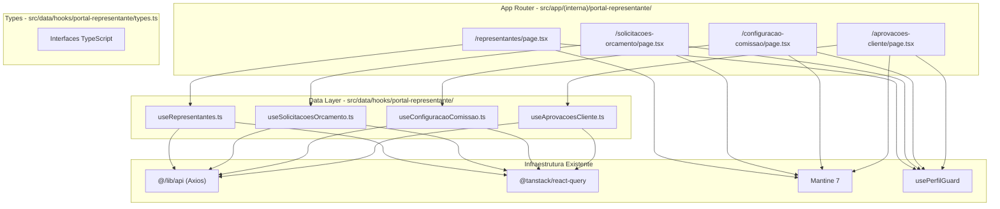
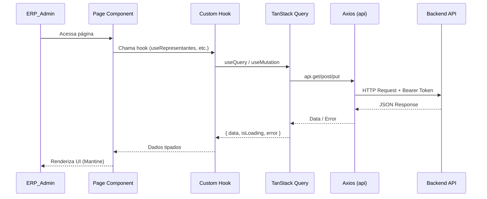

# Design Document — Portal Representante (Admin Frontend)

## Overview

Este documento descreve o design das telas administrativas do Portal do Representante no frontend do Vizor ERP. O módulo permite que administradores (ADMIN/SUPER_ADMIN) gerenciem contas de representantes, processem solicitações de orçamento, configurem critérios de comissão e revisem aprovações de clientes.

O backend já está implementado com contrato fixo em `/api/portal-rep/admin/`. O frontend será construído seguindo os padrões consolidados do projeto: Next.js 15 App Router, Mantine 7, TanStack Query, Axios e TypeScript.

### Decisões de Design

- **Navegação**: O módulo será adicionado como item do `MODULE_MENUS` no `ModuleSidebar`, detectado via `detectModule()` para rotas `/portal-representante/*`.
- **Controle de acesso**: Uso de `usePerfilGuard(['ADMIN', 'SUPER_ADMIN'])` em cada página, consistente com o padrão do PCP.
- **Hooks de dados**: Pasta dedicada `src/data/hooks/portal-representante/` com hooks isolados por domínio.
- **Layout**: Padrão existente — breadcrumb → título → Card com LoadingOverlay → filtros → Table → Pagination.

---

## Architecture

### Diagrama de Componentes



### Fluxo de Dados



### Roteamento

| Rota | Página | Descrição |
|------|--------|-----------|
| `/portal-representante/representantes` | `page.tsx` | CRUD de contas |
| `/portal-representante/solicitacoes-orcamento` | `page.tsx` | Listagem + calcular |
| `/portal-representante/configuracao-comissao` | `page.tsx` | Config critério |
| `/portal-representante/aprovacoes-cliente` | `page.tsx` | Listagem + review |

---

## Components and Interfaces

### Páginas (Page Components)

#### 1. RepresentantesPage

- **Responsabilidade**: CRUD completo de contas de representantes.
- **Estado local**: `modalCriar`, `modalEditar`, `representanteEditando`, `senhaTemporariaDialog`.
- **Hooks utilizados**: `useRepresentantes`, `useCriarRepresentante`, `useEditarRepresentante`, `useInativarRepresentante`, `useResetarSenha`, `useVendedoresDisponiveis`.
- **Componentes Mantine**: Card, Table, Badge, Modal, TextInput, Select, Button, ActionIcon, LoadingOverlay, Group, CopyButton.

#### 2. SolicitacoesOrcamentoPage

- **Responsabilidade**: Listar solicitações com filtros e paginação; disparar cálculo.
- **Estado local**: `filtros` (status, vendedor, cliente, período), `page`, `pageSize`.
- **Hooks utilizados**: `useSolicitacoesOrcamento`, `useCalcularOrcamento`.
- **Componentes Mantine**: Card, Table, Badge, Select, TextInput, DatePickerInput, Pagination, Button, LoadingOverlay, Group.

#### 3. ConfiguracaoComissaoPage

- **Responsabilidade**: Exibir e alterar o critério de creditamento de comissão.
- **Estado local**: `criterioSelecionado`, `criterioAnterior` (para rollback).
- **Hooks utilizados**: `useConfiguracaoComissao`, `useAlterarConfiguracaoComissao`.
- **Componentes Mantine**: Card, Radio.Group, Radio, Button, Text, LoadingOverlay.

#### 4. AprovacoesClientePage

- **Responsabilidade**: Listar aprovações pendentes; visualizar comparação de dados.
- **Estado local**: `modalDetalhes`, `aprovacaoSelecionada`.
- **Hooks utilizados**: `useAprovacoesCliente`.
- **Componentes Mantine**: Card, Table, Badge, Modal, Grid, Text, Highlight, LoadingOverlay.

### Hooks de Dados

```typescript
// useRepresentantes.ts
export function useRepresentantes(): UseQueryResult<Representante[]>
export function useVendedoresDisponiveis(): UseQueryResult<VendedorDisponivel[]>
export function useCriarRepresentante(): UseMutationResult<CriarRepresentanteResponse, Error, CriarRepresentantePayload>
export function useEditarRepresentante(): UseMutationResult<void, Error, { id: string; data: EditarRepresentantePayload }>
export function useInativarRepresentante(): UseMutationResult<void, Error, string>
export function useResetarSenha(): UseMutationResult<ResetarSenhaResponse, Error, string>

// useSolicitacoesOrcamento.ts
export function useSolicitacoesOrcamento(params: SolicitacoesFilters): UseQueryResult<PaginatedResponse<SolicitacaoOrcamento>>
export function useCalcularOrcamento(): UseMutationResult<void, Error, string>

// useConfiguracaoComissao.ts
export function useConfiguracaoComissao(): UseQueryResult<ConfiguracaoComissao>
export function useAlterarConfiguracaoComissao(): UseMutationResult<void, Error, AlterarComissaoPayload>

// useAprovacoesCliente.ts
export function useAprovacoesCliente(): UseQueryResult<AprovacaoCliente[]>
```

### Navegação (ModuleSidebar)

Adição ao `MODULE_MENUS` no `ModuleSidebar.tsx`:

```typescript
'portal-representante': {
  title: 'Portal Representante',
  entries: [
    { icon: IconUsers, label: 'Representantes', href: '/portal-representante/representantes' },
    { icon: IconFileText, label: 'Solicitações de Orçamento', href: '/portal-representante/solicitacoes-orcamento' },
    { icon: IconSettings, label: 'Configuração de Comissão', href: '/portal-representante/configuracao-comissao' },
    { icon: IconCheck, label: 'Aprovações de Clientes', href: '/portal-representante/aprovacoes-cliente' },
  ],
}
```

Adição à função `detectModule()`:
```typescript
if (pathname.startsWith('/portal-representante')) return 'portal-representante'
```

### Controle de Acesso na Sidebar

O item "Portal Representante" no menu lateral deve ser visível **somente** para perfis ADMIN e SUPER_ADMIN. A verificação será feita no componente `ModuleSidebar` usando `getUserPerfil()`, ocultando a entrada do módulo para perfis sem permissão (SUPERVISOR, OPERADOR).

---

## Data Models

### Interfaces TypeScript

```typescript
// src/data/hooks/portal-representante/types.ts

export type StatusRepresentante = 'ATIVO' | 'INATIVO'
export type CriterioComissao = 'ENTREGUE' | 'FATURADO' | 'PAGO'
export type TipoAprovacao = 'VINCULACAO' | 'ALTERACAO_FISCAL'
export type StatusAprovacao = 'PENDENTE' | 'APROVADA' | 'REJEITADA'
export type StatusSolicitacao = 'PENDENTE' | 'CALCULADO' | 'ENVIADO' | 'ACEITO' | 'RECUSADO'

// ─── Representantes ──────────────────────────────────────────────

export interface Representante {
  id: string
  vendedorId: string
  vendedorNome: string
  email: string
  status: StatusRepresentante
  senhaTemporaria: boolean
  notificacaoEmail: boolean
  ultimoAcesso: string | null
  criadoEm: string
}

export interface VendedorDisponivel {
  id: string
  nome: string
}

export interface CriarRepresentantePayload {
  vendedorId: string
  email: string
}

export interface CriarRepresentanteResponse {
  id: string
  senhaTemporaria: string
}

export interface EditarRepresentantePayload {
  email?: string
  status?: StatusRepresentante
  notificacaoEmail?: boolean
}

export interface ResetarSenhaResponse {
  senhaTemporaria: string
}

// ─── Solicitações de Orçamento ───────────────────────────────────

export interface SolicitacaoOrcamento {
  id: string
  representanteNome: string
  clienteNome: string
  status: StatusSolicitacao
  criadoEm: string
  itens: SolicitacaoItem[]
}

export interface SolicitacaoItem {
  produtoNome: string
  quantidade: number
  especificacao?: string
}

export interface SolicitacoesFilters {
  page: number
  pageSize: number
  status?: StatusSolicitacao
  vendedorId?: string
  clienteNome?: string
  dataInicio?: string
  dataFim?: string
}

export interface PaginatedResponse<T> {
  data: T[]
  total: number
  page: number
  pageSize: number
}

// ─── Configuração de Comissão ────────────────────────────────────

export interface ConfiguracaoComissao {
  criterio: CriterioComissao
}

export interface AlterarComissaoPayload {
  criterio: CriterioComissao
}

// ─── Aprovações de Clientes ──────────────────────────────────────

export interface AprovacaoCliente {
  id: string
  representanteNome: string
  clienteNome: string
  tipo: TipoAprovacao
  status: StatusAprovacao
  criadoEm: string
  dadosAnteriores: Record<string, unknown>
  dadosNovos: Record<string, unknown>
}
```

### Constantes de UI

```typescript
// Status badges para representantes
export const statusRepresentanteColors: Record<StatusRepresentante, string> = {
  ATIVO: 'green',
  INATIVO: 'red',
}

// Status badges para solicitações
export const statusSolicitacaoColors: Record<StatusSolicitacao, string> = {
  PENDENTE: 'yellow',
  CALCULADO: 'blue',
  ENVIADO: 'cyan',
  ACEITO: 'green',
  RECUSADO: 'red',
}

// Opções de critério de comissão
export const criterioComissaoOptions = [
  { value: 'ENTREGUE', label: 'Entregue', description: 'Comissão creditada na confirmação de entrega' },
  { value: 'FATURADO', label: 'Faturado', description: 'Comissão creditada na emissão da nota fiscal' },
  { value: 'PAGO', label: 'Pago', description: 'Comissão creditada na confirmação de pagamento' },
]
```

### Mapeamento de Endpoints

| Hook | Método | Endpoint | Query Key |
|------|--------|----------|-----------|
| `useRepresentantes` | GET | `/portal-rep/admin/representantes` | `['portal-rep-representantes']` |
| `useVendedoresDisponiveis` | GET | `/portal-rep/admin/representantes` (param: vendedores-disponiveis) | `['portal-rep-vendedores-disponiveis']` |
| `useCriarRepresentante` | POST | `/portal-rep/admin/representantes` | invalida `['portal-rep-representantes']` |
| `useEditarRepresentante` | PUT | `/portal-rep/admin/representantes/:id` | invalida `['portal-rep-representantes']` |
| `useInativarRepresentante` | PUT | `/portal-rep/admin/representantes/:id/inativar` | invalida `['portal-rep-representantes']` |
| `useResetarSenha` | PUT | `/portal-rep/admin/representantes/:id/resetar-senha` | invalida `['portal-rep-representantes']` |
| `useSolicitacoesOrcamento` | GET | `/portal-rep/admin/solicitacoes-orcamento` | `['portal-rep-solicitacoes', params]` |
| `useCalcularOrcamento` | POST | `/portal-rep/admin/solicitacoes-orcamento/:id/calcular` | invalida `['portal-rep-solicitacoes']` |
| `useConfiguracaoComissao` | GET | `/portal-rep/admin/configuracao-comissao` | `['portal-rep-config-comissao']` |
| `useAlterarConfiguracaoComissao` | PUT | `/portal-rep/admin/configuracao-comissao` | invalida `['portal-rep-config-comissao']` |
| `useAprovacoesCliente` | GET | `/portal-rep/admin/aprovacoes-cliente` | `['portal-rep-aprovacoes']` |

---

## Correctness Properties

*Uma propriedade é uma característica ou comportamento que deve ser verdadeira em todas as execuções válidas de um sistema — essencialmente, uma declaração formal sobre o que o sistema deve fazer. Propriedades servem como ponte entre especificações legíveis por humanos e garantias de correção verificáveis por máquina.*

### Property 1: Renderização completa de dados em tabelas

*Para qualquer* objeto de dados válido (Representante, SolicitacaoOrcamento ou AprovacaoCliente), a renderização da linha correspondente na tabela deve conter todas as informações obrigatórias definidas nos requisitos (todas as colunas especificadas).

**Validates: Requirements 2.2, 7.2, 10.2**

### Property 2: Validação de e-mail rejeita formatos inválidos

*Para qualquer* string que não segue o formato de e-mail válido (RFC 5322 simplificado), a função de validação do formulário de criação/edição de representante deve retornar erro; e *para qualquer* string que é um e-mail válido, a validação deve aceitar.

**Validates: Requirements 3.3**

### Property 3: Rollback de seleção de comissão em caso de erro

*Para qualquer* valor de critério de comissão anterior e qualquer novo critério selecionado, se a API retornar erro ao tentar salvar a alteração, a interface deve reverter a seleção para o valor anterior (o estado visual antes da tentativa).

**Validates: Requirements 9.5**

### Property 4: Destaque de campos alterados na comparação

*Para quaisquer* dois objetos de dados (dadosAnteriores e dadosNovos) de uma aprovação de cliente, todos os campos cujos valores diferem entre os dois objetos devem receber destaque visual, e campos com valores iguais não devem ser destacados.

**Validates: Requirements 10.5**

### Property 5: Botões desabilitados durante mutações

*Para qualquer* operação de mutação (criar, editar, inativar, resetar senha, calcular orçamento, alterar comissão) enquanto a requisição estiver em estado pendente (isPending), os botões de ação associados devem estar desabilitados, prevenindo submissões duplicadas.

**Validates: Requirements 8.3, 11.5**

### Property 6: Notificações seguem convenção de cores

*Para qualquer* operação de mutação neste módulo que resulte em sucesso, a notificação exibida deve usar `color: 'green'`; e *para qualquer* operação que resulte em erro, a notificação deve usar `color: 'red'`.

**Validates: Requirements 11.1**

---

## Error Handling

### Estratégia de Tratamento de Erros

| Cenário | Comportamento |
|---------|---------------|
| **Erro de rede / timeout** | Notificação vermelha com mensagem genérica + opção retry (via TanStack Query `refetch`) |
| **HTTP 400 (empresa não selecionada)** | Redirecionar para `/selecionar-empresa` |
| **HTTP 403 (sem permissão)** | Notificação vermelha: "Apenas administradores podem acessar esta funcionalidade" |
| **HTTP 400/409 (validação backend)** | Exibir `response.data.message` no modal (se em modal) ou em notificação |
| **Erro durante mutation em modal** | Manter modal aberto, exibir mensagem de erro inline |
| **Erro durante mutation fora de modal** | Notificação vermelha com mensagem do backend |

### Padrão de Implementação

```typescript
// Padrão para mutations em modal
mutacao.mutate(payload, {
  onSuccess: (data) => {
    notifications.show({ title: 'Sucesso', message: '...', color: 'green' })
    queryClient.invalidateQueries({ queryKey: ['portal-rep-representantes'] })
    fecharModal()
  },
  onError: (err: any) => {
    const msg = err?.response?.data?.message || 'Erro inesperado. Tente novamente.'
    if (err?.response?.status === 400 && msg.includes('empresa')) {
      router.replace('/selecionar-empresa')
      return
    }
    if (err?.response?.status === 403) {
      notifications.show({ title: 'Acesso negado', message: msg, color: 'red' })
      return
    }
    // Em modal: exibir no estado local de erro do form
    setErroForm(msg)
  },
})
```

### Rollback Otimista (Configuração de Comissão)

A página de configuração de comissão armazena o `criterioAnterior` antes de disparar a mutation. Se a API retornar erro, reverte a seleção:

```typescript
const criterioAnterior = useRef(data?.criterio)

function handleAlterarCriterio(novoCriterio: CriterioComissao) {
  criterioAnterior.current = data?.criterio
  setCriterioLocal(novoCriterio)
  
  alterarComissao.mutate({ criterio: novoCriterio }, {
    onError: () => {
      setCriterioLocal(criterioAnterior.current) // rollback
      notifications.show({ title: 'Erro', message: '...', color: 'red' })
    },
  })
}
```

---

## Testing Strategy

### Abordagem Dual

O módulo será testado com:

1. **Testes unitários (Vitest + React Testing Library)**: Cenários específicos, interações de UI, mocks de API, verificação de renderização.
2. **Testes property-based (fast-check + Vitest)**: Propriedades universais que devem valer para qualquer input válido.

### Testes Unitários (Exemplos)

- Renderizar página com mock de dados e verificar presença de colunas
- Verificar que `usePerfilGuard` é chamado com `['ADMIN', 'SUPER_ADMIN']`
- Simular clique em "Novo Representante" e verificar modal aberto
- Simular erro 403 e verificar notificação de permissão
- Verificar que LoadingOverlay aparece durante loading
- Verificar paginação envia params corretos

### Testes Property-Based (fast-check)

Configuração: **mínimo 100 iterações** por propriedade.

| Propriedade | Gerador | Verificação |
|-------------|---------|-------------|
| P1: Renderização completa | Gerar `Representante` / `SolicitacaoOrcamento` / `AprovacaoCliente` aleatórios | Todas as colunas obrigatórias presentes no output renderizado |
| P2: Validação e-mail | `fc.emailAddress()` + `fc.string()` | Aceita e-mails válidos, rejeita inválidos |
| P3: Rollback comissão | `fc.constantFrom('ENTREGUE','FATURADO','PAGO')` × 2 | Após erro, estado reverte ao anterior |
| P4: Destaque de campos | Dois `fc.record()` com campos aleatórios | Campos diferentes → highlight, iguais → sem highlight |
| P5: Botões disabled | Qualquer mutation em isPending | `button.disabled === true` |
| P6: Notificação cores | Qualquer mutation + resultado (sucesso/erro) | verde para sucesso, vermelho para erro |

**Tag format**: `Feature: portal-representante-admin-frontend, Property {N}: {texto}`

### Biblioteca PBT

- **fast-check** (já instalado no projeto, conforme `package.json` e steering)
- Cada teste property-based executará com `fc.assert(fc.property(...), { numRuns: 100 })`

---

## Estrutura de Arquivos

```
src/
├── app/(interna)/portal-representante/
│   ├── representantes/
│   │   └── page.tsx
│   ├── solicitacoes-orcamento/
│   │   └── page.tsx
│   ├── configuracao-comissao/
│   │   └── page.tsx
│   └── aprovacoes-cliente/
│       └── page.tsx
├── data/hooks/portal-representante/
│   ├── types.ts
│   ├── useRepresentantes.ts
│   ├── useSolicitacoesOrcamento.ts
│   ├── useConfiguracaoComissao.ts
│   └── useAprovacoesCliente.ts
└── components/layout/ModuleSidebar.tsx  (modificação: adicionar módulo)
```
