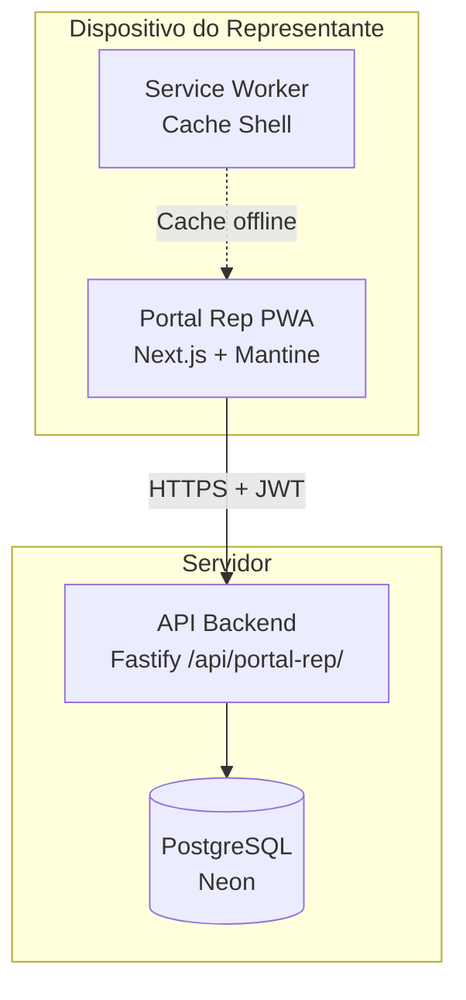
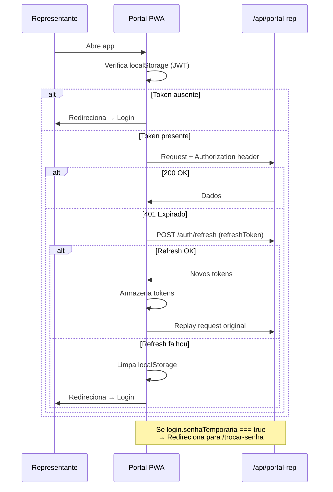

# Design — Portal do Representante Externo (Frontend PWA)

## Overview

Aplicação web mobile-first (PWA) para representantes comerciais externos, implementada como route group isolado `src/app/(portal-rep)/` no projeto Next.js 15 existente. O portal consome exclusivamente a API já implementada em `/api/portal-rep/` e oferece experiência equivalente a um app nativo: instalável, com gestos touch-friendly, pull-to-refresh e navegação adaptativa (bottom nav em mobile, sidebar em desktop).

**Decisões arquiteturais chave:**
- Route group separado com layout próprio — zero dependência visual do ERP
- Mantine 7 com tema verde/branco — identidade visual distinta do ERP (azul)
- Axios com interceptor dedicado para JWT + refresh token (separado do interceptor do ERP)
- React Query para cache e sincronização de dados
- PWA via `next-pwa` com service worker para cache do shell
- Hooks de dados em `src/data/hooks/portal-rep-app/` (separados dos hooks admin)

---

## Architecture

### Diagrama de Contexto



### Diagrama de Componentes (Alto Nível)

```mermaid
graph TD
    subgraph "Route Group: (portal-rep)"
        Layout[layout.tsx<br/>Auth Guard + Nav]
        Login[portal-rep/login]
        TrocarSenha[portal-rep/trocar-senha]
        Dashboard[portal-rep/dashboard]
        Clientes[portal-rep/clientes]
        ClienteNovo[portal-rep/clientes/novo]
        ClienteDetalhe[portal-rep/clientes/id]
        Orcamentos[portal-rep/orcamentos]
        OrcamentoNovo[portal-rep/orcamentos/novo]
        OrcamentoDetalhe[portal-rep/orcamentos/id]
        Pipeline[portal-rep/pipeline]
        PipelineDetalhe[portal-rep/pipeline/id]
        Comissoes[portal-rep/comissoes]
        Notificacoes[portal-rep/notificacoes]
        Perfil[portal-rep/perfil]
    end

    subgraph "Hooks de Dados"
        useAuth[usePortalRepAuth]
        useClientes[usePortalRepClientes]
        useOrcamentos[usePortalRepOrcamentos]
        usePipeline[usePortalRepPipeline]
        useComissoes[usePortalRepComissoes]
        useNotificacoes[usePortalRepNotificacoes]
    end

    subgraph "Infraestrutura"
        portalApi[portalRepApi<br/>Axios Instance]
        theme[portalRepTheme<br/>Mantine Theme]
        pullRefresh[usePullToRefresh<br/>Custom Hook]
    end

    Layout --> Login
    Layout --> Dashboard
    Layout --> Clientes
    Dashboard --> useAuth
    Dashboard --> useOrcamentos
    Dashboard --> usePipeline
    Dashboard --> useComissoes
    Clientes --> useClientes
    Orcamentos --> useOrcamentos
    Pipeline --> usePipeline
    Comissoes --> useComissoes
    Notificacoes --> useNotificacoes

    useAuth --> portalApi
    useClientes --> portalApi
    useOrcamentos --> portalApi
    usePipeline --> portalApi
    useComissoes --> portalApi
    useNotificacoes --> portalApi
```



### Fluxo de Autenticação



---

## Components and Interfaces

### Estrutura de Arquivos

```
src/app/(portal-rep)/
├── layout.tsx                    # Auth guard + navegação adaptativa
├── portal-rep/
│   ├── login/page.tsx           # Login (email + senha + empresa)
│   ├── trocar-senha/page.tsx    # Troca de senha obrigatória
│   ├── dashboard/page.tsx       # Cards de resumo
│   ├── clientes/
│   │   ├── page.tsx             # Lista de clientes (busca + filtro)
│   │   ├── novo/page.tsx        # Cadastro de novo cliente
│   │   └── [id]/page.tsx        # Edição do cliente
│   ├── orcamentos/
│   │   ├── page.tsx             # Lista de solicitações
│   │   ├── novo/page.tsx        # Nova solicitação de orçamento
│   │   └── [id]/page.tsx        # Detalhe da solicitação
│   ├── pipeline/
│   │   ├── page.tsx             # Lista com timeline
│   │   └── [id]/page.tsx        # Detalhe com progresso
│   ├── comissoes/page.tsx       # Resumo + detalhamento
│   ├── notificacoes/page.tsx    # Lista paginada
│   └── perfil/page.tsx          # Dados + alterar senha + logout

src/data/hooks/portal-rep-app/
├── types.ts                     # Interfaces e tipos
├── portal-rep-api.ts            # Instância Axios dedicada
├── usePortalRepAuth.ts          # Login, refresh, logout
├── usePortalRepClientes.ts      # CRUD clientes
├── usePortalRepOrcamentos.ts    # Solicitações de orçamento
├── usePortalRepPipeline.ts      # Pipeline de pedidos
├── usePortalRepComissoes.ts     # Comissões
├── usePortalRepNotificacoes.ts  # Notificações
└── usePortalRepDashboard.ts     # Dashboard (3 queries paralelas)

src/components/portal-rep/
├── BottomNav.tsx                # Navegação mobile (< 768px)
├── SidebarDesktop.tsx           # Sidebar desktop (≥ 768px)
├── PullToRefresh.tsx            # Componente de pull-to-refresh
├── PipelineTimeline.tsx         # Timeline horizontal de status
├── NotificationBadge.tsx        # Badge com contagem
├── EmptyState.tsx               # Estado vazio genérico
├── SkeletonCard.tsx             # Skeleton para cards
└── formatters.ts                # Formatação BR (data, moeda, CPF, CNPJ, tel)

src/lib/portal-rep-theme.ts      # Mantine theme (verde/branco)
public/manifest-portal-rep.json  # Manifesto PWA
```

### Componentes Principais

#### `layout.tsx` — Layout Raiz do Portal

```typescript
// Responsabilidades:
// 1. Auth guard: verifica token em localStorage, redireciona se ausente
// 2. Detecta senhaTemporaria e força /trocar-senha
// 3. Renderiza BottomNav ou SidebarDesktop conforme breakpoint
// 4. Polling de notificações não-lidas a cada 60s
// 5. NÃO renderiza nav na página de login e trocar-senha
```

#### `BottomNav.tsx` — Navegação Mobile

5 itens fixos na barra inferior:
1. **Dashboard** (IconHome)
2. **Clientes** (IconUsers)
3. **Orçamentos** (IconFileInvoice)
4. **Pipeline** (IconTimeline)
5. **Mais** (IconDotsVertical) → abre sheet com: Comissões, Notificações, Perfil

Badge de notificações no ícone "Mais" (ou "Notificações" quando sheet aberto).

#### `SidebarDesktop.tsx` — Sidebar Desktop

Links para todas as seções, logotipo no topo, botão "Sair" no rodapé.
Badge de notificações no item "Notificações".

#### `PipelineTimeline.tsx` — Timeline de Status

```typescript
interface PipelineTimelineProps {
  statusAtual: StatusPedido
  compacto?: boolean // true em cards mobile
  datas?: Record<StatusPedido, string | null> // datas de transição
}

// Estágios: Orçamento → PV → OP → Produção → Expedição → Entregue
// Estágio atual: ícone preenchido + cor verde
// Estágios concluídos: ícone check + cor verde opaco
// Estágios futuros: ícone outline + cor cinza
```

#### `formatters.ts` — Funções de Formatação

```typescript
export function formatarData(date: string | Date): string
// → DD/MM/AAAA

export function formatarDataHora(date: string | Date): string
// → DD/MM/AAAA HH:mm

export function formatarMoeda(valor: number): string
// → R$ X.XXX,XX

export function formatarCpf(cpf: string): string
// → XXX.XXX.XXX-XX

export function formatarCnpj(cnpj: string): string
// → XX.XXX.XXX/XXXX-XX

export function formatarTelefone(tel: string): string
// → (XX) XXXXX-XXXX ou (XX) XXXX-XXXX

export function formatarDocumento(doc: string): string
// → detecta 11 ou 14 dígitos e aplica máscara correta

export function validarCpf(cpf: string): boolean
// → valida dígitos verificadores

export function validarCnpj(cnpj: string): boolean
// → valida dígitos verificadores
```

---

## Data Models

### Interfaces TypeScript

```typescript
// ─── Auth ────────────────────────────────────────────────────────
export interface LoginPayload {
  email: string
  senha: string
  empresaId?: string
}

export interface LoginResponse {
  token: string
  refreshToken: string
  senhaTemporaria: boolean
  representante: {
    id: string
    nome: string
    email: string
  }
}

export interface TrocarSenhaPayload {
  senhaAtual: string
  novaSenha: string
}

// ─── Clientes ────────────────────────────────────────────────────
export interface ClienteCarteira {
  id: string
  razaoSocial: string
  nomeFantasia: string | null
  cpfCnpj: string
  inscricaoEstadual: string | null
  telefone: string | null
  email: string | null
  cidade: string | null
  uf: string | null
  logradouro: string | null
  numero: string | null
  complemento: string | null
  bairro: string | null
  cep: string | null
}

export interface CriarClientePayload {
  razaoSocial: string
  nomeFantasia?: string
  cpfCnpj: string
  inscricaoEstadual?: string
  telefone?: string
  email?: string
  logradouro?: string
  numero?: string
  complemento?: string
  bairro?: string
  cidade?: string
  uf?: string
  cep?: string
}

export interface EditarClientePayload {
  telefone?: string
  email?: string
  logradouro?: string
  numero?: string
  complemento?: string
  bairro?: string
  cidade?: string
  uf?: string
  cep?: string
}

export interface SolicitarAlteracaoFiscalPayload {
  razaoSocial?: string
  cpfCnpj?: string
  inscricaoEstadual?: string
}

// ─── Solicitações de Orçamento ───────────────────────────────────
export type StatusSolicitacao = 'PENDENTE' | 'CALCULADO' | 'ENVIADO' | 'ACEITO' | 'RECUSADO'

export interface ItemSolicitacao {
  produtoNome: string
  quantidade: number
  especificacao?: string
  precoUnitario?: number  // apenas quando status >= CALCULADO
  precoTotal?: number     // apenas quando status >= CALCULADO
}

export interface SolicitacaoOrcamento {
  id: string
  clienteId: string
  clienteNome: string
  status: StatusSolicitacao
  criadoEm: string
  itens: ItemSolicitacao[]
}

export interface CriarSolicitacaoPayload {
  clienteId: string
  itens: Array<{
    produtoNome: string
    quantidade: number
    especificacao?: string
  }>
}

// ─── Pipeline ────────────────────────────────────────────────────
export type StatusPedido = 
  | 'ORCAMENTO' 
  | 'PV' 
  | 'OP' 
  | 'PRODUCAO' 
  | 'EXPEDICAO' 
  | 'ENTREGUE'

export interface PedidoPipeline {
  id: string
  numero: string
  clienteNome: string
  statusAtual: StatusPedido
  criadoEm: string
  dataEntregaPrevista: string | null
}

export interface DetalhePipeline {
  id: string
  numero: string
  clienteNome: string
  statusAtual: StatusPedido
  percentualProducao: number | null // só quando status === 'PRODUCAO'
  produtos: Array<{ nome: string; quantidade: number }>
  criadoEm: string
  dataEntregaPrevista: string | null
  transicoes: Array<{ status: StatusPedido; data: string }>
}

// ─── Comissões ───────────────────────────────────────────────────
export interface ResumoComissao {
  mes: number
  ano: number
  projetada: number
  realizada: number
}

export interface DetalheComissao {
  pedidoNumero: string
  clienteNome: string
  valorVenda: number
  percentualComissao: number
  valorComissao: number
}

// ─── Notificações ────────────────────────────────────────────────
export interface Notificacao {
  id: string
  titulo: string
  mensagem: string
  lida: boolean
  criadoEm: string
}

// ─── Dashboard ───────────────────────────────────────────────────
export interface DashboardData {
  orcamentosPendentes: number
  pipeline: Record<StatusPedido, number>
  comissaoMes: { projetada: number; realizada: number }
}
```

### Instância Axios Dedicada

```typescript
// src/data/hooks/portal-rep-app/portal-rep-api.ts

import axios from 'axios'

const STORAGE_KEY_TOKEN = 'portal-rep-token'
const STORAGE_KEY_REFRESH = 'portal-rep-refresh-token'

export const portalRepApi = axios.create({
  baseURL: `${process.env.NEXT_PUBLIC_API_URL || 'http://localhost:3333/api'}/portal-rep`,
})

// Interceptor request: adiciona Authorization header
// Interceptor response: 401 → tenta refresh → falha → redirect /portal-rep/login
// Separado do interceptor do ERP (api.ts) para não conflitar tokens
```

**Motivação**: O ERP e o portal do representante usam tokens diferentes (endpoints de login diferentes, payloads de JWT diferentes). Manter instâncias Axios separadas evita conflitos de interceptor e facilita a manutenção.

---

## Tema Visual

```typescript
// src/lib/portal-rep-theme.ts
import { createTheme } from '@mantine/core'

export const portalRepTheme = createTheme({
  primaryColor: 'green',
  defaultRadius: 'md',
  white: '#ffffff',
  colors: {
    // Verde customizado para o portal
    green: [
      '#e6f9ed', '#c1f0d4', '#8ee4ad', '#5ad887',
      '#33cc6a', '#1ab854', '#14a348', '#0f8e3c',
      '#0a7930', '#066424'
    ],
  },
  components: {
    Card: { defaultProps: { shadow: 'xs', withBorder: true } },
    Button: { defaultProps: { radius: 'md' } },
  },
})
```

---

## Hooks de Dados

### Padrão de Hook (React Query)

Todos os hooks seguem o padrão consolidado do projeto:

```typescript
// usePortalRepClientes.ts
import { useQuery, useMutation, useQueryClient } from '@tanstack/react-query'
import { portalRepApi } from './portal-rep-api'
import type { ClienteCarteira, CriarClientePayload, EditarClientePayload } from './types'

const QUERY_KEY = 'portal-rep-clientes'

export function usePortalRepClientes() {
  return useQuery<ClienteCarteira[]>({
    queryKey: [QUERY_KEY],
    queryFn: async () => {
      const { data } = await portalRepApi.get('/clientes')
      return data
    },
  })
}

export function useCriarCliente() {
  const qc = useQueryClient()
  return useMutation({
    mutationFn: async (body: CriarClientePayload) => {
      const { data } = await portalRepApi.post('/clientes', body)
      return data
    },
    onSuccess: () => qc.invalidateQueries({ queryKey: [QUERY_KEY] }),
  })
}

// ... padrão análogo para editar, solicitar alteração fiscal
```

### Hooks Específicos

| Hook | Query Key | Endpoints |
|------|-----------|-----------|
| `usePortalRepAuth` | — (mutations apenas) | `POST /auth/login`, `POST /auth/refresh`, `POST /auth/trocar-senha` |
| `usePortalRepClientes` | `portal-rep-clientes` | `GET /clientes`, `POST /clientes`, `PUT /clientes/:id`, `PUT /clientes/:id/campos-fiscais` |
| `usePortalRepOrcamentos` | `portal-rep-solicitacoes-orcamento` | `GET /solicitacoes-orcamento`, `GET /solicitacoes-orcamento/:id`, `POST /solicitacoes-orcamento`, `DELETE /solicitacoes-orcamento/:id` |
| `usePortalRepPipeline` | `portal-rep-pipeline` | `GET /pipeline`, `GET /pipeline/:pedidoVendaId` |
| `usePortalRepComissoes` | `portal-rep-comissoes` | `GET /comissoes`, `GET /comissoes/detalhe` |
| `usePortalRepNotificacoes` | `portal-rep-notificacoes` | `GET /notificacoes`, `PUT /notificacoes/:id/lida`, `PUT /notificacoes/ler-todas`, `GET /notificacoes/count-nao-lidas` |
| `usePortalRepDashboard` | `portal-rep-dashboard` | Combina: contagem orçamentos + resumo pipeline + comissão mês |

### Hook de Pull-to-Refresh

```typescript
// src/components/portal-rep/usePullToRefresh.ts
export function usePullToRefresh(onRefresh: () => Promise<void>) {
  // Detecta touch start/move/end
  // Threshold: 60px de deslocamento vertical
  // Exibe indicador visual (spinner rotativo)
  // Desabilita durante refresh em andamento
  // Retorna: { ref, isRefreshing }
}
```

---

## Navegação Adaptativa

### Breakpoints

| Breakpoint | Comportamento |
|---|---|
| < 768px (mobile) | Bottom_Nav fixa no rodapé, sem sidebar |
| ≥ 768px (desktop) | Sidebar fixa à esquerda, sem bottom nav |

### Itens de Navegação

**Bottom Nav (mobile) — 5 itens:**
1. Dashboard (IconHome)
2. Clientes (IconUsers)
3. Orçamentos (IconFileInvoice)
4. Pipeline (IconTimeline)
5. Mais (IconDotsVertical) → Sheet com: Comissões, Notificações (com badge), Perfil

**Sidebar Desktop — todos os itens:**
- Dashboard
- Clientes
- Orçamentos
- Pipeline
- Comissões
- Notificações (com badge)
- Perfil
- Sair (rodapé)

---

## PWA

### Manifesto

```json
{
  "name": "Vizor - Portal do Representante",
  "short_name": "Vizor Rep",
  "start_url": "/portal-rep/dashboard",
  "display": "standalone",
  "theme_color": "#1ab854",
  "background_color": "#ffffff",
  "icons": [
    { "src": "/icons/portal-rep-192.png", "sizes": "192x192", "type": "image/png" },
    { "src": "/icons/portal-rep-512.png", "sizes": "512x512", "type": "image/png" }
  ]
}
```

### Service Worker

Usando `next-pwa` (já configurado via `next.config.js`):
- Precache: Shell da aplicação (HTML, CSS, JS, fontes, ícones)
- Runtime cache: Network-first para API calls
- Fallback offline: Shell com mensagem "Sem conexão"
- Ao recuperar conexão: `navigator.onLine` + evento `online` → invalida queries React Query

---

## Correctness Properties

*Uma propriedade é uma característica ou comportamento que deve ser verdadeiro em todas as execuções válidas de um sistema — essencialmente, uma declaração formal sobre o que o sistema deve fazer. Propriedades servem como ponte entre especificações legíveis por humanos e garantias de corretude verificáveis por máquina.*

### Property 1: Interceptor de autenticação — token sempre presente

*Para qualquer* requisição HTTP feita pela instância `portalRepApi` enquanto existe um token em localStorage, o header `Authorization: Bearer {token}` DEVE estar presente na requisição.

**Validates: Requirements 3.2, 3.6, 22.3, 22.4**

### Property 2: Refresh automático em 401

*Para qualquer* resposta HTTP 401 recebida (exceto da própria rota de refresh), o interceptor DEVE tentar renovar o token automaticamente. Se o refresh falhar, DEVE limpar localStorage e redirecionar para `/portal-rep/login`.

**Validates: Requirements 3.3, 3.4, 20.3**

### Property 3: Validação de CPF/CNPJ — dígitos verificadores

*Para qualquer* string de 11 dígitos que satisfaça o algoritmo de dígitos verificadores do CPF, `validarCpf()` DEVE retornar `true`. *Para qualquer* string de 11 dígitos que NÃO satisfaça o algoritmo, DEVE retornar `false`. Analogamente para CNPJ com 14 dígitos.

**Validates: Requirements 7.2**

### Property 4: Validação de confirmação de senha

*Para qualquer* par de strings (novaSenha, confirmacao) onde `novaSenha !== confirmacao`, o formulário de troca de senha DEVE exibir erro de validação e impedir o submit.

**Validates: Requirements 4.3, 18.3**

### Property 5: Filtragem local de clientes

*Para qualquer* lista de clientes e *qualquer* termo de busca, o resultado filtrado DEVE conter apenas clientes cujo nome, CPF/CNPJ ou cidade contenha o termo (case-insensitive). Nenhum cliente que não contenha o termo deve aparecer nos resultados.

**Validates: Requirements 6.2**

### Property 6: Campos de custo/margem nunca renderizados

*Para qualquer* objeto de resposta da API que contenha campos `custo`, `margem`, `markup`, `custoUnitario` ou similares, esses campos NUNCA devem aparecer no HTML renderizado em nenhuma tela do portal.

**Validates: Requirements 10.5, 13.4, 24.1, 24.2, 24.3**

### Property 7: Formatação brasileira — round-trip de padrão

*Para qualquer* número inteiro de centavos (0 a 99.999.999), `formatarMoeda(valor / 100)` DEVE produzir uma string no padrão `R$ X.XXX,XX`. *Para qualquer* data válida, `formatarData()` DEVE produzir `DD/MM/AAAA`. *Para qualquer* string de 11 dígitos, `formatarCpf()` DEVE produzir `XXX.XXX.XXX-XX`. *Para qualquer* string de 14 dígitos, `formatarCnpj()` DEVE produzir `XX.XXX.XXX/XXXX-XX`. *Para qualquer* string de 10 ou 11 dígitos, `formatarTelefone()` DEVE produzir `(XX) XXXX-XXXX` ou `(XX) XXXXX-XXXX` respectivamente.

**Validates: Requirements 14.4, 25.1, 25.2, 25.3, 25.4**

### Property 8: Timeline do pipeline destaca estágio correto

*Para qualquer* pedido com `statusAtual = S`, o componente `PipelineTimeline` DEVE renderizar o estágio `S` como "ativo" (cor verde, ícone preenchido), todos os estágios anteriores como "concluído" (check), e todos os posteriores como "futuro" (cinza).

**Validates: Requirements 12.2, 12.3**

### Property 9: Badge de notificações — lógica de exibição

*Para qualquer* contagem de notificações não-lidas `n`: se `n === 0` o badge DEVE estar oculto; se `1 ≤ n ≤ 99` o badge DEVE exibir o número exato; se `n > 99` o badge DEVE exibir "99+".

**Validates: Requirements 17.1, 17.2, 17.3**

### Property 10: Botão cancelar apenas para solicitações PENDENTE

*Para qualquer* solicitação de orçamento com `status !== 'PENDENTE'`, o botão "Cancelar" NÃO DEVE ser renderizado. *Para qualquer* solicitação com `status === 'PENDENTE'`, o botão "Cancelar" DEVE ser renderizado.

**Validates: Requirements 10.7, 11.3**

---

## Error Handling

### Estratégia por Camada

| Camada | Responsabilidade | Implementação |
|---|---|---|
| **Interceptor Axios** | 401 → refresh → redirect | `portal-rep-api.ts` |
| **Interceptor Axios** | 403 `SENHA_TEMPORARIA` → redirect `/trocar-senha` | `portal-rep-api.ts` |
| **React Query** | Retry automático (3x para erros de rede) | Config global |
| **Componente** | Loading → Skeleton, Error → mensagem + retry, Empty → empty state | Cada página |
| **Toast (Notifications)** | Sucesso → verde, Erro → vermelho | `@mantine/notifications` |

### Mapeamento de Erros HTTP

| Código | Comportamento |
|---|---|
| 401 (não refresh) | Interceptor tenta refresh automaticamente |
| 401 (refresh falhou) | Limpa tokens, redireciona para login |
| 401 `CONTA_BLOQUEADA` | Mensagem específica na tela de login |
| 403 `SENHA_TEMPORARIA` | Redireciona para `/portal-rep/trocar-senha` |
| 409 `DOCUMENTO_EXISTENTE` | Mensagem + opção de solicitar vinculação |
| 422 (validação) | Exibe mensagem do campo `message` da resposta |
| 5xx / Network Error | Mensagem "Erro de conexão" + botão "Tentar novamente" |

### Padrão de Feedback Visual

```typescript
// Sucesso
notifications.show({ message: 'Cliente cadastrado!', color: 'green' })

// Erro
notifications.show({ message: err.response?.data?.message || 'Erro inesperado', color: 'red' })

// Loading
<Skeleton height={120} radius="md" />  // primeira carga
<LoadingOverlay visible={isFetching} />  // recargas subsequentes
```

### Estado Offline

```typescript
// No layout.tsx:
useEffect(() => {
  const handleOnline = () => queryClient.invalidateQueries()
  window.addEventListener('online', handleOnline)
  return () => window.removeEventListener('online', handleOnline)
}, [])

// Mensagem quando offline:
if (!navigator.onLine) {
  return <OfflineBanner message="Sem conexão com a internet" />
}
```

---

## Testing Strategy

### Abordagem Dual

**Testes unitários** (Vitest + Testing Library):
- Formatters: `formatarMoeda`, `formatarCpf`, `formatarCnpj`, `formatarTelefone`, `formatarData`
- Validators: `validarCpf`, `validarCnpj`
- Componentes isolados: `NotificationBadge`, `PipelineTimeline`, `BottomNav`
- Hooks: interceptor de auth (mock Axios)

**Testes de propriedade** (fast-check):
- Mínimo 100 iterações por propriedade
- Cada teste referencia a propriedade do design
- Tag: `Feature: portal-representante-externo, Property N: {descrição}`
- Biblioteca: `fast-check` (já instalada no projeto)

**Testes E2E** (Playwright):
- Fluxo de login completo
- Navegação entre seções
- Pull-to-refresh
- Responsividade (mobile vs desktop viewport)

### Mapeamento Propriedade → Teste

| Propriedade | Tipo de Teste | Gerador fast-check |
|---|---|---|
| 1. Token sempre presente | Property | `fc.string()` para tokens, mock de requests |
| 2. Refresh em 401 | Property | `fc.string()` para endpoints, mock 401 |
| 3. CPF/CNPJ validation | Property | `fc.integer({min:0, max:99999999999})` para CPF, gerador custom para CNPJs válidos/inválidos |
| 4. Confirmação de senha | Property | `fc.tuple(fc.string(), fc.string()).filter(([a,b]) => a !== b)` |
| 5. Filtragem local | Property | `fc.array(fc.record({nome: fc.string(), cpfCnpj: fc.string(), cidade: fc.string()}))` + `fc.string()` para termo |
| 6. Custo/margem ocultos | Property | `fc.record(...)` com campos proibidos injetados |
| 7. Formatação BR | Property | `fc.integer()` para centavos, `fc.date()` para datas, `fc.stringOf(fc.constantFrom(...'0123456789'), {minLength:11, maxLength:14})` |
| 8. Timeline status | Property | `fc.constantFrom('ORCAMENTO','PV','OP','PRODUCAO','EXPEDICAO','ENTREGUE')` |
| 9. Badge notificações | Property | `fc.integer({min:0, max:999})` |
| 10. Cancelar só PENDENTE | Property | `fc.constantFrom('PENDENTE','CALCULADO','ENVIADO','ACEITO','RECUSADO')` |

### Configuração de Testes de Propriedade

```typescript
import { describe, it, expect } from 'vitest'
import * as fc from 'fast-check'

describe('Feature: portal-representante-externo', () => {
  it('Property 7: Formatação brasileira de moeda', () => {
    fc.assert(
      fc.property(
        fc.integer({ min: 0, max: 9999999999 }),
        (centavos) => {
          const resultado = formatarMoeda(centavos / 100)
          expect(resultado).toMatch(/^R\$ [\d.]+,\d{2}$/)
        }
      ),
      { numRuns: 100 }
    )
  })
})
```
