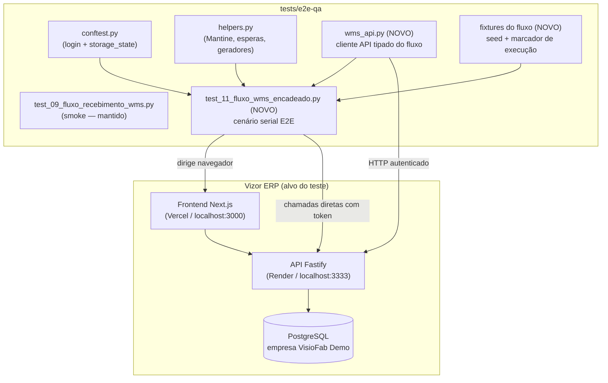
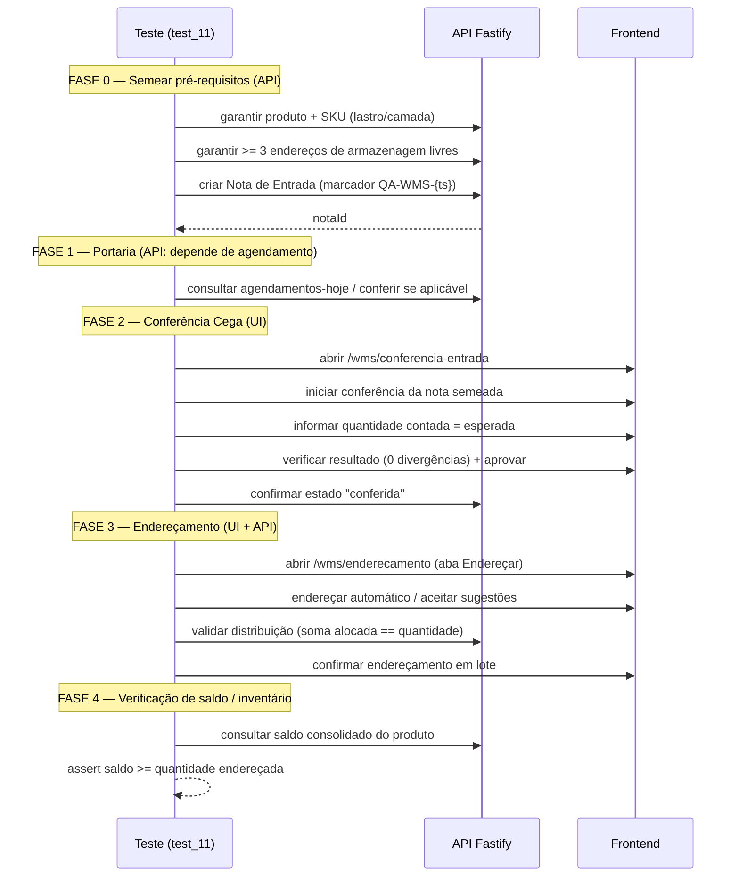

# Design — QA Fluxo WMS Completo (E2E Encadeado)

## Overview

Esta feature evolui o módulo de QA automatizado do recebimento WMS
(`tests/e2e-qa/test_09_fluxo_recebimento_wms.py`) de uma bateria de "smoke
tests" (cada tela carrega, cada modal abre, com `pytest.skip()` quando falta
dado) para um **fluxo E2E verdadeiramente encadeado**: um único cenário que
semeia os dados de pré-requisito, cria uma nota de entrada rastreável e a
percorre por todas as etapas do recebimento — Portaria → Conferência Cega →
Endereçamento → validação de saldo/inventário — gerando **estado real** e
verificando cada transição.

O problema hoje é que o `test_09` não garante que o fluxo *funciona ponta a
ponta*: ele garante que cada tela isolada abre. As etapas que dependem de
estado sequencial (uma nota precisa existir para ser conferida; precisa estar
conferida para ser endereçada) caem em `skip` quando a empresa demo não tem
o dado no estado certo. O resultado é uma suíte que raramente exercita o
caminho crítico do WMS.

A solução segue o padrão já validado no teste de referência TypeScript
(`tests/e2e/fluxo-recebimento.spec.ts`): **híbrido UI + API**. Passos cuja
interface é o alvo do teste são exercitados via UI (Playwright dirigindo o
navegador); passos que apenas precisam preparar/avançar estado, ou cuja UI
depende de um pré-requisito difícil de garantir só clicando, são executados
via chamadas diretas à API autenticada com o mesmo token da sessão. Assim o
fluxo nunca "pula" — ele constrói o que falta e continua.

### Objetivos

- Um cenário E2E encadeado que vai de "nota criada" a "produto endereçado e
  com saldo consultável", sem depender de dados pré-existentes no estado
  exato.
- Rastreabilidade: todo dado criado carrega um marcador de execução único
  (ex.: `QA-WMS-{timestamp}`) para identificação e limpeza.
- Verificação real de cada transição de estado (não só "a tela abriu").
- Reaproveitar a infraestrutura existente da suíte (`conftest.py`,
  `helpers.py`, fixtures de autenticação, ambiente `.env`).
- Manter a suíte executável tanto contra produção (Vercel/Render) quanto
  localmente.

### Não-objetivos

- Reescrever os smoke tests de carregamento de tela do `test_09` (eles
  continuam úteis como verificação rápida; o fluxo encadeado é adicional).
- Cobrir caminhos de exceção do WMS que já têm cobertura em outros arquivos
  (ex.: shelf life já é validado no teste TS de referência — pode ser
  portado, mas não é o foco).
- Criar/gerenciar infraestrutura de banco de dados de teste dedicada
  (continuamos usando a empresa "VisioFab Demo").
- Testar o backend isoladamente (isto é E2E de sistema, não teste de unidade
  de rota).

## Requisitos abordados

Como este é um spec design-first, os requisitos formais serão derivados
deste design. Em alto nível, o design atende:

- **R-QA1**: Executar o fluxo completo de recebimento WMS ponta a ponta em
  uma única sessão autenticada, sem `skip` no caminho feliz.
- **R-QA2**: Semear automaticamente os pré-requisitos (produto/SKU,
  endereços livres, nota de entrada) quando não existirem.
- **R-QA3**: Verificar cada transição de estado (nota PENDENTE → conferida →
  endereçada; saldo aparece após endereçamento).
- **R-QA4**: Marcar e permitir limpeza dos dados de teste.
- **R-QA5**: Rodar de forma determinística e idempotente (repetível sem
  poluir progressivamente a base a ponto de quebrar).

## Architecture

_(Arquitetura — Alto Nível)_

### Componentes



### Decisão central: estratégia híbrida UI + API

Cada passo do fluxo é classificado em um de dois modos de execução:

| Modo | Quando usar | Como |
|------|-------------|------|
| **UI** | O passo *é* o que queremos testar na interface (o operador interage com essa tela no dia a dia e queremos pegar regressão visual/de comportamento) | Playwright dirigindo o DOM, usando helpers Mantine |
| **API** | O passo apenas prepara/avança estado (seed), ou a UI depende de um pré-requisito sequencial que seria frágil garantir só clicando | `page.request` / cliente `wms_api.py` com o token da sessão |

Essa classificação é a mesma filosofia do teste TS de referência (que confere
a portaria e valida a distribuição inteligente via API, mas exercita
conferência e endereçamento pela UI).

### Mapa do fluxo encadeado



### Fluxo de dados e marcador de execução

Toda execução gera um **marcador único** no início (`run_id =
QA-WMS-{YYYYMMDD-HHMMSS}-{rand}`), propagado para:
- Número/fornecedor da nota de entrada (`fornecedor = "QA-WMS {run_id}"`).
- Lote do item (`lote = "LOTE-{run_id}"`).
- Descrição do produto de teste quando criado.

Isso permite localizar e limpar os artefatos depois, e evita colisão entre
execuções concorrentes.

## Components and Interfaces

_(Design Detalhado — Baixo Nível)_

### Arquivos

| Arquivo | Status | Responsabilidade |
|---------|--------|------------------|
| `tests/e2e-qa/wms_api.py` | **novo** | Cliente API do fluxo WMS: seed e verificação de estado via HTTP autenticado |
| `tests/e2e-qa/test_11_fluxo_wms_encadeado.py` | **novo** | Cenário `serial` E2E encadeado |
| `tests/e2e-qa/conftest.py` | editar | Adicionar fixture `run_id` (sessão) e `wms_api` (por teste); expor `API_URL` |
| `tests/e2e-qa/helpers.py` | editar | Adicionar helpers específicos do fluxo se necessário (ex.: `iniciar_conferencia_por_marcador`) |
| `tests/e2e-qa/README.md` | editar | Documentar o novo cenário e como rodá-lo |

### `conftest.py` — novos elementos

Derivar `API_URL` do `BASE_URL` de forma explícita (hoje o `test_09` faz um
`replace` frágil de string; centralizamos):

```python
# conftest.py
import os

def _derivar_api_url() -> str:
    """Deriva a URL da API a partir do BASE_URL ou de env dedicada."""
    explicit = os.getenv("API_URL")
    if explicit:
        return explicit.rstrip("/")
    # produção padrão do projeto
    if "vercel" in BASE_URL or "visiofav-front" in BASE_URL:
        return "https://api.vizorerp.com.br/api"
    # local
    return "http://localhost:3333/api"

API_URL = _derivar_api_url()
```

```python
# conftest.py — marcador de execução (escopo de sessão: um por run da suíte)
import random, string
from datetime import datetime

@pytest.fixture(scope="session")
def run_id() -> str:
    ts = datetime.now().strftime("%Y%m%d-%H%M%S")
    rand = "".join(random.choices(string.ascii_uppercase + string.digits, k=4))
    return f"QA-WMS-{ts}-{rand}"
```

```python
# conftest.py — token de API extraído do storage_state autenticado
@pytest.fixture()
def api_token(page_auth) -> str:
    """Lê o JWT persistido no localStorage pela sessão autenticada."""
    token = page_auth.evaluate(
        "() => localStorage.getItem('visiofab-wms-token')"
    )
    assert token, "Token de autenticação não encontrado no localStorage"
    return token
```

```python
# conftest.py — cliente de API do fluxo
from wms_api import WmsApiClient

@pytest.fixture()
def wms_api(page_auth, api_token) -> "WmsApiClient":
    # Reaproveita o APIRequestContext do Playwright (mesma sessão TLS/cookies)
    return WmsApiClient(page_auth.request, API_URL, api_token)
```

### `wms_api.py` — cliente API do fluxo (novo)

Encapsula as chamadas de seed e verificação. Assinaturas:

```python
class WmsApiClient:
    def __init__(self, request, api_url: str, token: str): ...

    # ---- helpers internos ----
    def _headers(self) -> dict: ...           # Authorization: Bearer <token>
    def _get(self, path: str, params=None): ...
    def _post(self, path: str, data=None): ...

    # ---- seed / garantia de pré-requisitos ----
    def garantir_produto_com_sku(
        self, run_id: str, lastro: int = 9, camada: int = 5
    ) -> dict:
        """Retorna um produto que tenha SKU com lastro/camada.
        Prefere um produto demo existente (ex.: código MOCA395CX48); só cria
        se nenhum atender. Retorna {id, codigo, ...}."""

    def garantir_enderecos_livres(self, minimo: int = 3) -> list[dict]:
        """Garante >= `minimo` endereços tipo ARMAZENAGEM/LIVRE ativos.
        Retorna a lista de endereços livres."""

    def criar_nota_entrada(
        self, run_id: str, produto: dict, quantidade: int = 50
    ) -> dict:
        """POST /notas-entrada com marcador no fornecedor e lote.
        Retorna a nota criada {id, numero, itens:[...]}."""

    # ---- avanço/verificação de estado ----
    def iniciar_conferencia(self, nota_id: str) -> dict: ...
    def conferir_todos(self, nota_id: str, itens: list[dict]) -> dict: ...
    def confirmar_conferencia(self, nota_id: str) -> dict: ...
    def sugerir_enderecamento(self, nota_id: str) -> dict: ...
    def distribuir(self, produto_id: str, quantidade: int) -> dict: ...
    def agendamentos_hoje(self) -> list[dict]: ...
    def saldo_consolidado(self, produto_id: str) -> dict: ...

    # ---- limpeza ----
    def listar_notas_por_marcador(self, run_id: str) -> list[dict]: ...
```

Notas de implementação:
- Endpoints derivados do teste TS de referência e do steering do PCP:
  `/notas-entrada`, `/conferencia-entrada/iniciar/:id`,
  `/conferencia-entrada/conferir-todos/:id`,
  `/conferencia-entrada/confirmar/:id`, `/enderecamento-wms/sugerir-lote`,
  `/enderecamento-inteligente/distribuir`, `/portaria/agendamentos-hoje`,
  `/produtos`, `/enderecos`, `/saldos/consolidado`.
- `garantir_*` são **idempotentes**: primeiro consultam (GET) e só criam
  (POST) se o pré-requisito não for atendido — evita poluição progressiva.
- Toda resposta com `status >= 500` é tratada como falha dura (assert);
  `4xx` é inspecionado (pode ser regra de negócio esperada em cenários de
  exceção).

### `test_11_fluxo_wms_encadeado.py` — cenário serial (novo)

Estrutura em uma classe com ordem serial (o estado de uma etapa alimenta a
próxima). Como pytest não garante ordem entre métodos por padrão, o
encadeamento é feito por uma **fixture de escopo de classe** que carrega o
contexto do fluxo (`fluxo_ctx`), e cada teste assere uma fase. Alternativa
mais simples e robusta: **um único teste** `test_fluxo_recebimento_completo`
que executa as fases em sequência e faz asserts intermediários (evita
fragilidade de ordenação). Adotamos a segunda por padrão, com asserts
nomeados por fase para diagnóstico.

```python
@pytest.mark.slow
class TestFluxoWmsEncadeado:
    def test_fluxo_recebimento_completo(
        self, page_auth: Page, wms_api: WmsApiClient, run_id: str
    ):
        # ── FASE 0: seed (API) ──────────────────────────────────────
        produto = wms_api.garantir_produto_com_sku(run_id)
        enderecos = wms_api.garantir_enderecos_livres(minimo=3)
        assert len(enderecos) >= 3, "pré-requisito: endereços livres"

        qtd = 50
        nota = wms_api.criar_nota_entrada(run_id, produto, quantidade=qtd)
        nota_id = nota["id"]
        assert nota_id, "nota de entrada criada"

        # ── FASE 1: portaria (API — só se houver agendamento) ───────
        agendamentos = wms_api.agendamentos_hoje()
        # não bloqueia o fluxo: nota manual não exige portaria

        # ── FASE 2: conferência cega (UI) ───────────────────────────
        navegar_para(page_auth, "/wms/conferencia-entrada")
        aguardar_carregamento(page_auth)
        _iniciar_conferencia_da_nota(page_auth, nota)   # helper local
        _informar_contagem_e_aprovar(page_auth, qtd)    # contagem == esperado
        # verificação de estado via API (fonte de verdade)
        estado = wms_api.confirmar_conferencia(nota_id)  # idempotente
        assert estado.get("divergentes", 0) == 0

        # ── FASE 3: endereçamento (UI + API) ────────────────────────
        navegar_para(page_auth, "/wms/enderecamento")
        aguardar_carregamento(page_auth)
        _enderecar_automatico_e_confirmar(page_auth)     # helper local UI
        dist = wms_api.distribuir(produto["id"], qtd)
        total = sum(a["quantidadeAlocada"] for a in dist.get("alocacoes", []))
        assert total + dist.get("quantidadeRestante", 0) == qtd

        # ── FASE 4: verificação de saldo ────────────────────────────
        saldo = wms_api.saldo_consolidado(produto["id"])
        assert saldo.get("fisico", 0) >= qtd, "saldo após endereçamento"

        screenshot_com_nome(page_auth, f"fluxo_wms_{run_id}")
```

Helpers locais de UI (privados ao arquivo, encapsulam a interação Mantine já
descoberta no `test_09` e no teste TS):

```python
def _iniciar_conferencia_da_nota(page, nota) -> None:
    """Localiza a linha da nota (pelo número/fornecedor marcador) e clica
    em Iniciar Conferência; trata o modal opcional de funcionários."""

def _informar_contagem_e_aprovar(page, quantidade: int) -> None:
    """Preenche a contagem cega == quantidade esperada, clica em
    Verificar Resultado e Aprovar."""

def _enderecar_automatico_e_confirmar(page) -> None:
    """Aba Endereçar → Endereçar Automático → aceitar sugestões →
    confirmar em lote; trata o modal de funcionário obrigatório."""
```

### Padrão Mantine Select (obrigatório)

Conforme o steering `qa-automatizado.md`, toda seleção em `Select` Mantine 7
deve ser via teclado (o dropdown usa portal e fecha antes do clique):

```python
input_field.click()
time.sleep(0.5)
input_field.press("ArrowDown")
time.sleep(0.3)
input_field.press("Enter")
```

Os helpers de UI acima seguem esse padrão; `helpers.preencher_select` é
usado apenas onde já comprovadamente funciona.

### Idempotência e limpeza

- **Seed idempotente**: `garantir_*` só cria o que falta.
- **Notas acumulam**: cada run cria uma nota nova (com marcador). Para não
  poluir indefinidamente, um teste opcional de limpeza (`@pytest.mark.slow`,
  desabilitado por padrão) lista notas por marcador antigo e as remove via
  API quando o endpoint permitir; caso contrário, documenta-se a limpeza
  manual pelo marcador `QA-WMS-*`.
- **Sem dependência de ordem** entre arquivos de teste (o cenário é
  autossuficiente: cria o que precisa).

## Data Models

_(Modelos de Dados — estruturas manipuladas pelo fluxo de teste)_

Estas são as estruturas de dados que a automação constrói/consome. Não são
tabelas novas no banco — são os payloads da API do Vizor e os objetos de
contexto internos do teste.

### Marcador de execução (`run_id`)

```
run_id: str  # formato "QA-WMS-{YYYYMMDD-HHMMSS}-{RAND4}"
```

Propagado para os campos rastreáveis abaixo.

### Nota de Entrada (payload `POST /notas-entrada`)

```python
{
  "numero": int,          # aleatório, não colidente
  "serie": "1",
  "fornecedor": str,      # "QA-WMS {run_id}"  -> marcador
  "tipo": "COMPRA",
  "itens": [
    {
      "item": 1,
      "descricao": str,   # inclui run_id quando produto é criado
      "codigoProduto": str,   # ex.: "MOCA395CX48"
      "unidade": "CX",
      "quantidade": int,  # ex.: 50
      "lote": str,        # "LOTE-{run_id}" -> marcador
      "validade": "YYYY-MM-DD",
    }
  ],
}
```

### Distribuição de endereçamento (resposta `/enderecamento-inteligente/distribuir`)

```python
{
  "alocacoes": [ { "enderecoId": str, "quantidadeAlocada": number }, ... ],
  "quantidadeRestante": number,
}
# Invariante P1: sum(quantidadeAlocada) + quantidadeRestante == quantidade
```

### Saldo consolidado (resposta `/saldos/consolidado`)

```python
{
  "produtoId": str,
  "fisico": number,       # físico total
  "reservado": number,    # venda + produção
  "disponivel": number,   # fisico - reservado
  # (origem WMS por endereço ou Estoque global — ver steering pcp-modulo §1.7)
}
```

### Contexto interno do fluxo (`fluxo_ctx`)

Objeto (dict/dataclass) que carrega o estado entre as fases do cenário:

```python
@dataclass
class FluxoCtx:
    run_id: str
    produto: dict           # {id, codigo, ...}
    enderecos_livres: list  # [{id, tipo, status}, ...]
    nota: dict              # {id, numero, itens:[...]}
    quantidade: int
```

## Correctness Properties

_(Propriedades de Correção — invariantes de estado verificadas como asserts)_

O alvo é um fluxo de UI/integração determinístico, não uma função pura, então
não há testes baseados em propriedades (PBT) generalizáveis. As invariantes
de correção do fluxo são verificadas como asserts:

### Property 1: Conservação de quantidade no endereçamento

A soma das alocações de endereçamento mais a quantidade restante é igual à
quantidade da nota: `sum(quantidadeAlocada) + quantidadeRestante ==
quantidade`. Verificada com a resposta de `/enderecamento-inteligente/distribuir`.

**Validates: Requirements 3.1**

### Property 2: Não-divergência no caminho feliz

Quando a contagem cega informada é igual à quantidade esperada da nota, o
resultado da conferência tem `divergentes == 0`.

**Validates: Requirements 3.2**

### Property 3: Saldo reflete a entrada

O saldo consolidado (`fisico`) do produto após o endereçamento é maior ou
igual à quantidade endereçada.

**Validates: Requirements 3.3**

### Property 4: Progressão de estado sem skip

A nota percorre os estados PENDENTE → conferida → endereçada sem cair em
`pytest.skip` em nenhuma etapa do caminho feliz.

**Validates: Requirements 1.1, 5.1**

## Error Handling

_(Tratamento de Erros)_

| Situação | Comportamento |
|----------|---------------|
| Token ausente no localStorage | `assert` falha cedo com mensagem clara (sessão não autenticou) |
| API retorna `5xx` em seed | Falha dura — o ambiente está quebrado, não faz sentido continuar |
| API retorna `4xx` esperado (ex.: shelf life) | Inspecionado no cenário de exceção específico, não é falha do fluxo feliz |
| Botão/elemento de UI ausente no caminho feliz | **Falha** (diferente do `test_09`, que dá `skip`) — o seed garantiu o pré-requisito, então a ausência é regressão real |
| Pré-requisito de dado externo genuinamente indisponível (ex.: nenhum CD cadastrado) | `pytest.skip` com motivo explícito, apenas nas FASES de seed, nunca no meio do fluxo |
| Divergência de quantidade na conferência | `assert` falha e captura screenshot de evidência |

Screenshots de evidência são gerados nos pontos-chave e em falha (padrão
`helpers.screenshot_com_nome`), nomeados com o `run_id`.

## Testing Strategy

_(Estratégia de Testes — meta-testes / verificação da automação)_

Como esta feature *é* código de teste, a "verificação" tem dois níveis:

1. **Execução em modo visual** (`HEADLESS=false`, `SLOW_MO`) contra a empresa
   demo para validar manualmente que o fluxo encadeado percorre todas as
   fases e os asserts passam.
2. **Execução headless em produção** (`pytest test_11_fluxo_wms_encadeado.py`)
   integrada à suíte, verificando que o caminho feliz passa de forma
   determinística.

As invariantes de correção verificadas pelo cenário estão documentadas na
seção **Correctness Properties** (P1–P4) e são checadas como asserts dentro
do teste de fluxo. Não há PBT aplicável (o alvo é um fluxo determinístico de
UI/integração, não uma função pura com invariantes generalizáveis por
geração de entradas aleatórias).

## Como executar

```powershell
cd C:\Source\VisioFab.Wms.Front\tests\e2e-qa
.venv\Scripts\activate

# Cenário encadeado, headless, contra produção (padrão)
pytest test_11_fluxo_wms_encadeado.py

# Modo visual para depurar
$env:HEADLESS="false"; $env:SLOW_MO="600"
pytest test_11_fluxo_wms_encadeado.py -s

# Contra ambiente local
$env:BASE_URL="http://localhost:3000"; $env:API_URL="http://localhost:3333/api"
pytest test_11_fluxo_wms_encadeado.py
```

## Decisões e Trade-offs

- **Híbrido UI + API em vez de UI puro**: UI puro seria mais fiel ao usuário,
  mas o passo de portaria/seed depende de estado que é caro e frágil de
  montar só clicando. O teste TS de referência já adotou o híbrido com
  sucesso — seguimos o mesmo padrão para consistência.
- **Um único teste de fluxo em vez de N testes serial-ordenados**: elimina a
  fragilidade de ordenação do pytest e deixa o encadeamento explícito. O
  custo é um teste "grande", mitigado por asserts nomeados por fase e
  screenshots.
- **Seed idempotente reaproveitando dados demo**: preferimos reusar
  `MOCA395CX48` (já usado no teste TS) e só criar quando ausente, reduzindo
  poluição da base demo compartilhada.
- **Manter `test_09` como smoke**: não removemos a cobertura de
  carregamento de tela; o fluxo encadeado é `test_11`, complementar.
