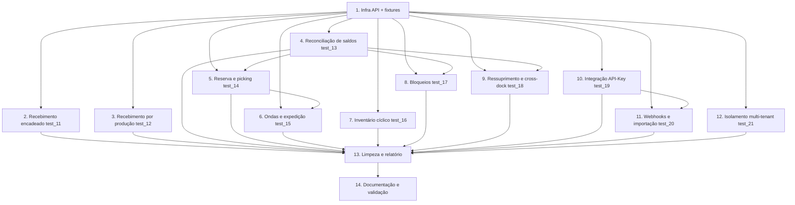

# Implementation Plan

## Overview

Este plano implementa a expansão da suíte de QA automatizada (Python + Playwright,
`tests/e2e-qa`) para cobrir o fluxo WMS de ponta a ponta com lançamentos reais e
validação de valor, conforme `design.md` e `requirements.md`.

Convenções de execução (todas as tasks):
- Rodar do diretório `tests/e2e-qa` com o venv ativo (`.venv\Scripts\activate`).
- Todo dado criado carrega o marcador `run_id` (`QA-WMS-{ts}-{rand}`) para rastreio/limpeza.
- Seleção em `Select` Mantine 7 sempre via teclado (ArrowDown + Enter), nunca clique em `[role="option"]`.
- Respostas de API com `status >= 500` são falha dura; `4xx` é inspecionado conforme o cenário.
- Não rodar em modo watch. Executar módulo específico com `pytest test_XX_....py -s`.

> Nota: o design declara explicitamente que o alvo é um fluxo determinístico de UI/integração,
> sem PBT aplicável. As invariantes de correção (P1–P4) são verificadas como asserts dentro dos testes.

## Tasks

- [x] 1. Infraestrutura compartilhada de API e fixtures
- [x] 1.1 Centralizar a derivação de `API_URL` e o marcador de execução no `conftest.py`
  - Adicionar `_derivar_api_url()` (respeita env `API_URL`; deriva de `BASE_URL` para produção/local) e expor `API_URL` no módulo.
  - Adicionar fixture `run_id` (escopo de sessão) no formato `QA-WMS-{YYYYMMDD-HHMMSS}-{RAND4}`.
  - Adicionar fixture `api_token` que lê o JWT de `localStorage` (`visiofab-wms-token`) da sessão autenticada, com `assert` claro se ausente.
  - _Requirements: 15.1, 13.1_

- [x] 1.2 Criar o cliente de API do fluxo `wms_api.py`
  - Classe `WmsApiClient(request, api_url, token)` reaproveitando o `APIRequestContext` do Playwright (mesma sessão).
  - Helpers internos `_headers()` (Bearer), `_get()`, `_post()`; tratar `>= 500` como falha dura.
  - Fixture `wms_api` no `conftest.py` (por teste), construída a partir de `page_auth` + `api_token` + `API_URL`.
  - _Requirements: 15.1, 15.2_

- [x] 1.3 Implementar seed idempotente de pré-requisitos no `WmsApiClient`
  - `garantir_produto_com_sku(run_id, lastro, camada)`: prefere produto demo existente (ex.: `MOCA395CX48`), só cria se nenhum atender.
  - `garantir_enderecos_livres(minimo=3)`: garante endereços ARMAZENAGEM/LIVRE ativos, filtrando por `empresaId` da sessão.
  - `criar_nota_entrada(run_id, produto, quantidade)`: marca `fornecedor="QA-WMS {run_id}"` e `lote="LOTE-{run_id}"`; retorna `{id, numero, itens}`.
  - Cada `garantir_*` consulta (GET) antes de criar (POST) para evitar poluição progressiva.
  - _Requirements: 13.1, 13.4_

- [x] 1.4 Implementar métodos de avanço e verificação de estado no `WmsApiClient`
  - `iniciar_conferencia`, `conferir_todos`, `confirmar_conferencia`, `sugerir_enderecamento`, `distribuir`, `agendamentos_hoje`, `saldo_consolidado`, `listar_notas_por_marcador`.
  - Endpoints conforme o teste TS de referência e o steering do PCP.
  - _Requirements: 1.1, 3.1_

- [x] 2. Cenário E2E encadeado de recebimento por compra (`test_11_fluxo_wms_encadeado.py`)
- [x] 2.1 Estruturar o teste único de fluxo e helpers locais de UI
  - Classe `TestFluxoWmsEncadeado` com um único `test_fluxo_recebimento_completo` (evita fragilidade de ordenação do pytest), marcado `@pytest.mark.slow`.
  - Helpers locais de UI: `_iniciar_conferencia_da_nota`, `_informar_contagem_e_aprovar`, `_enderecar_automatico_e_confirmar` (encapsulam a interação Mantine já descoberta no `test_09`/teste TS).
  - _Requirements: 15.2, 15.3, 15.4_

- [x] 2.2 FASE 0 (seed via API) + FASE 1 (portaria)
  - Semear produto/SKU, ≥3 endereços livres e a nota de entrada rastreável; `assert` de pré-requisitos.
  - Consultar `agendamentos_hoje()` (não bloqueia: nota manual não exige portaria).
  - Registrar evidência da nota criada.
  - _Requirements: 1.1, 13.4, 14.1_

- [x] 2.3 FASE 2 (conferência cega via UI) com validação de saldo físico
  - Iniciar conferência da nota semeada pela UI, informar contagem = quantidade esperada, aprovar.
  - Verificar via API que `divergentes == 0` (Property 2).
  - Verificar que o Saldo_Fisico do produto aumentou exatamente pela quantidade conferida e não excede a quantidade da nota.
  - Cenário de divergência: contagem ≠ nota registra a diferença com o valor.
  - _Requirements: 1.2, 1.3, 1.5_

- [x] 2.4 FASE 3 (endereçamento via UI + API) com conservação de quantidade
  - Endereçar automático pela UI e confirmar em lote.
  - Validar Property 1: `sum(quantidadeAlocada) + quantidadeRestante == quantidade` via `distribuir`.
  - Verificar que a soma das quantidades nos endereços de destino é igual à quantidade endereçada.
  - _Requirements: 1.4, 3.1_

- [x] 2.5 FASE 4 (verificação de saldo) e evidência final
  - Consultar `saldo_consolidado` e validar Property 3 (`fisico >= quantidade endereçada`).
  - Registrar evidência final nomeada com `run_id` e confirmar progressão sem `skip` no caminho feliz (Property 4).
  - _Requirements: 1.6, 3.3_

- [x] 3. Recebimento por produção (integração PCP → WMS) — `test_12_recebimento_producao.py`
- [x] 3.1 Validar geração da Nota de Entrada tipo PRODUCAO ao concluir OP
  - Concluir a última etapa de uma OP com quantidade produzida > 0 (integração automática ativa) e verificar via API que a NotaEntrada tipo PRODUCAO foi criada.
  - Verificar que a quantidade da nota é igual à quantidade efetivamente produzida.
  - Verificar que a nota pertence ao `empresaId` da OP.
  - _Requirements: 2.1, 2.3, 2.5_

- [x] 3.2 Validar casos de não-geração
  - Quantidade produzida zero → nenhuma NotaEntrada PRODUCAO criada.
  - Flag de integração automática desativada → nenhuma NotaEntrada PRODUCAO ao concluir a OP.
  - _Requirements: 2.2, 2.4_

- [x] 4. Reconciliação de saldos — `test_13_saldos_consolidados.py`
- [x] 4.1 Validar a fórmula de saldo e origem WMS vs ERP
  - `disponivel == fisico - reservado` no `Endpoint_Saldo_Consolidado`.
  - Origem WMS com endereços detalhados quando há `SaldoEndereco > 0` (mesmo com consolidado zero) e soma por endereço == físico.
  - Origem ERP quando não há `SaldoEndereco` mas há estoque global.
  - _Requirements: 3.1, 3.2, 3.3_

- [x] 4.2 Validar impacto de reserva de produção e paridade UI × API
  - Criar reserva de produção ATIVA e verificar aumento de reservado e redução de disponível pela mesma quantidade.
  - Verificar que o saldo exibido na tela de Consulta de Saldos é igual ao retornado pelo endpoint.
  - _Requirements: 3.4, 3.5_

- [x] 5. Reserva e separação/picking — `test_14_reserva_picking.py`
- [x] 5.1 Validar reserva dentro e acima do disponível
  - Reserva ≤ disponível persiste com a quantidade solicitada.
  - Reserva > disponível: sistema exibe mensagem de erro E rejeita a operação (ambos).
  - _Requirements: 4.1, 4.2_

- [x] 5.2 Validar separação (picking) e paridade de quantidade
  - Confirmar separação de quantidade reservada e verificar redução do Saldo_Fisico no endereço de origem.
  - Verificar que a quantidade separada na tela é igual à do backend, incluindo o caso zero.
  - _Requirements: 4.3, 4.4_

- [x] 6. Ondas, conferência de saída e expedição — `test_15_ondas_expedicao.py`
- [x] 6.1 Validar geração da onda e conferência de saída
  - Onda gerada a partir de pedidos contém a soma dos itens dos pedidos incluídos.
  - Conferência de saída sem divergência: quantidade conferida == separada.
  - Conferência com quantidade menor: sistema sinaliza divergência com o valor faltante.
  - _Requirements: 5.1, 5.2, 5.3_

- [x] 6.2 Validar expedição e evidências por etapa
  - Expedição de carga conferida reduz o Saldo_Fisico pela quantidade expedida.
  - Registrar evidência de cada etapa concluída da onda.
  - _Requirements: 5.4, 5.5_

- [x] 7. Inventário cíclico — `test_16_inventario_ciclico.py`
- [x] 7.1 Validar ajuste por contagem
  - Contagem diferente do saldo: ajuste aplicado == diferença (contagem − saldo anterior).
  - Contagem igual ao saldo: nenhum ajuste aplicado.
  - Saldo após inventário == quantidade contada.
  - _Requirements: 6.1, 6.2, 6.3_

- [x] 8. Bloqueios de WMS — `test_17_bloqueios.py`
- [x] 8.1 Validar bloqueio, impedimento de separação e liberação
  - Bloquear saldo em endereço: quantidade bloqueada subtraída do disponível.
  - Separação sobre saldo bloqueado é impedida.
  - Liberar bloqueio: quantidade retorna ao disponível.
  - _Requirements: 7.1, 7.2, 7.3_

- [x] 9. Ressuprimento e cross-dock — `test_18_ressuprimento_crossdock.py`
- [x] 9.1 Validar ressuprimento (conservação de físico total)
  - Mover quantidade de endereço de reserva para picking: origem diminui e destino aumenta pela mesma quantidade.
  - Saldo_Fisico total do produto permanece inalterado.
  - _Requirements: 8.1, 8.2_

- [x] 9.2 Validar cross-dock até a expedição
  - Item por cross-dock chega à expedição, admitindo saldo temporário em endereço durante o roteamento, sem saldo residual em endereço de armazenagem ao final.
  - _Requirements: 8.3_

- [x] 10. Integração de ERP externo via API-Key — `test_19_integracao_api_key.py`
- [x] 10.1 Validar autenticação por API-Key
  - Requisição sem `X-Api-Key` → 401 `API_KEY_MISSING`.
  - API-Key inválida/revogada/expirada → 401 `API_KEY_INVALID` (independente de outras condições).
  - Empresa sem integração ativa → 403.
  - _Requirements: 9.2, 9.3, 9.4_

- [x] 10.2 Validar lançamento autenticado e persistência por empresa
  - Requisição com API-Key válida é aceita e o dado é persistido no `empresaId` da chave.
  - Lançamento de entrada via integração reflete no Saldo_Fisico do produto.
  - _Requirements: 9.1, 9.5_

- [x] 11. Webhooks e importação por arquivo — `test_20_webhook_importacao.py`
- [x] 11.1 Validar disparo e conteúdo de webhooks
  - Evento coberto por webhook registra uma entrega (independente de sucesso/falha HTTP imediata).
  - Payload contém o identificador do registro que originou o evento.
  - Falha na entrega inicial marca a entrega para retentativa.
  - Webhooks/entregas visíveis apenas para o `empresaId` que os configurou.
  - _Requirements: 10.1, 10.2, 10.3, 10.4_

- [x] 11.2 Validar importação de lançamentos por arquivo
  - Arquivo válido: registros persistidos == linhas válidas.
  - Arquivo com linhas inválidas: reporta inválidas e persiste apenas as válidas.
  - Saldos resultantes == soma das quantidades das linhas válidas por produto, inclusive soma zero (saldo inalterado).
  - _Requirements: 11.1, 11.2, 11.3_

- [x] 12. Isolamento multi-tenant — `test_21_isolamento_multitenant.py`
- [x] 12.1 Validar isolamento em consultas e por identificador
  - Consulta de saldos/endereços/notas autenticada como uma empresa retorna apenas registros do `empresaId` dessa empresa.
  - Lançamento via integração externa é gravado com o `empresaId` da API-Key.
  - Acesso a registro de outra empresa por identificador responde como não encontrado.
  - _Requirements: 12.1, 12.2, 12.3_

- [x] 13. Limpeza de dados e relatório de execução
- [x] 13.1 Implementar limpeza rastreável por marcador
  - Ao final de cada teste, remover/reverter os dados criados (`QA-`), usando `listar_notas_por_marcador` e endpoints de exclusão quando disponíveis.
  - Se a limpeza falhar, registrar o identificador não removido no relatório e continuar os demais testes.
  - _Requirements: 13.1, 13.2, 13.3_

- [x] 13.2 Garantir evidências e relatório consolidado
  - Salvar evidência em etapas relevantes e em falha (screenshot com nome descritivo + horário).
  - Gerar relatório HTML consolidado ao final; falha ao gravar evidência não interrompe o teste e é reportada separadamente.
  - _Requirements: 14.1, 14.2, 14.3, 14.4_

- [x] 14. Documentação e validação da suíte
- [x] 14.1 Atualizar `README.md` da suíte
  - Documentar os novos módulos, o cenário encadeado, o marcador `QA-WMS-*`, execução visual/headless e local/produção.
  - _Requirements: 15.4_

- [x] 14.2 Validar a suíte expandida em modo visual e headless
  - Rodar o cenário encadeado em modo visual (`HEADLESS=false`, `SLOW_MO`) e depois headless, confirmando que o caminho feliz passa sem `skip` e que os asserts de valor passam.
  - Executar em modo visual foge do modo watch; rodar módulo a módulo com `pytest test_XX_....py -s`.
  - _Requirements: 15.3, 15.4_

## Task Dependency Graph



```json
{
  "waves": [
    {
      "wave": 1,
      "tasks": ["1.1", "1.2", "1.3", "1.4"],
      "description": "Infraestrutura compartilhada de API e fixtures — base de todos os módulos."
    },
    {
      "wave": 2,
      "tasks": ["2.1", "2.2", "2.3", "2.4", "2.5", "3.1", "3.2", "4.1", "4.2", "7.1", "10.1", "10.2", "12.1"],
      "description": "Cenário encadeado de recebimento, recebimento por produção, reconciliação de saldos, inventário, integração por API-Key e isolamento — dependem apenas da infra."
    },
    {
      "wave": 3,
      "tasks": ["5.1", "5.2", "8.1", "9.1", "9.2", "11.1", "11.2"],
      "description": "Reserva/picking, bloqueios, ressuprimento/cross-dock e webhooks/importação — dependem de saldos e da integração externa."
    },
    {
      "wave": 4,
      "tasks": ["6.1", "6.2"],
      "description": "Ondas, conferência de saída e expedição — dependem de reserva/picking."
    },
    {
      "wave": 5,
      "tasks": ["13.1", "13.2"],
      "description": "Limpeza de dados e relatório consolidado — após os módulos de teste existirem."
    },
    {
      "wave": 6,
      "tasks": ["14.1", "14.2"],
      "description": "Documentação e validação final da suíte expandida."
    }
  ]
}
```

## Notes

- Esta feature *é* código de teste; a "verificação" acontece rodando a própria suíte
  (modo visual para depurar, headless para o gate final), conforme a Testing Strategy do design.
- Não há tasks de PBT: o design declara que o alvo é um fluxo determinístico de UI/integração.
  As invariantes de correção (P1–P4) são asserts dentro dos testes de fluxo.
- Ordem sugerida: task 1 (infra) primeiro; task 2 valida o caminho crítico ponta a ponta.
  As tasks 4 (saldos) habilitam as validações de valor de 5, 8 e 9. As tasks 10/11 (integração
  externa) dependem de uma API-Key/config de integração ativa na empresa demo.
- Isolamento multi-tenant (task 12) é classe de bug histórica do projeto — priorizar sua
  execução mesmo que os demais módulos ainda estejam em construção.
- Toda alteração em `conftest.py`/`helpers.py` deve preservar a compatibilidade com os
  testes existentes (`test_01`..`test_10`), que reutilizam essas fixtures/helpers.
