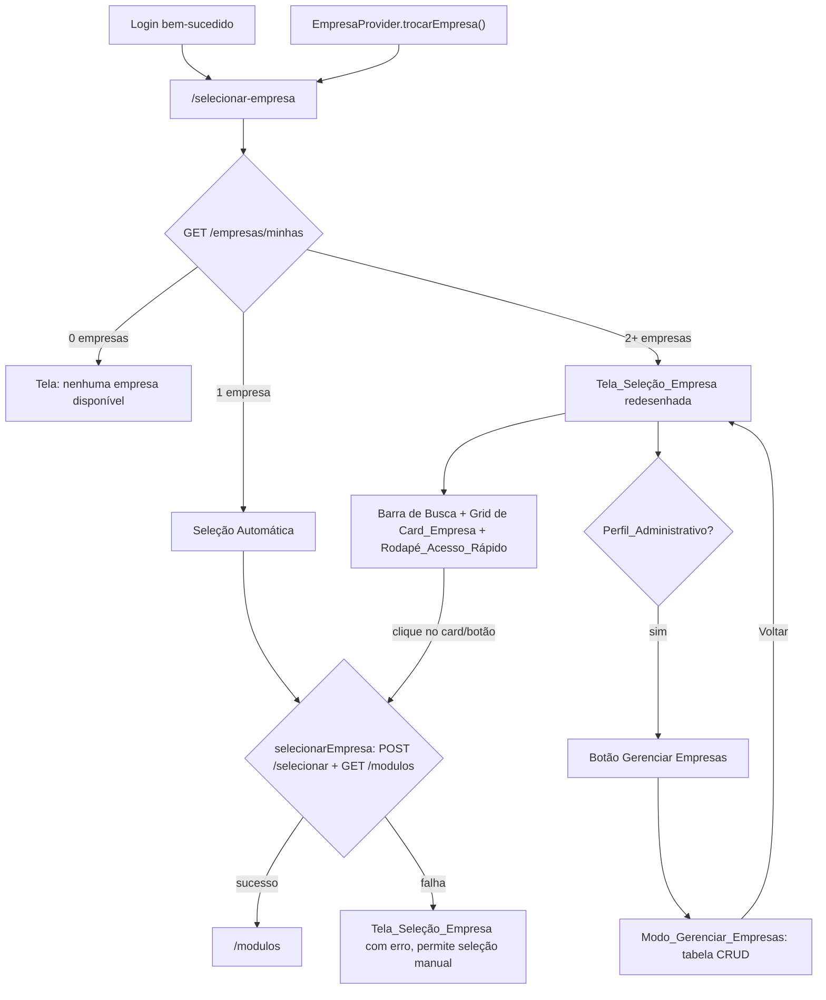

# Design Document

## Overview

Este documento detalha o design técnico para o redesenho da tela `/selecionar-empresa` do Vizor WMS/ERP. A implementação é inteiramente frontend (`VisioFab.Wms.Front`, Next.js 15 App Router + Mantine 7 + TanStack Query + Axios) e cobre:

1. **Seleção automática** de empresa única — pulando a renderização da tela de seleção quando o usuário tem acesso a exatamente 1 empresa, tanto no fluxo pós-login quanto no fluxo de `trocarEmpresa`.
2. **Redesenho visual** da tela: barra de busca client-side, cards de empresa mais ricos (avatar, endereço, botão de ação) e um rodapé fixo de atalhos ("Acesso Rápido").
3. **Preservação total** do Modo Gerenciar Empresas (CRUD administrativo via tabela + `EmpresaModal`), incluindo ocultar busca/rodapé quando esse modo estiver ativo.

A estratégia geral é **extrair a lógica de decisão em funções puras e testáveis** (quando deve ocorrer seleção automática, como filtrar por busca, como derivar iniciais/localização/CNPJ formatado, quais atalhos exibir por perfil) e manter o componente de página (`page.tsx`) como uma camada fina de orquestração (fetch, roteamento, efeitos), seguindo o padrão já usado no projeto (ex.: `src/utils/produtoSku.ts`, `src/data/hooks/fiscal/useSeedFiscal.ts`).

### Fora do escopo (dependências externas)

- **Backend**: a extensão de `GET /empresas/minhas` para incluir `cidade`, `uf` e `logo` (Assumption 1 dos requirements) é responsabilidade de um spec de backend próprio. O frontend deve ser escrito de forma **defensiva** — funcionando corretamente tanto com a resposta atual (sem esses campos) quanto com a resposta estendida (tratando os campos como opcionais).
- **Badge "Matriz/Filial"**: excluído do escopo (Assumption 2), não há código relacionado a ele neste design.
- **Tela "Meus Dados"**: não existe hoje uma rota dedicada de dados pessoais/perfil de usuário no frontend, nem endpoint `/usuarios/me` no backend. Por decisão de produto (confirmada com o usuário), o atalho "Meus Dados" do Rodapé_Acesso_Rápido **reaproveita o `PreferencesDrawer` já existente** (`src/components/preferences/PreferencesDrawer.tsx`), que já exibe nome do usuário, preferências e ação de logout. Não é necessária nenhuma nova tela.
- **Central de Ajuda**: reaproveita a rota `/suporte` já existente (confirmado com o usuário).

## Architecture

### Visão geral de fluxo



### Decisão de design: onde vive a lógica de "seleção automática"

A lógica de decidir *se* a seleção automática deve ocorrer (contagem de empresas == 1) é uma função pura, independente de React/DOM, testável por PBT. Ela é usada em dois pontos distintos da UI que hoje já compartilham o mesmo `EmpresaProvider`:

1. **`SelecionarEmpresaPage`** (`page.tsx`): ao carregar a lista de empresas via `useQuery`, se `empresas.length === 1`, dispara a seleção automaticamente via `useEffect`, sem renderizar o grid.
2. **`EmpresaProvider.trocarEmpresa`**: hoje apenas limpa o estado e navega para `/selecionar-empresa` (deixando a decisão para o passo 1). Como a Acceptance Criteria 1.6 exige que `trocarEmpresa` "execute a Seleção_Automática... sem exibir a Tela_Seleção_Empresa", a navegação para `/selecionar-empresa` já é suficiente **desde que** o passo 1 sempre intercepte antes da renderização — não é necessário duplicar a lógica de fetch dentro do provider. Isso evita duas fontes de verdade para a mesma decisão e mantém `trocarEmpresa` simples (apenas limpa estado + navega), com toda a lógica de "1 empresa → auto-seleciona" centralizada em `SelecionarEmpresaPage`.

Isso significa: a tela sempre busca `GET /empresas/minhas` ao montar; se `length === 1`, o `useEffect` dispara `selecionarEmpresa` e navega, sem nunca renderizar `SimpleGrid`/Busca/Rodapé. O usuário nunca percebe a tela, mesmo vindo de `trocarEmpresa`.

### Decisão de design: ocultar o controle "Trocar Empresa" no header

Requirement 1.7 exige ocultar o ícone/menu "Trocar Empresa" quando o usuário só tem 1 empresa. Hoje `Header.tsx` e `ModulesHeader.tsx` decidem exibir esse controle apenas com base em `empresa !== null` (via `useEmpresa()`). Será necessário que o `EmpresaProvider` também exponha a **contagem de empresas disponíveis para o usuário** (ou um boobooleano derivado `podeTrocarEmpresa`), buscada uma única vez (reaproveitando `GET /empresas/minhas`) e cacheada, para que os headers possam decidir sem re-buscar a lista a cada render.

## Components and Interfaces

### 1. `EmpresaProvider` (alterado)

Adiciona ao contexto a contagem de empresas disponíveis, carregada uma vez (a mesma chamada que popula `/selecionar-empresa`, reaproveitada via TanStack Query cache com a mesma `queryKey: ['empresas-minhas']` para evitar refetch duplicado):

```ts
interface EmpresaContextType {
  empresa: Empresa | null
  modulos: string[]
  loading: boolean
  podeTrocarEmpresa: boolean          // NOVO — Requirement 1.7
  selecionarEmpresa: (empresa: Empresa) => Promise<void>
  trocarEmpresa: () => void
  logout: () => Promise<void>
}
```

`podeTrocarEmpresa` é `true` quando o número de empresas vinculadas ao usuário (via `GET /empresas/minhas`) é maior que 1. Enquanto a contagem não foi carregada, o valor padrão é `true` (fail-safe: preferimos mostrar o controle a escondê-lo indevidamente antes do carregamento).

### 2. `SelecionarEmpresaPage` (reescrita)

Estrutura de estado (mantém os existentes + novos):

```ts
const [modoGerenciar, setModoGerenciar] = useState(false)
const [modalOpened, setModalOpened] = useState(false)
const [editData, setEditData] = useState<EmpresaAdmin | undefined>(undefined)
const [busca, setBusca] = useState('')                 // NOVO — Requirement 2
const [prefsOpened, setPrefsOpened] = useState(false)  // NOVO — "Meus Dados" abre PreferencesDrawer
const [erroSelecaoAutomatica, setErroSelecaoAutomatica] = useState(false) // NOVO — Requirement 1.5
```

Fluxo de seleção automática (novo `useEffect`, roda quando `empresas` chega da query):

```ts
useEffect(() => {
  if (!empresas || erroSelecaoAutomatica) return
  if (deveSelecionarAutomaticamente(empresas.length)) {
    handleSelecionar(empresas[0]).catch(() => setErroSelecaoAutomatica(true))
  }
}, [empresas, erroSelecaoAutomatica])
```

Enquanto a seleção automática está em andamento (`empresas.length === 1 && !erroSelecaoAutomatica`), a página exibe apenas um `Loader` centralizado — nunca o grid, a busca ou o rodapé (Requirement 1.1). Se `erroSelecaoAutomatica` for `true`, a página renderiza normalmente a Tela_Seleção_Empresa (com todos os elementos) e exibe uma notificação/alerta de erro, permitindo seleção manual (Requirement 1.5).

Filtragem de busca (client-side, aplicada sobre `empresas` já carregado):

```ts
const empresasFiltradas = filtrarEmpresasPorBusca(empresas ?? [], busca)
```

Renderização do grid usa `empresasFiltradas` em vez de `empresas` diretamente; a barra de busca só é renderizada quando `(empresas?.length ?? 0) >= 2` (Requirement 2.1).

### 3. `CardEmpresa` (novo componente, extraído de `page.tsx`)

Novo arquivo `src/app/(interna)/selecionar-empresa/CardEmpresa.tsx`, componente de apresentação puro (sem fetch próprio):

```ts
interface CardEmpresaProps {
  empresa: EmpresaItem   // ver Data Models — inclui campos opcionais cidade/uf/logo
  onAcessar: (empresa: EmpresaItem) => void
  ocultarLocalizacao?: boolean   // Requirement 3.5 — variação visual sem linha de localização
}
```

Conteúdo do card (Requirement 3):
- `Avatar` circular: `src={empresa.logo ?? undefined}` com fallback para as iniciais calculadas por `obterIniciaisEmpresa(empresa)` (função pura — Requirement 3.1, 3.2).
- Nome fantasia em destaque (fallback razão social) via `obterNomeExibicaoEmpresa(empresa)`.
- Razão social (quando nome fantasia existir e for diferente do nome de exibição) e CNPJ formatado via `formatarCnpj(empresa.cnpj)` (Requirement 3.3).
- Linha de localização `Cidade/UF`, renderizada apenas quando `!ocultarLocalizacao && obterLocalizacaoEmpresa(empresa) !== null` (Requirement 3.4, 3.5, 3.6).
- Botão `Acessar empresa →`, e o card inteiro é clicável (`onClick` no `Card` + no botão, ambos chamando `onAcessar(empresa)`) (Requirement 3.7, 3.8).

### 4. `RodapeAcessoRapido` (novo componente)

Novo arquivo `src/app/(interna)/selecionar-empresa/RodapeAcessoRapido.tsx`:

```ts
interface RodapeAcessoRapidoProps {
  isAdmin: boolean
  onMeusDados: () => void       // abre PreferencesDrawer
  onNovaEmpresa: () => void     // abre EmpresaModal (sem editData)
  onCentralDeAjuda: () => void  // router.push('/suporte')
}
```

Renderizado como uma barra fixa (`position: sticky` ou `fixed`, `bottom: 0`) fora do fluxo do grid, contendo 2 ou 3 `Button`/`UnstyledButton` (Requirement 4.2–4.4). A visibilidade do atalho "Nova Empresa" é controlada pela função pura `deveExibirAtalhoNovaEmpresa(perfil)` (Requirement 4.3), reaproveitando a mesma lista `ADMIN_PROFILES` já usada na página.

Só é renderizado quando `!modoGerenciar` (Requirement 5.5) e a tela não está em estado de seleção automática/loading.

### 5. `BarraBusca` 

Não é necessário um componente dedicado — um `TextInput` do Mantine com `leftSection={<IconSearch />}` diretamente em `page.tsx` é suficiente, dado que a única lógica não-trivial (filtragem) já está extraída em função pura.

### 6. Funções puras extraídas (novo arquivo `src/app/(interna)/selecionar-empresa/selecaoEmpresa.utils.ts`)

Centraliza toda a lógica testável por PBT, desacoplada de React:

```ts
export interface EmpresaItem {
  id: string
  razaoSocial: string
  nomeFantasia: string | null
  cnpj: string
  cidade?: string | null   // opcional — depende da extensão de backend (Assumption 1)
  uf?: string | null
  logo?: string | null
}

export function deveSelecionarAutomaticamente(quantidadeEmpresas: number): boolean
export function filtrarEmpresasPorBusca(empresas: EmpresaItem[], termo: string): EmpresaItem[]
export function obterNomeExibicaoEmpresa(empresa: EmpresaItem): string
export function obterIniciaisEmpresa(empresa: EmpresaItem): string
export function formatarCnpj(cnpj: string): string
export function obterLocalizacaoEmpresa(empresa: EmpresaItem): string | null
export function deveExibirAtalhoNovaEmpresa(perfil: string | null): boolean
export function podeTrocarEmpresa(quantidadeEmpresas: number): boolean
```

## Data Models

Nenhuma nova entidade de banco de dados é criada por este spec (frontend-only). O modelo relevante é a forma como o frontend tipa a resposta de `GET /empresas/minhas`:

```ts
// Tipo hoje retornado pelo backend (sem alteração deste spec):
interface EmpresaItemAtual {
  id: string
  razaoSocial: string
  nomeFantasia: string | null
  cnpj: string
}

// Tipo assumido após a extensão de backend (Assumption 1, fora de escopo):
interface EmpresaItemEstendido extends EmpresaItemAtual {
  cidade: string | null
  uf: string | null
  logo: string | null
}

// Tipo usado no frontend — união defensiva, todos os campos novos opcionais,
// funciona com QUALQUER uma das duas formas de resposta acima:
export interface EmpresaItem {
  id: string
  razaoSocial: string
  nomeFantasia: string | null
  cnpj: string
  cidade?: string | null
  uf?: string | null
  logo?: string | null
}
```

Essa modelagem defensiva (campos opcionais em vez de obrigatórios) é o que permite ao frontend ser desenvolvido e testado **antes** da extensão de backend estar disponível, sem quebrar quando ela chegar, e sem quebrar caso ela nunca chegue (Requirement 3.6 já cobre a ausência de cidade/uf).

Não há alteração de schema Prisma, migrations, ou contratos de API neste spec.

## Correctness Properties

*A property is a characteristic or behavior that should hold true across all valid executions of a system-essentially, a formal statement about what the system should do. Properties serve as the bridge between human-readable specifications and machine-verifiable correctness guarantees.*

Esta feature concentra sua lógica não-trivial em funções puras extraídas de `page.tsx` (decisão de seleção automática, filtragem de busca, formatação/derivação de dados de exibição, visibilidade de controles administrativos). Essas funções são ideais para testes baseados em propriedades: são determinísticas, sem efeitos colaterais, e seu comportamento deve valer universalmente para qualquer entrada válida.

### Property 1: Seleção automática ocorre se e somente se há exatamente uma empresa

*For any* número não-negativo de empresas disponíveis para o usuário, `deveSelecionarAutomaticamente(quantidade)` retorna `true` se e somente se `quantidade === 1`.

**Validates: Requirements 1.1, 1.2, 1.3, 1.6**

### Property 2: O controle "Trocar Empresa" só é exibido quando há mais de uma empresa

*For any* número não-negativo de empresas disponíveis para o usuário, `podeTrocarEmpresa(quantidade)` retorna `true` se e somente se `quantidade > 1`.

**Validates: Requirements 1.7**

### Property 3: A barra de busca só é exibida com duas ou mais empresas

*For any* número não-negativo de empresas disponíveis, `deveExibirBarraBusca(quantidade)` retorna `true` se e somente se `quantidade >= 2`.

**Validates: Requirements 2.1**

### Property 4: Filtragem de busca é case-insensitive por substring, e string vazia é identidade

*For any* lista de empresas e *for any* termo de busca, `filtrarEmpresasPorBusca(empresas, termo)` retorna exatamente o subconjunto de empresas cuja razão social ou nome fantasia contém `termo` (case-insensitive, após normalização de caixa). Adicionalmente, *for any* lista de empresas, `filtrarEmpresasPorBusca(empresas, '')` retorna a lista original inalterada (round-trip de identidade para termo vazio).

**Validates: Requirements 2.2, 2.4**

### Property 5: O avatar exibe o logotipo quando presente, e iniciais derivadas do nome de exibição quando ausente

*For any* empresa, se `empresa.logo` é uma string não-vazia, o avatar exibido deve ser a imagem desse logotipo; caso contrário, o avatar exibido deve ser as iniciais derivadas de `obterNomeExibicaoEmpresa(empresa)`.

**Validates: Requirements 3.1, 3.2**

### Property 6: O nome de exibição usa nome fantasia com fallback para razão social

*For any* razão social não-vazia e *for any* nome fantasia (incluindo `null`, vazio ou composto apenas por espaços), `obterNomeExibicaoEmpresa({ razaoSocial, nomeFantasia })` retorna `nomeFantasia` (após trim) quando este não é vazio, e retorna `razaoSocial` caso contrário.

**Validates: Requirements 3.3**

### Property 7: Formatação de CNPJ segue sempre o padrão XX.XXX.XXX/XXXX-XX

*For any* string de exatamente 14 dígitos numéricos, `formatarCnpj(cnpj)` retorna uma string que corresponde exatamente ao padrão `XX.XXX.XXX/XXXX-XX`, preservando os mesmos 14 dígitos na mesma ordem.

**Validates: Requirements 3.3**

### Property 8: A linha de localização é exibida se e somente se não suprimida pela variação visual e cidade/UF estão presentes

*For any* empresa (com cidade e UF opcionais) e *for any* valor booleano de `ocultarLocalizacao`, a linha de localização é exibida se e somente se `ocultarLocalizacao` é `false` **e** tanto `cidade` quanto `uf` são strings não-vazias (após trim). Quando exibida, o texto é exatamente `${cidade}/${uf}`.

**Validates: Requirements 3.4, 3.5, 3.6**

### Property 9: O clique no card propaga exatamente a empresa clicada

*For any* lista de empresas e *for any* empresa dessa lista, disparar a ação de acesso sobre essa empresa invoca o callback `onAcessar` exatamente uma vez, com o mesmo objeto de empresa (mesmo `id`), independentemente das demais empresas presentes na lista.

**Validates: Requirements 3.8**

### Property 10: Controles administrativos (Nova Empresa / Gerenciar Empresas) são exibidos se e somente se o perfil é administrativo

*For any* valor de perfil (incluindo `null`, string vazia, um dos três perfis administrativos, ou qualquer outro perfil), a função de visibilidade do controle administrativo retorna `true` se e somente se o perfil está contido em `['SUPER_ADMIN', 'ADMIN', 'DIRETOR']`.

**Validates: Requirements 4.3, 5.1, 5.2**

### Property 11: Modo Gerenciar Empresas e os elementos do redesenho (busca, rodapé) são mutuamente exclusivos

*For any* valor booleano de `modoGerenciar` e *for any* número de empresas disponíveis, se `modoGerenciar` é `true`, então a barra de busca e o rodapé de acesso rápido nunca são exibidos, independentemente do número de empresas.

**Validates: Requirements 5.5**

## Error Handling

| Cenário | Tratamento |
|---|---|
| `GET /empresas/minhas` falha (rede/5xx) | `useQuery` reporta `isError`; a página exibe um estado de erro com opção de tentar novamente (`refetch`), sem tentar seleção automática nem renderizar o grid vazio. |
| Seleção automática falha (`selecionarEmpresa` rejeita — erro em `POST /:id/selecionar` ou `GET /:id/modulos`) | Captura o erro no `useEffect`, seta `erroSelecaoAutomatica = true`, exibe notificação de erro (`notifications.show`) e renderiza a Tela_Seleção_Empresa normalmente (grid, busca, rodapé) permitindo que o usuário clique manualmente no único card disponível (Requirement 1.5). O estado `erroSelecaoAutomatica` evita um loop infinito de tentativas automáticas. |
| Seleção manual falha (clique no card, `handleSelecionar` rejeita) | Comportamento já existente hoje: erro é logado via `console.error` dentro de `EmpresaProvider.selecionarEmpresa`, e a `Promise` rejeitada propaga para quem chamou — a página deve capturar e exibir uma notificação de erro sem navegar, mantendo o usuário na tela de seleção. |
| Backend ainda não retorna `cidade`/`uf`/`logo` em `GET /empresas/minhas` (Assumption 1 não implementada) | Todas as funções puras (`obterLocalizacaoEmpresa`, avatar) tratam esses campos como opcionais (`?? null`/`?.trim()`), então a ausência apenas resulta na omissão da linha de localização e no uso de iniciais — nenhum erro de runtime. |
| Empresa com `nomeFantasia` e `razaoSocial` ambos vazios (dado inconsistente, teoricamente impossível dado que `razaoSocial` é obrigatória no backend) | `obterNomeExibicaoEmpresa` retorna a `razaoSocial` (ainda que vazia) — não lança exceção; a validação de obrigatoriedade de `razaoSocial` é responsabilidade do backend/formulário de cadastro, fora de escopo deste redesenho. |
| CNPJ com formato inesperado (não 14 dígitos) chega em `formatarCnpj` | Função retorna a string original sem aplicar a máscara, em vez de lançar exceção ou produzir uma máscara corrompida — evita quebrar a renderização do card por dado malformado vindo do backend. |
| Modo_Gerenciar_Empresas: erros de CRUD (criar/editar/inativar) | Sem alteração — comportamento já existente (`notifications.show` com mensagem de erro da API) é preservado integralmente. |

## Testing Strategy

**Abordagem dual**: testes unitários para exemplos e casos específicos de interação/integração, e testes de propriedade para as funções puras que variam de forma significativa com o input.

### Testes de propriedade (Property-Based Testing)

- **Biblioteca**: `fast-check`, já utilizada no projeto (ver `src/utils/produtoSku.test.ts`), integrada com `vitest`.
- **Configuração**: mínimo de 100 execuções por propriedade (`{ numRuns: 100 }`), seguindo o padrão já estabelecido no repositório.
- **Localização dos testes**: `src/app/(interna)/selecionar-empresa/selecaoEmpresa.utils.test.ts`, cobrindo as 11 properties acima, uma função de teste (`it(...)`) por propriedade.
- **Tag obrigatória**: cada teste de propriedade deve referenciar a propriedade do design em um comentário imediatamente acima do `it(...)`, no formato:
  `// Feature: selecao-empresa-redesign, Property N: <título da propriedade>`

Mapeamento Property → teste:

| Property | Função testada | Geradores fast-check |
|---|---|---|
| 1 | `deveSelecionarAutomaticamente` | `fc.nat()` (inteiros >= 0) |
| 2 | `podeTrocarEmpresa` | `fc.nat()` |
| 3 | `deveExibirBarraBusca` | `fc.nat()` |
| 4 | `filtrarEmpresasPorBusca` | `fc.array` de empresas arbitrárias + `fc.string()` (termo), incluindo geração de termos extraídos de substrings dos próprios nomes para garantir matches |
| 5 | função de decisão de avatar (`deveExibirLogoNoAvatar` / avatar resultante) | `fc.record` de empresa com `logo` opcional (`fc.option(fc.webUrl())` ou string arbitrária) |
| 6 | `obterNomeExibicaoEmpresa` | `fc.string({minLength:1})` para razaoSocial, `fc.option(fc.string())` para nomeFantasia |
| 7 | `formatarCnpj` | strings de exatamente 14 dígitos geradas via `fc.stringOf(fc.constantFrom('0'..'9'), {minLength:14, maxLength:14})` |
| 8 | função de decisão de linha de localização (`obterLocalizacaoEmpresa` + flag) | `fc.record` de empresa com `cidade`/`uf` opcionais + `fc.boolean()` para `ocultarLocalizacao` |
| 9 | callback de clique do `CardEmpresa` | `fc.array` de empresas arbitrárias + índice aleatório da empresa clicada |
| 10 | função de visibilidade de controle administrativo | `fc.option(fc.constantFrom('SUPER_ADMIN','ADMIN','DIRETOR','OPERADOR','SUPERVISOR', ''))` e `fc.string()` arbitrária para perfis desconhecidos |
| 11 | regra de exclusão mútua (busca/rodapé vs. `modoGerenciar`) | `fc.boolean()` + `fc.nat()` |

### Testes unitários (exemplos e casos específicos)

Cobrem os itens classificados como `example`/`edge-case`/`integration` no prework, sem duplicar o que já é coberto por PBT:

- Renderização do `RodapeAcessoRapido`: "Meus Dados" e "Central de Ajuda" sempre presentes; clique em "Meus Dados" abre o `PreferencesDrawer` (mock de `onMeusDados`); clique em "Central de Ajuda" navega para `/suporte` (mock de `router.push`).
- Clique em "Nova Empresa" (perfil admin) abre `EmpresaModal` sem `editData` (modo criação).
- `CardEmpresa`: botão "Acessar empresa →" está sempre presente no DOM, independentemente dos dados da empresa.
- Cenário de nenhuma empresa disponível (`empresas.length === 0`): mensagem "nenhuma empresa disponível" exibida, sem chamada a `selecionarEmpresa`.
- Cenário de busca sem resultados (`filtrarEmpresasPorBusca` retorna `[]`): mensagem "nenhuma empresa encontrada" exibida.
- Cenário de falha na seleção automática (mock de `selecionarEmpresa` rejeitando): a Tela_Seleção_Empresa é renderizada com notificação de erro, e o clique manual no card ainda funciona.
- Regressão do Modo_Gerenciar_Empresas: fluxo completo de criar/editar/inativar empresa via tabela continua funcionando (teste de integração já existente, apenas verificado/estendido para confirmar que busca e rodapé não aparecem nesse modo).
- Botão "Voltar para Seleção" retorna ao modo padrão preservando o estado da busca (ou limpando-a — decisão de UX simples a confirmar na implementação, documentada como TODO no código se necessário).

### Testes de integração/E2E (Playwright)

- Fluxo ponta a ponta: login com usuário de 1 empresa → redirecionamento direto para `/modulos`, sem passar visualmente por `/selecionar-empresa`.
- Fluxo ponta a ponta: login com usuário de 2+ empresas → tela de seleção exibida, busca filtra corretamente, clique em um card leva a `/modulos`.
- Fluxo de admin: acesso a "Gerenciar Empresas", criação de empresa via rodapé "Nova Empresa", retorno à seleção.
