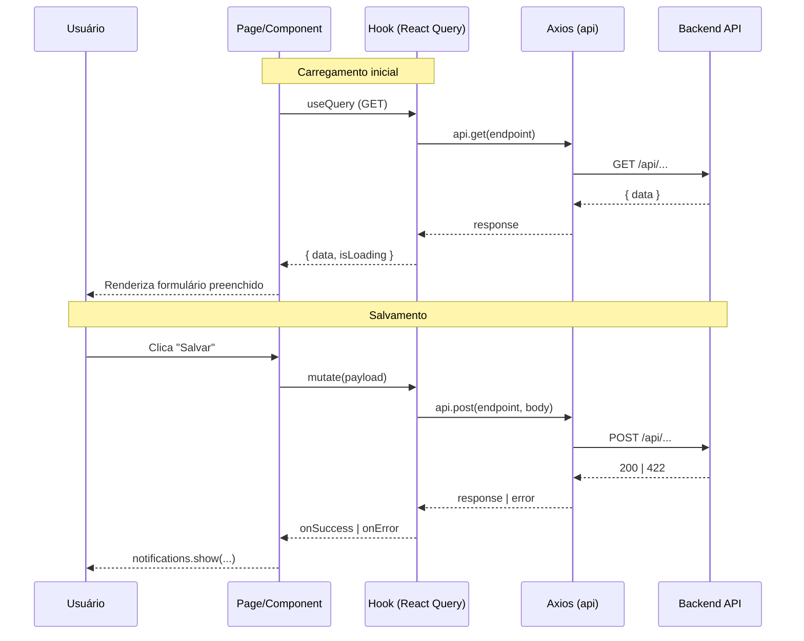

# Design Document — Conferência, Integração e Pendências (Frontend)

## Overview

Este design descreve a arquitetura frontend para as funcionalidades de configuração de integração, configuração de e-mail fiscal, reformulação do cadastro de produto (bloqueio de conferência) e listagem/resolução de pendências CC-e. O frontend consome a API REST do backend Fastify via Axios, utiliza TanStack React Query para cache e revalidação, e segue os padrões existentes do projeto (Mantine 7, react-hook-form + Zod).

### Decisões de Design

- **Seções adicionadas na página existente** `/configurador/conferencia` ao invés de nova rota, mantendo coesão de configuração.
- **Hooks customizados dedicados** (`usePendenciasCce`, `useConfigIntegracao`, `useConfigEmailFiscal`) ao invés de usar `useCrudGenerico`, pois os endpoints possuem semântica específica (upsert, PATCH para resolução).
- **Componentes de seção isolados** para cada formulário (IntegracaoSection, EmailFiscalSection), permitindo carregamento e salvamento independentes.
- **Zod schemas no frontend** para validação client-side antes de enviar à API, seguindo o padrão existente do ProdutoModal.
- **Mapeamento de valores legados** no ProdutoModal para manter compatibilidade durante a migração dos enums antigos para booleanos.

## Architecture

```
┌────────────────────────────────────────────────────────────────────────┐
│                        Next.js 15 App Router                           │
├────────────────────────────────────────────────────────────────────────┤
│                                                                        │
│  ┌─────────────────────────────────────┐  ┌─────────────────────────┐ │
│  │  /configurador/conferencia (page)   │  │ /wms/pendencias-cce     │ │
│  │  ┌───────────────────────────────┐  │  │  ┌───────────────────┐  │ │
│  │  │ Seções existentes (switches)  │  │  │  │ FiltrosPendencia  │  │ │
│  │  ├───────────────────────────────┤  │  │  ├───────────────────┤  │ │
│  │  │ IntegracaoSection             │  │  │  │ TabelaPendencias  │  │ │
│  │  ├───────────────────────────────┤  │  │  └───────────────────┘  │ │
│  │  │ EmailFiscalSection            │  │  └─────────────────────────┘ │
│  │  └───────────────────────────────┘  │                              │
│  └─────────────────────────────────────┘                              │
│                                                                        │
│  ┌─────────────────────────────────────┐                              │
│  │  ProdutoModal (modificado)          │                              │
│  │  ┌───────────────────────────────┐  │                              │
│  │  │ BloqueioConferenciaSection    │  │                              │
│  │  └───────────────────────────────┘  │                              │
│  └─────────────────────────────────────┘                              │
│                                                                        │
├────────────────────────────────────────────────────────────────────────┤
│                        Data Layer (hooks)                               │
│  ┌────────────────┐ ┌──────────────────┐ ┌──────────────────────────┐ │
│  │useConfigInteg. │ │useConfigEmail    │ │usePendenciasCce          │ │
│  └────────────────┘ └──────────────────┘ └──────────────────────────┘ │
├────────────────────────────────────────────────────────────────────────┤
│                        @/lib/api (Axios)                                │
│                      GET/POST/PATCH → Backend API                       │
└────────────────────────────────────────────────────────────────────────┘
```

### Fluxo de Dados



## Components and Interfaces

### File Structure (novos arquivos)

```
src/
├── app/(interna)/
│   ├── configurador/conferencia/
│   │   ├── page.tsx                          # Modificado: adiciona novas seções
│   │   ├── IntegracaoSection.tsx             # Novo: formulário de integração
│   │   └── EmailFiscalSection.tsx            # Novo: formulário de e-mail fiscal
│   ├── configurador/produtos/
│   │   ├── ProdutoModal.tsx                  # Modificado: substitui Selects por BloqueioSection
│   │   └── BloqueioConferenciaSection.tsx    # Novo: checkboxes de bloqueio
│   └── wms/pendencias-cce/
│       └── page.tsx                          # Novo: listagem + resolução
├── data/hooks/
│   ├── useConfigIntegracao.ts                # Novo: hook de config integração
│   ├── useConfigEmailFiscal.ts               # Novo: hook de config e-mail fiscal
│   └── usePendenciasCce.ts                   # Novo: hook de pendências
└── lib/
    └── mapearModosBloqueio.ts                # Novo: utility de migração enum→bool
```

### Component Specifications

#### IntegracaoSection

```typescript
// src/app/(interna)/configurador/conferencia/IntegracaoSection.tsx
'use client'

import { Card, Switch, TextInput, Button, Stack, Group, Text, Divider } from '@mantine/core'
import { IconPlugConnected } from '@tabler/icons-react'
import { useConfigIntegracao, useSalvarConfigIntegracao } from '@/data/hooks/useConfigIntegracao'

interface Props {}

export function IntegracaoSection() {
  // Estado local do formulário (useState, não react-hook-form — formulário simples)
  // Carrega config existente via useConfigIntegracao()
  // Salva via useSalvarConfigIntegracao() mutation
  // Desabilita TextInput quando switch=false
  // Exibe notificação de sucesso/erro conforme resposta
}
```

#### EmailFiscalSection

```typescript
// src/app/(interna)/configurador/conferencia/EmailFiscalSection.tsx
'use client'

import { Card, TextInput, Button, Stack, Group, Text, Divider } from '@mantine/core'
import { IconMail } from '@tabler/icons-react'
import { useConfigEmailFiscal, useSalvarConfigEmailFiscal } from '@/data/hooks/useConfigEmailFiscal'

interface Props {}

export function EmailFiscalSection() {
  // Estado local do formulário
  // Carrega config existente via useConfigEmailFiscal()
  // Salva via useSalvarConfigEmailFiscal() mutation
  // Exibe notificação de sucesso/erro conforme resposta
}
```

#### BloqueioConferenciaSection

```typescript
// src/app/(interna)/configurador/produtos/BloqueioConferenciaSection.tsx
'use client'

import { Checkbox, Stack, Text, Alert } from '@mantine/core'
import { IconInfoCircle } from '@tabler/icons-react'
import { Control, Controller } from 'react-hook-form'

interface Props {
  control: Control<any>
}

export function BloqueioConferenciaSection({ control }: Props) {
  // Renderiza dois Checkboxes controlados via react-hook-form Controller
  // Campos: aceitarSenha, aceitarCcePendente
  // Exibe texto descritivo quando ambos desmarcados
}
```

#### Página de Pendências

```typescript
// src/app/(interna)/wms/pendencias-cce/page.tsx
'use client'

import { Card, Table, Badge, Button, Group, TextInput, Select, Text, Stack } from '@mantine/core'
import { DateInput } from '@mantine/dates'
import { modals } from '@mantine/modals'
import { notifications } from '@mantine/notifications'
import { usePendenciasCce, useResolverPendencia } from '@/data/hooks/usePendenciasCce'

// Filtros: fornecedor (text), dataInicial (date), dataFinal (date), status (select)
// Tabela: Fornecedor, Nota Fiscal, Data Criação, Produto, Motivo, Status (Badge), Ações
// Ações: Resolver / Cancelar (apenas para status AGUARDANDO_CCE)
// Confirm modal antes de cada ação
// Empty state quando lista vazia
```

### Hook Interfaces

#### useConfigIntegracao

```typescript
// src/data/hooks/useConfigIntegracao.ts
import { useQuery, useMutation, useQueryClient } from '@tanstack/react-query'
import { api } from '@/lib/api'

interface ConfigIntegracao {
  integracaoAtiva: boolean
  sistemaExterno: string | null
}

const KEY = 'config-integracao'

export function useConfigIntegracao() {
  return useQuery<ConfigIntegracao>({
    queryKey: [KEY],
    queryFn: async () => {
      const { data } = await api.get('/config-integracao')
      return data
    },
    staleTime: 1000 * 60 * 5,
  })
}

export function useSalvarConfigIntegracao() {
  const qc = useQueryClient()
  return useMutation({
    mutationFn: async (body: ConfigIntegracao) => {
      const { data } = await api.post('/config-integracao', body)
      return data
    },
    onSuccess: () => qc.invalidateQueries({ queryKey: [KEY] }),
  })
}
```

#### useConfigEmailFiscal

```typescript
// src/data/hooks/useConfigEmailFiscal.ts
import { useQuery, useMutation, useQueryClient } from '@tanstack/react-query'
import { api } from '@/lib/api'

interface ConfigEmailFiscal {
  email: string
}

const KEY = 'config-email-fiscal'

export function useConfigEmailFiscal() {
  return useQuery<ConfigEmailFiscal>({
    queryKey: [KEY],
    queryFn: async () => {
      const { data } = await api.get('/config-email-fiscal')
      return data
    },
    staleTime: 1000 * 60 * 5,
  })
}

export function useSalvarConfigEmailFiscal() {
  const qc = useQueryClient()
  return useMutation({
    mutationFn: async (body: ConfigEmailFiscal) => {
      const { data } = await api.post('/config-email-fiscal', body)
      return data
    },
    onSuccess: () => qc.invalidateQueries({ queryKey: [KEY] }),
  })
}
```

#### usePendenciasCce

```typescript
// src/data/hooks/usePendenciasCce.ts
import { useQuery, useMutation, useQueryClient } from '@tanstack/react-query'
import { api } from '@/lib/api'

interface PendenciaCce {
  id: string
  fornecedor: string
  notaFiscal: string
  criadoEm: string
  codigoProduto: string
  descricaoProduto: string
  motivo: string
  status: 'AGUARDANDO_CCE' | 'RESOLVIDA' | 'CANCELADA'
}

interface FiltrosPendencia {
  fornecedor?: string
  dataInicial?: string
  dataFinal?: string
  status?: string
}

const KEY = 'pendencias-cce'

export function usePendenciasCce(filtros?: FiltrosPendencia) {
  return useQuery<PendenciaCce[]>({
    queryKey: [KEY, filtros],
    queryFn: async () => {
      const { data } = await api.get('/pendencias-cce', { params: filtros })
      return data.data ?? data
    },
    staleTime: 1000 * 30,
  })
}

export function useResolverPendencia() {
  const qc = useQueryClient()
  return useMutation({
    mutationFn: async ({ id, status }: { id: string; status: 'RESOLVIDA' | 'CANCELADA' }) => {
      const { data } = await api.patch(`/pendencias-cce/${id}/resolver`, { status })
      return data
    },
    onSuccess: () => qc.invalidateQueries({ queryKey: [KEY] }),
  })
}
```

### Utility: mapearModosBloqueio

```typescript
// src/lib/mapearModosBloqueio.ts

/**
 * Mapeia os valores antigos dos enums modoResolucaoLote/modoResolucaoValidade
 * para os novos campos booleanos aceitarSenha e aceitarCcePendente.
 *
 * Regras de mapeamento:
 * - BLOQUEAR         → aceitarSenha=false, aceitarCcePendente=false
 * - ACEITAR_LIVRE    → aceitarSenha=false, aceitarCcePendente=false (opção removida, vira bloqueio total)
 * - ACEITAR_SENHA    → aceitarSenha=true, aceitarCcePendente=false
 * - ACEITAR_CCE      → aceitarSenha=false, aceitarCcePendente=true
 *
 * Se o produto já possui os campos booleanos (após migração), retorna diretamente.
 */
export function mapearModosBloqueio(produto: Record<string, any>): {
  aceitarSenha: boolean
  aceitarCcePendente: boolean
} {
  // Se já possui campos booleanos da nova API, usar diretamente
  if (typeof produto.aceitarSenha === 'boolean') {
    return {
      aceitarSenha: produto.aceitarSenha,
      aceitarCcePendente: produto.aceitarCcePendente ?? false,
    }
  }

  // Mapeamento dos valores legados
  const modoLote = produto.modoResolucaoLote || 'BLOQUEAR'
  const modoValidade = produto.modoResolucaoValidade || 'BLOQUEAR'

  const aceitarSenha = modoLote === 'ACEITAR_SENHA' || modoValidade === 'ACEITAR_SENHA'
  const aceitarCcePendente = modoLote === 'ACEITAR_CCE' || modoValidade === 'ACEITAR_CCE'

  return { aceitarSenha, aceitarCcePendente }
}
```

## Data Models

```typescript
// Interfaces compartilhadas entre hooks e componentes

interface ConfigIntegracao {
  integracaoAtiva: boolean
  sistemaExterno: string | null
}

interface ConfigEmailFiscal {
  email: string
}

interface PendenciaCce {
  id: string
  fornecedor: string
  notaFiscal: string       // número da NF associada
  criadoEm: string         // ISO date string
  codigoProduto: string
  descricaoProduto: string
  motivo: string           // "Aguardando CCE de lote" | "Aguardando CCE de validade"
  status: 'AGUARDANDO_CCE' | 'RESOLVIDA' | 'CANCELADA'
}

// Payload de resolução
interface ResolverPendenciaPayload {
  status: 'RESOLVIDA' | 'CANCELADA'
}

// Filtros da listagem
interface FiltrosPendencia {
  fornecedor?: string      // busca parcial (contains)
  dataInicial?: string     // ISO date (yyyy-MM-dd)
  dataFinal?: string       // ISO date (yyyy-MM-dd)
  status?: 'AGUARDANDO_CCE' | 'RESOLVIDA' | 'CANCELADA'
}

// Campos do produto (novos booleanos)
interface BloqueioConferencia {
  aceitarSenha: boolean
  aceitarCcePendente: boolean
}
```

## Zod Schemas (validação client-side)

```typescript
import { z } from 'zod'

// Schema de validação para config integração (client-side)
export const configIntegracaoSchema = z.object({
  integracaoAtiva: z.boolean(),
  sistemaExterno: z.string().max(100).nullable(),
}).refine(
  (data) => !data.integracaoAtiva || (data.sistemaExterno && data.sistemaExterno.trim().length > 0),
  { message: 'Nome do sistema externo é obrigatório quando integração está ativa', path: ['sistemaExterno'] }
)

// Schema de validação para config e-mail fiscal (client-side)
export const configEmailFiscalSchema = z.object({
  email: z.string().min(1, 'E-mail é obrigatório').max(254).email('Formato de e-mail inválido'),
})

// Schema de resolução de pendência
export const resolverPendenciaSchema = z.object({
  status: z.enum(['RESOLVIDA', 'CANCELADA']),
})
```

## Error Handling

### Estratégia de Tratamento de Erros no Frontend

| Cenário | Código HTTP | Comportamento UI |
|---------|-------------|-----------------|
| Config integração: sistema externo obrigatório | 422 | `notifications.show({ color: 'red', message: msg da API })` + preserva form |
| Config e-mail: formato inválido | 422 | `notifications.show({ color: 'red', message: msg da API })` + preserva form |
| Resolução pendência: não encontrada | 404 | `notifications.show({ color: 'red', message: msg da API })` |
| Resolução pendência: já processada | 409 | `notifications.show({ color: 'red', message: msg da API })` |
| Erro de rede / timeout | - | `notifications.show({ color: 'red', message: 'Erro de conexão' })` |
| Token expirado | 401 | Interceptor global redireciona para `/login` (existente) |

### Padrão de Tratamento em Mutations

```typescript
// Padrão reutilizado em todos os hooks de mutation
useMutation({
  mutationFn: async (body) => { /* ... */ },
  onSuccess: () => {
    notifications.show({ title: 'Sucesso', message: '...', color: 'green' })
    queryClient.invalidateQueries({ queryKey: [KEY] })
  },
  onError: (err: any) => {
    const msg = err?.response?.data?.error?.message
      || err?.response?.data?.message
      || 'Erro ao processar operação'
    notifications.show({ title: 'Erro', message: msg, color: 'red' })
  },
})
```

## Correctness Properties

*A property is a characteristic or behavior that should hold true across all valid executions of a system — essentially, a formal statement about what the system should do. Properties serve as the bridge between human-readable specifications and machine-verifiable correctness guarantees.*

*Nota: Este é um projeto frontend com foco em UI/integração. A maioria dos acceptance criteria são verificáveis via testes de exemplo (component tests com Testing Library). As propriedades abaixo cobrem a lógica pura que pode ser validada por property-based testing.*

### Property 1: Mapeamento de modos legados para booleanos

*For any* produto com campos legados `modoResolucaoLote` e `modoResolucaoValidade` (valores possíveis: "BLOQUEAR", "ACEITAR_LIVRE", "ACEITAR_SENHA", "ACEITAR_CCE"), a função `mapearModosBloqueio` SHALL produzir `aceitarSenha=true` se e somente se pelo menos um dos modos for "ACEITAR_SENHA", e `aceitarCcePendente=true` se e somente se pelo menos um dos modos for "ACEITAR_CCE".

**Validates: Requirements 3.6**

### Property 2: Badge de status exibe cor correta

*For any* pendência com status em {"AGUARDANDO_CCE", "RESOLVIDA", "CANCELADA"}, o mapeamento de status para cor de Badge SHALL produzir: "AGUARDANDO_CCE" → "orange", "RESOLVIDA" → "green", "CANCELADA" → "blue" (CCE Emitida é mapeada no backend como status separado, mas no frontend exibimos "Pendente"=orange, "CCE Emitida"=blue, "Resolvida"=green).

**Validates: Requirements 4.8**

### Property 3: Botões de ação condicionais por status

*For any* pendência, os botões "Resolver" e "Cancelar" SHALL ser renderizados se e somente se o status da pendência for "AGUARDANDO_CCE". Para qualquer outro status, nenhum botão de ação deve ser exibido.

**Validates: Requirements 5.1, 5.8**

## Testing Strategy

### Abordagem

Dado que este é um projeto frontend, a maioria dos testes são **component tests** (vitest + @testing-library/react) e **testes de exemplo**. Property-based testing é aplicado apenas à lógica pura utilitária.

### Distribuição de Testes

| Tipo | Escopo | Framework |
|------|--------|-----------|
| **Property tests** | `mapearModosBloqueio`, mapeamento de cor de badge, lógica de visibilidade de botões | vitest + fast-check |
| **Component tests** | Renderização de seções, interações de formulário, estados empty/loading/error | vitest + @testing-library/react |
| **E2E tests** | Fluxo completo de configuração e resolução de pendência | Playwright |

### Arquivos de Teste

```
src/
├── lib/__tests__/
│   └── mapearModosBloqueio.test.ts           # Property test (P1)
├── app/(interna)/configurador/conferencia/__tests__/
│   ├── IntegracaoSection.test.tsx            # Component tests (Req 1)
│   └── EmailFiscalSection.test.tsx           # Component tests (Req 2)
├── app/(interna)/configurador/produtos/__tests__/
│   └── BloqueioConferenciaSection.test.tsx   # Component tests (Req 3)
└── app/(interna)/wms/pendencias-cce/__tests__/
    └── page.test.tsx                         # Component tests (Req 4, 5) + Property (P2, P3)
```
