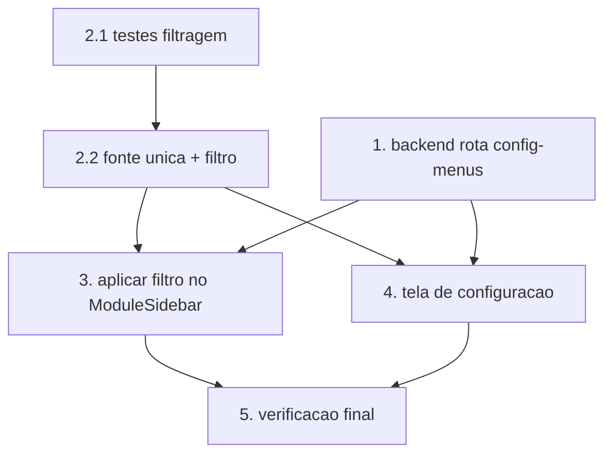

# Implementation Plan

## Overview

Plano de implementação da configuração de menus do WMS: rota de backend para
persistir por empresa (tabela `Parametro`, sem migration), função pura de
filtragem dos itens do menu, aplicação do filtro no `ModuleSidebar` (desktop e
mobile) e uma tela de administração para ligar/desligar itens/grupos. Reaproveita
o padrão já existente de filtragem de menu do PCP.

## Tasks

- [x] 1. Backend: rota de configuração de menus do WMS
  - Criar `VisioFab.Wms.Back/src/modules/wms-config-menus/wms-config-menus.routes.ts` com `GET /wms/config-menus` (qualquer usuário do módulo WMS autenticado → `{ menusDesabilitados: string[] }`) e `PUT /wms/config-menus` (somente ADMIN/SUPER_ADMIN).
  - Persistir na tabela `Parametro` com chave `wms.menusDesabilitados` (JSON `string[]`), escopado por `empresaId` (mesmo padrão de `configuracao-pcp.routes.ts`).
  - Na escrita, validar o body com Zod (`{ menusDesabilitados: z.array(z.string()) }`) e **remover o id do item protegido** (`/wms/configuracoes/menus`) antes de persistir.
  - Leitura sem configuração salva → `[]`. Registrar a rota no `server.ts`.
  - _Requirements: 3.1, 3.2, 4.1, 4.2, 4.3, 5.2, 5.3_

- [x] 2. Fonte única dos itens de menu do WMS + função pura de filtragem
  - [x] 2.1 Escrever testes property-based da função de filtragem
    - Criar teste (fast-check) para `filtrarEntriesWms(entries, menusDesabilitados)` cobrindo P1–P4 do design: item desabilitado nunca aparece; item habilitado sempre aparece (salvo grupo desabilitado); grupo desabilitado oculta todos os itens; lista vazia preserva o menu completo. Incluir caso do item protegido nunca ser filtrado.
    - _Requirements: 1.1, 1.2, 1.3, 2.1, 2.2, 5.2_
  - [x] 2.2 Implementar a fonte única e a função de filtragem
    - Extrair a definição do menu do WMS e criar `listarItensMenuWms()` (grupos/itens com id) reutilizável pela sidebar e pela tela de config, evitando duplicar `MODULE_MENUS`.
    - Implementar `filtrarEntriesWms(entries, menusDesabilitados)`: id de item = `href`; id de grupo = `grupo:<label>`; grupo desabilitado ou vazio após filtro não aparece; nunca filtrar o item protegido.
    - Garantir que os testes de 2.1 passem.
    - _Requirements: 1.1, 1.2, 1.3, 2.1, 2.2, 5.2_

- [x] 3. Aplicar o filtro no ModuleSidebar (desktop + mobile)
  - Em `ModuleSidebar.tsx`, no `useModuleEntries`, quando `moduleName === 'wms'`, carregar `GET /wms/config-menus` (uma vez, como já é feito para o PCP) e aplicar `filtrarEntriesWms` sobre as entries do WMS.
  - Fail-open: se a leitura falhar, manter o menu completo (`.catch(() => {})`).
  - Como o drawer mobile e a sidebar desktop consomem o mesmo `useModuleEntries`, confirmar que ambos refletem a filtragem (mesma lógica funcional).
  - _Requirements: 1.1, 1.2, 1.3, 1.4, 2.1, 2.2, 5.1_

- [x] 4. Tela de Configuração de Menus do WMS
  - Criar `VisioFab.Wms.Front/src/app/(interna)/wms/configuracoes/menus/page.tsx`, restrita a ADMIN/SUPER_ADMIN (guard de perfil, como outras telas de config).
  - Listar grupos e itens via `listarItensMenuWms()`, com `Switch` por item e por grupo (grupo desliga todos). Carregar estado atual via `GET /wms/config-menus`; salvar via `PUT`.
  - Exibir o item protegido ("Configuração de Menus") com switch fixo/desabilitado (não pode ser desligado). Tratar erro 403/rede via `notifications`.
  - Adicionar o link para esta tela no grupo "Configuração WMS" do menu (`{ label: 'Configuração de Menus', href: '/wms/configuracoes/menus' }`).
  - _Requirements: 3.1, 3.3, 3.4, 3.5, 5.2_

- [x] 5. Verificação final (build, testes, regressão)
  - Rodar os testes property-based/unitários de `filtrarEntriesWms` e confirmar que passam.
  - `get_diagnostics` limpo nos arquivos tocados; build/lint do frontend e `tsc` do backend sem novos erros em relação à baseline conhecida.
  - Confirmar que nenhuma alteração de schema Prisma foi introduzida (config em `Parametro`; sem migration).
  - Verificação manual: desativar item/grupo → some da barra (desktop e mobile); reativar → volta; item protegido não pode ser desligado; fail-open ao simular erro de carga.
  - _Requirements: 1.1, 1.4, 3.4, 4.3, 5.1, 5.2_

## Task Dependency Graph



```json
{
  "waves": [
    { "wave": 1, "tasks": ["1", "2.1"] },
    { "wave": 2, "tasks": ["2.2"] },
    { "wave": 3, "tasks": ["3", "4"] },
    { "wave": 4, "tasks": ["5"] }
  ]
}
```

## Notes

- Feature majoritariamente no `VisioFab.Wms.Front` (menu + tela), com uma rota nova no `VisioFab.Wms.Back` (persistência da config).
- Sem migration: a configuração vive na tabela genérica `Parametro` (chave `wms.menusDesabilitados` por empresa).
- Reaproveita o padrão de filtragem de menu já existente no PCP (`useModuleEntries` + `/pcp/permissoes/minha`).
- Fonte única do menu (`listarItensMenuWms`) evita duplicar `MODULE_MENUS` entre a sidebar e a tela de config.
- Criar branch nova antes de commitar (padrão do repositório).
